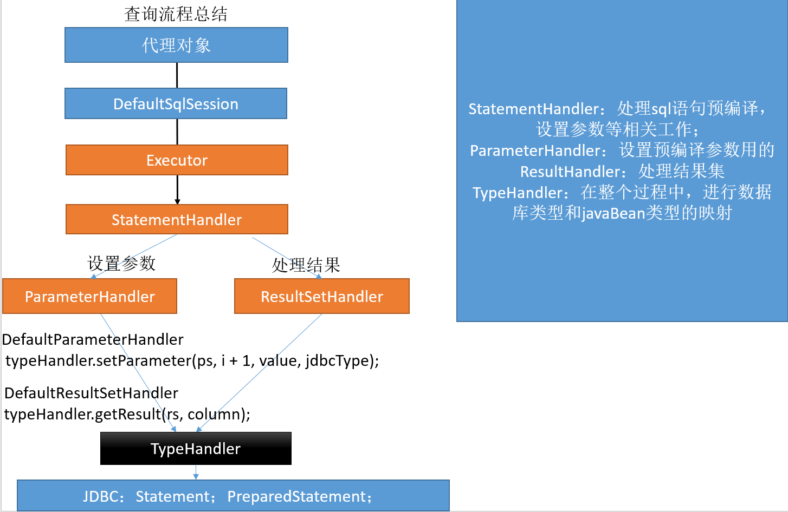

# 一、MyBatis简介
1. MyBatis 是支持定制化 SQL、存储过程以及高级映射的优秀的持久层框架。
2. MyBatis 避免了几乎所有的 JDBC 代码和手动设置参数以及获取结果集。
3. MyBatis可以使用简单的XML或注解用于配置和原始映射，将接口和Java的POJO（Plain Old Java Objects，普通的Java对象）映射成数据库中的记录。
---
- Hibernate


- MyBatis


## 1、MyBatis历史
1. 原是Apache的一个开源项目iBatis, 2010年6月这个项目由Apache Software Foundation 迁移到了 Google  Code ，随着开发团队转投 Google Code 旗下， iBatis3.x 正式更名为 MyBatis ，代码于2013年11月迁移到 Github（下载地址见后）。
2. iBatis 一词来源于 "internet" 和 "abatis" 的组合，是一个基于 Java 的持久层框架。 iBatis 提供的持久层框架包括 SQL Maps 和 Data Access Objects（DAO）


## 2、为什么要使用MyBatis？
1. MyBatis是一个半自动化的持久化层框架。
2. JDBC
   1. SQL夹在Java代码块里，耦合度高导致硬编码内伤
   2. 维护不易且实际开发需求中sql是有变化，频繁修改的情况多见
3. Hibernate和JPA
   1. 长难复杂SQL，对于Hibernate而言处理也不容易
   2. 内部自动生产的SQL，不容易做特殊优化。
   3. 基于全映射的全自动框架，大量字段的POJO进行部分映射时比较困难。导致数据库性能下降。
4. 对开发人员而言，核心sql还是需要自己优化
5. <font color="red">sql和java编码分开，功能边界清晰，一个专注业务、一个专注数据。</font>


## 3、去哪里找MyBatis？
- https://github.com/mybatis/mybatis-3/

- 主页


- 官方文档


- 下载


# 二、MyBatis-HelloWorld
1. <font color="red">MyBatis 的全局配置文件</font>包含了影响 MyBatis 行为甚深的设置（settings）和属性（properties）信息、如数据库连接池信息等。指导着MyBatis进行工作。我们可以参照官方文件的配置示例。
2. <font color="red">sql 映射文件</font>的作用就相当于是定义Dao接口的实现类如何工作。这也是我们使用MyBatis时编写的最多的文件。
3. SqlSession 的实例不是线程安全的，因此是不能被共享的。
4. SqlSession每次使用完成后需要正确关闭，这个关闭操作是必须的
5. SqlSession可以直接调用方法的id进行数据库操作，但是我们一般还是推荐使用SqlSession获取到Dao接口的代理类，执行代理对象的方法，可以更安全的进行类型检查操作


## 1、MyBatis 的初次使用
1. 创建数据库：MyBatis
2. 创建数据库表：tbl_employee
```sql
    CREATE TABLE tbl_employee(
        id INT(11) PRIMARY KEY AUTO_INCREMENT,
        last_name VARCHAR(255),
        gender CHAR(1),
        email VARCHAR(255)
    )
```
3. 往数据库中添加数据


4. 项目结构


5. 导入 jar 包


6. 创建日志所需的 log4j.xml 配置文件
```xml
    <?xml version="1.0" encoding="UTF-8" ?>
    <!DOCTYPE log4j:configuration SYSTEM "log4j.dtd">
    
    <log4j:configuration xmlns:log4j="http://jakarta.apache.org/log4j/">
    
    <appender name="STDOUT" class="org.apache.log4j.ConsoleAppender">
    <param name="Encoding" value="UTF-8" />
    <layout class="org.apache.log4j.PatternLayout">
        <param name="ConversionPattern" value="%-5p %d{MM-dd HH:mm:ss,SSS} %m  (%F:%L) \n" />
    </layout>
    </appender>
    <logger name="java.sql">
    <level value="debug" />
    </logger>
    <logger name="org.apache.ibatis">
    <level value="info" />
    </logger>
    <root>
    <level value="debug" />
    <appender-ref ref="STDOUT" />
    </root>
    </log4j:configuration>
```
7. 创建对应数据库表 tbl_employee 的实体类 Employee
```java
    public class Employee {
        private Integer id;
        private String lastName;
        private String gender;
        private String email;

        public Employee() { }
        public Employee(Integer id, String lastName, String gender, String email) {
            this.id = id;
            this.lastName = lastName;
            this.gender = gender;
            this.email = email;
        }

        public Integer getId() { return id; }
        public void setId(Integer id) { this.id = id; }
        public String getLastName() { return lastName; }
        public void setLastName(String lastName) { this.lastName = lastName; }
        public String getGender() { return gender; }
        public void setGender(String gender) { this.gender = gender; }
        public String getEmail() { return email; }
        public void setEmail(String email) { this.email = email; }

        @Override
        public String toString() {
            return "Employee{" +
                    "id=" + id +
                    ", lastName='" + lastName + '\'' +
                    ", gender='" + gender + '\'' +
                    ", email='" + email + '\'' +
                    '}';
        }
    }
```
8. 创建 MyBatis 全局配置文件 mybatis-config.xml
```xml
    <?xml version="1.0" encoding="UTF-8" ?>
    <!DOCTYPE configuration
            PUBLIC "-//mybatis.org//DTD Config 3.0//EN"
            "http://mybatis.org/dtd/mybatis-3-config.dtd">

    <!-- 全局配置文件 -->

    <configuration>

        <!-- 数据库连接池 -->
        <environments default="development">
            <environment id="development">
                <transactionManager type="JDBC"/>
                <dataSource type="POOLED">
                    <property name="driver" value="com.mysql.jdbc.Driver"/>
                    <property name="url" value="jdbc:mysql://152.136.229.92:3306/mybatis?characterEncoding=utf-8"/>
                    <property name="username" value="root"/>
                    <property name="password" value="000123"/>
                </dataSource>
            </environment>
        </environments>

        <!-- 将我们写好的 sql 映射文件一定要注册到全局配置文件中 -->
        <mappers>
            <!-- MyBatis 配置文件名 -->
            <mapper resource="EmployeeMapper.xml"/>
        </mappers>

    </configuration>
```
9. 创建 MyBatis 的 sql 映射文件 EmployeeMapper.xml
```xml
    <?xml version="1.0" encoding="UTF-8" ?>
    <!DOCTYPE mapper
            PUBLIC "-//mybatis.org//DTD Mapper 3.0//EN"
            "http://mybatis.org/dtd/mybatis-3-mapper.dtd">

    <!-- sql 映射文件 -->
    <!-- namespace：名称空间 -->
    <mapper namespace="com.yuehai.mybatis.bean.Employee">
        <!--
            select 标签：查询
            id：唯一标识
            resultType：返回值类型，各种基本类型去看笔记：typeAliases别名处理器
                若是对象则写实体类的全类名（若全局配置文件中有配置别名，则可使用别名）
                如果返回的是一个集合，要写集合中元素的泛型的类型
            #{id}：从传递过来的参数中取出属性 id 的值
        -->
        <select id="selectEmp" resultType="com.yuehai.mybatis.bean.Employee">
            -- 注意起别名
            select id,last_name lastName,email,gender from tbl_employee where id = #{id}
        </select>
    </mapper>
```
10. 测试类
```java
    public class MyBatisTest {

        /**
        * MyBatis 使用步骤：
        * 1、根据 xml 配置文件（全局配置文件）创建一个 SqlSessionFactory 对象，配置文件中有数据源和一些运行环境的信息
        * 2、sql 映射文件，配置了每一个 sql，以及 sql 的封装规则等
        * 3、将 sql 映射文件注册在全局配置文件中
        * 4、写代码：
        *      ①：根据全局配置文件得到 SqlSessionFactory 工厂
        *      ②：使用 SqlSessionFactory 工厂获取到 sqlSession 对象，使用他来执行增删改查，一个 sqlSession 就是代表和数据库的一次会话，用完就要关闭
        *      ③：使用 sql 语句的唯一标识来告诉 MyBatis 执行哪一个 sql，sql 都是保存在 sql 映射文件中的
        *      ④：
        * @throws IOException
        */
        @Test
        public void test() throws IOException {
            // 获取配置文件
            String resource = "mybatis-config.xml";
            InputStream inputStream = Resources.getResourceAsStream(resource);
            SqlSessionFactory sqlSessionFactory = new SqlSessionFactoryBuilder().build(inputStream);

            // 2、获取 sqlSession 实例，能直接执行已经映射的 sql 语句
            SqlSession sqlSession = sqlSessionFactory.openSession();

            // 3、调用方法
            // 参数1：sql 语句的唯一标识，MyBatis 配置文件中的 namespace + id
            // 参数2：执行 sql 要用的参数，占位符
            Employee employee = sqlSession.selectOne("com.yuehai.mybatis.bean.Employee.selectEmp", 1);

            // 打印
            System.out.println(employee);

            // 4、关闭数据库链接
            sqlSession.close();
        }
    }
```


## 2、MyBatis 接口式编程
1. 项目结构


2. 导入 jar 包


3. 创建日志所需的 log4j.xml 配置文件
```xml
    <?xml version="1.0" encoding="UTF-8" ?>
    <!DOCTYPE log4j:configuration SYSTEM "log4j.dtd">
    
    <log4j:configuration xmlns:log4j="http://jakarta.apache.org/log4j/">
    
    <appender name="STDOUT" class="org.apache.log4j.ConsoleAppender">
    <param name="Encoding" value="UTF-8" />
    <layout class="org.apache.log4j.PatternLayout">
        <param name="ConversionPattern" value="%-5p %d{MM-dd HH:mm:ss,SSS} %m  (%F:%L) \n" />
    </layout>
    </appender>
    <logger name="java.sql">
    <level value="debug" />
    </logger>
    <logger name="org.apache.ibatis">
    <level value="info" />
    </logger>
    <root>
    <level value="debug" />
    <appender-ref ref="STDOUT" />
    </root>
    </log4j:configuration>
```
4. 创建对应数据库表 tbl_employee 的实体类 Employee
```java
    public class Employee {
        private Integer id;
        private String lastName;
        private String gender;
        private String email;

        public Employee() { }
        public Employee(Integer id, String lastName, String gender, String email) {
            this.id = id;
            this.lastName = lastName;
            this.gender = gender;
            this.email = email;
        }

        public Integer getId() { return id; }
        public void setId(Integer id) { this.id = id; }
        public String getLastName() { return lastName; }
        public void setLastName(String lastName) { this.lastName = lastName; }
        public String getGender() { return gender; }
        public void setGender(String gender) { this.gender = gender; }
        public String getEmail() { return email; }
        public void setEmail(String email) { this.email = email; }

        @Override
        public String toString() {
            return "Employee{" +
                    "id=" + id +
                    ", lastName='" + lastName + '\'' +
                    ", gender='" + gender + '\'' +
                    ", email='" + email + '\'' +
                    '}';
        }
    }
```
5. 创建 MyBatis 全局配置文件 mybatis-config.xml
```xml
    <?xml version="1.0" encoding="UTF-8" ?>
    <!DOCTYPE configuration
            PUBLIC "-//mybatis.org//DTD Config 3.0//EN"
            "http://mybatis.org/dtd/mybatis-3-config.dtd">

    <!-- 全局配置文件 -->

    <configuration>

        <!-- 数据库连接池 -->
        <environments default="development">
            <environment id="development">
                <transactionManager type="JDBC"/>
                <dataSource type="POOLED">
                    <property name="driver" value="com.mysql.jdbc.Driver"/>
                    <property name="url" value="jdbc:mysql://152.136.229.92:3306/mybatis?characterEncoding=utf-8"/>
                    <property name="username" value="root"/>
                    <property name="password" value="000123"/>
                </dataSource>
            </environment>
        </environments>

        <!-- 将我们写好的 sql 映射文件一定要注册到全局配置文件中 -->
        <mappers>
            <!-- MyBatis 配置文件名 -->
            <mapper resource="EmployeeMapper.xml"/>
        </mappers>

    </configuration>
```
6. 创建 Mapper 接口
```java
    // Mapper 接口
    public interface EmployeeMapper {
        // 根据 id 查询
        public Employee getEmployeeById(Integer id);
    }
```
7. 创建 MyBatis 的 sql 映射文件 EmployeeMapper.xml
```xml
    <?xml version="1.0" encoding="UTF-8" ?>
    <!DOCTYPE mapper
            PUBLIC "-//mybatis.org//DTD Mapper 3.0//EN"
            "http://mybatis.org/dtd/mybatis-3-mapper.dtd">
    <!-- sql 映射文件 -->
    <!-- namespace：名称空间，指定为 dao 接口的全类名 -->
    <mapper namespace="com.yuehai.mybatis.dao.EmployeeMapper">
        <!--
            select 标签：查询
            id：唯一标识，dao 接口中的方法名
            resultType：返回值类型，各种基本类型去看笔记：typeAliases别名处理器
                若是对象则写实体类的全类名（若全局配置文件中有配置别名，则可使用别名）
                如果返回的是一个集合，要写集合中元素的泛型的类型
            #{id}：从传递过来的参数中取出属性 id 的值
        -->
        <!-- public Employee getEmployeeById(Integer id); -->
        <select id="getEmployeeById" resultType="com.yuehai.mybatis.bean.Employee">
            -- 注意起别名
            select id,last_name lastName,email,gender from tbl_employee where id = #{id}
        </select>
    </mapper>
```
8. 测试类
```java
    // 将获取 SqlSessionFactory 的方法抽取出来，以便经常使用
    public SqlSessionFactory getSqlSessionFactory() throws IOException {
        String resource = "mybatis-config.xml";
        InputStream inputStream = Resources.getResourceAsStream(resource);
        return new SqlSessionFactoryBuilder().build(inputStream);
    }

    /**
     * 测试接口式编程
     * 1、接口式编程实现方式：
     *      原生：     Dao    --> DaoImpl
     *      MyBatis：  Mapper --> xxMapper.xml（配置文件）
     * 2、SqlSession 代表和数据库的一次会话，用完必须关闭
     * 3、SqlSession 和 Connection 一样都是非线程安全的，每次使用都应该器获取新的对象
     * 4、Mapper 接口没有实现类，但是 MyBatis 会为这个接口生成一个代理对象
     *      将接口和 xml sql 映射文件 进行绑定：
     *      EmployeeMapper mapper = sqlSession.getMapper(EmployeeMapper.class);
     * 5、两个重要的配置文件：
     *      Mapper 的全局配置文件：包含数据库连接池信息、事务管理器信息等系统运行环境信息
     *      sql 映射文件：保存了每一个 sql 语句的映射信息，将 sql 语句抽取出来
     * 6、
     * @throws IOException
     */
    @Test
    public void test2() throws IOException {
        // 1、获取 SqlSessionFactory 对象
        SqlSessionFactory sqlSessionFactory = getSqlSessionFactory();

        // 2、获取 sqlSession 实例，能直接执行已经映射的 sql 语句
        SqlSession sqlSession = sqlSessionFactory.openSession();

        try {
            // 3、获取接口类的对象，会为接口自动创建一个代理对象，代理对象去执行增删改查方法
            EmployeeMapper mapper = sqlSession.getMapper(EmployeeMapper.class);

            // 4、调用接口的方法
            Employee employeeById = mapper.getEmployeeById(1);

            // 5、打印测试
            System.out.println(employeeById);
        } catch (Exception e) {
            e.printStackTrace();
        } finally {
            // 6、关闭资源
            sqlSession.close();
        }
    }
```


# 三、MyBatis-全局配置文件
- MyBatis-全局配置文件中的各个标签有顺序，不可写错：properties --> settings --> typeAliases --> typeHandlers --> objectFactory --> objectWrapperFactory --> reflectorFactory --> plugins --> environments --> databaseIdProvider --> mappers
- MyBatis 的配置文件包含了影响 MyBatis 行为甚深的设置（settings）和属性（properties）信息。文档的顶层结构如下：
- configuration 配置
    - properties 属性
    - settings 设置
    - typeAliases 类型命名
    - typeHandlers 类型处理器
    - objectFactory 对象工厂（<font color="red">一般都使用默认的</font>）
    - plugins 插件
    - environments 环境
      - environment 环境变量
        - transactionManager 事务管理器
        - dataSource 数据源
    - databaseIdProvider 数据库厂商标识
    - mappers 映射器


## 1、properties属性
- 如果属性在不只一个地方进行了配置，那么 MyBatis 将按照下面的顺序来加载：
1. 在 properties 元素体内指定的属性首先被读取。
2. 然后根据 properties 元素中的 resource 属性读取类路径下属性文件或根据 url 属性指定的路径读取属性文件，并覆盖已读取的同名属性。
3. 最后读取作为方法参数传递的属性，并覆盖已读取的同名属性。
4. druid.properties 配置文件
```properties
    # 配置文件中的注释以#号开头

    jdbc.driver=com.mysql.jdbc.Driver
    # jdbc：主协议
    # mysql：子协议
    # 152.136.229.92：IP地址
    # 3306：端口号，MySQL默认的端口号
    # test：数据库名
    # ?：后面可添加参数
    # characterEncoding=utf-8：指定所处理字符的解码和编码的格式
    # 若项目的字符集和MySQL数据库字符集设置为同一字符集则url可以不加此参数。
    jdbc.url=jdbc:mysql://152.136.229.92:3306/test?characterEncoding=utf-8&rewriteBatchedStatements=true
    jdbc.username=root
    jdbc.password=000123

    # Druid（德鲁伊）连接池还可以在配置文件中配置常用基本配置属性
    # initialSize、maxActive等
```
5. mybatis-config.xml 全局配置文件
```xml
    <?xml version="1.0" encoding="UTF-8" ?>
    <!DOCTYPE configuration
            PUBLIC "-//mybatis.org//DTD Config 3.0//EN"
            "http://mybatis.org/dtd/mybatis-3-config.dtd">

    <!-- 全局配置文件 -->

    <configuration>

        <!--
            一、MyBatis 可以使用 properties 标签来引入外部 properties 配置文件的内容、
            1、resource：引入类路径下的资源
            2、url：引入网络路径或者磁盘路径下的资源
        -->
        <properties resource="druid.properties"></properties>

        <!-- 数据库连接池 -->
        <environments default="development">
            <environment id="development">
                <transactionManager type="JDBC"/>
                <dataSource type="POOLED">
                    <property name="driver" value="${jdbc.driver}"/>
                    <property name="url" value="${jdbc.url}"/>
                    <property name="username" value="${jdbc.username}"/>
                    <property name="password" value="${jdbc.password}"/>
                </dataSource>
            </environment>
        </environments>

        <!-- 将我们写好的 sql 映射文件一定要注册到全局配置文件中 -->
        <mappers>
            <!-- MyBatis 配置文件名 -->
            <mapper resource="EmployeeMapper.xml"/>
        </mappers>

    </configuration>
```


## 2、settings设置
- 这是 MyBatis 中极为重要的调整设置，它们会改变 MyBatis 的运行时行为。


- mybatis-config.xml 全局配置文件
```xml
    <!--
        二、settings 是 MyBatis 中极为重要的调整设置，它们会改变 MyBatis 的运行时行为
        settings：用来设置每一个设置项
        1、name：设置项的名称
        2、value：设置项的值
     -->
    <settings>
        <!-- 开启自动驼峰命名规则映射 -->
        <setting name="mapUnderscoreToCamelCase" value="true"/>
    </settings>
```


## 3、typeAliases别名处理器
- <font color="red">不区分大小写</font>
- <font color="red">还是推荐使用全类名，比较方便排查错误和分清类的路径</font>
1. 类型别名是为 Java 类型设置一个短的名字，可以方便我们引用某个类。
```xml
    <!-- 三、typeAliases：别名处理器，可以为我们的 Java 类型起别名，别名不区分大小写 -->
    <typeAliases>
        <!-- typeAlias：为 Java 类型设置一个短的名字，可以方便我们引用某个类 -->
        <!-- type：指定要起别名的类型全类名，默认是类名小写；alias：自定义类的别名 -->
        <typeAlias type="com.yuehai.mybatis.bean.Employee" alias="employee" />
    </typeAliases>
```
2. 类很多的情况下，可以批量设置别名这个包下的每一个类创建一个默认的别名，就是简单类名小写。
```xml
    <!-- 三、typeAliases：别名处理器，可以为我们的 Java 类型起别名，别名不区分大小写 -->
    <typeAliases>
        <!-- package：为某个包下的所有类批量起别名，就是类名小写 -->
        <!-- name：指定包名，为当前包以及所有后代包的每一个类都起一个默认的别名，类名小写 -->
        <!-- 批量起别名的情况下，使用 @Alias() 注解为某个类型指定新的别名，防止冲突 -->
        <package name="com.yuehai.mybatis.bean"/>
    </typeAliases>
```
3. 也可以使用@Alias注解为其指定一个别名
```java
    // 使用@Alias注解为类指定一个别名，防止批量起别名时有相同的别名
    @Alias("employee")
    public class Employee {
        private Integer id;
        private String lastName;
        private String gender;
        private String email;

        public Employee() { }
        public Employee(Integer id, String lastName, String gender, String email) {
            this.id = id;
            this.lastName = lastName;
            this.gender = gender;
            this.email = email;
        }

        public Integer getId() { return id; }
        public void setId(Integer id) { this.id = id; }
        public String getLastName() { return lastName; }
        public void setLastName(String lastName) { this.lastName = lastName; }
        public String getGender() { return gender; }
        public void setGender(String gender) { this.gender = gender; }
        public String getEmail() { return email; }
        public void setEmail(String email) { this.email = email; }

        @Override
        public String toString() {
            return "Employee{" +
                    "id=" + id +
                    ", lastName='" + lastName + '\'' +
                    ", gender='" + gender + '\'' +
                    ", email='" + email + '\'' +
                    '}';
        }
    }
```
4. sql 映射文件 EmployeeMapper.xml
```xml
    <?xml version="1.0" encoding="UTF-8" ?>
    <!DOCTYPE mapper
            PUBLIC "-//mybatis.org//DTD Mapper 3.0//EN"
            "http://mybatis.org/dtd/mybatis-3-mapper.dtd">
    <!-- sql 映射文件 -->
    <!-- namespace：名称空间，指定为 dao 接口的全类名 -->
    <mapper namespace="com.yuehai.mybatis.dao.EmployeeMapper">
        <!--
            select 标签：查询
            id：唯一标识，dao 接口中的方法名
            resultType：返回值类型，各种基本类型去看笔记：typeAliases别名处理器
                若是对象则写实体类的全类名（若全局配置文件中有配置别名，则可使用别名）
                如果返回的是一个集合，要写集合中元素的泛型的类型
            #{id}：从传递过来的参数中取出属性 id 的值
        -->
        <!-- public Employee getEmployeeById(Integer id); -->
        <select id="getEmployeeById" resultType="employee">
            select id,last_name lastName,email,gender from tbl_employee where id = #{id}
        </select>
    </mapper>
```
---
- 值得注意的是，MyBatis已经为许多常见的 Java 类型内建了相应的类型别名。它们都是<font color="red">大小写不敏感</font>的，我们在起别名的时候千万不要占用已有的别名。

|别名|映射的类型|
|--|--|
|_byte|byte|
|_long|long|
|_short|short|
|_int|int|
|_integer|int|
|_double|double|
|_float|float|
|_boolean|boolea|
|string|String|
|byte|Byte|
|long|Long|
|short|Short|
|int|Integer|
|integer|Integer|
|double|Double|
|float|Float|
|boolean|Boolea|
|date|Date|
|decimal|BigDecimal|
|bigdecimal|BigDecimal|
|object|Object|
|map|Map|
|hashmap|HashMap|
|list|List|
|arraylist|ArrayList|
|collection|Collection|
|iterator|Iterator|


## 4、typeHandlers类型处理器
- 无论是 MyBatis 在预处理语句（PreparedStatement）中设置一个参数时，还是从结果集中取出一个值时， 都会<font color="red">用类型处理器将获取的值以合适的方式转换成 Java 类型</font>。

|类型处理器|Java 类型|JDBC 类型|
|--|--|--|
|BooleanTypeHandler|java.lang.Boolean, boolean|数据库兼容的 BOOLEAN|
|ByteTypeHandler|java.lang.Byte, byte|数据库兼容的 NUMERIC 或 BYTE|
|ShortTypeHandler|java.lang.Short, short|数据库兼容的 NUMERIC 或 SHORT INTEGER|
|IntegerTypeHandler|java.lang.Integer, int|数据库兼容的 NUMERIC 或 INTEGER|
|LongTypeHandler|java.lang.Long, long|数据库兼容的 NUMERIC 或 LONG INTEGER|
|FloatTypeHandler|java.lang.Float, float|数据库兼容的 NUMERIC 或 FLOAT|
|DoubleTypeHandler|java.lang.Double, double|数据库兼容的 NUMERIC 或 DOUBLE|
|BigDecimalTypeHandler|java.math.BigDecimal|数据库兼容的 NUMERIC 或 DECIMAL|
|StringTypeHandler|java.lang.String|CHAR, VARCHAR|


## 5、日期类型的处理
1. <font color="red">日期和时间的处理</font>，JDK1.8以前一直是个头疼的问题。我们通常使用<font color="red">JSR310</font>规范领导者Stephen Colebourne创建的<font color="red">Joda-Time</font>来操作。1.8已经实现全部的JSR310规范了。
2. 日期时间处理上，我们可以使用MyBatis基于JSR310（Date and Time API）编写的各种<font color="red">日期时间类型处理器</font>。
3. MyBatis3.4 以前的版本需要我们手动注册这些处理器，以后的版本都是<font color="red">自动</font>注册的。
4. 从 MyBatis3.4.5 开始，MyBatis 默认支持 JSR-310（日期和时间 API）
5. MyBatis3.4 以前手动注册的方式：


## 6、自定义类型处理器
- 我们可以重写类型处理器或创建自己的类型处理器来处理不支持的或非标准的类型。
- 步骤：
1. 实现org.apache.ibatis.type.TypeHandler接口或者继承org.apache.ibatis.type.BaseTypeHandler
2. 指定其映射某个JDBC类型（可选操作）
3. 在mybatis全局配置文件中注测


## 7、plugins插件
- 插件是MyBatis提供的一个非常强大的机制，我们可以通过插件来修改MyBatis的一些核心行为。<font color="red">插件通过动态代理机制</font>，可以介入四大对象的任何一个方法的执行。
- 后面会有专门的章节我们来介绍mybatis运行原理以及插件
1. <font color="red">Executor</font> (update, query, flushStatements, commit, rollback, getTransaction, close, isClosed)
2. <font color="red">ParameterHandler</font> (getParameterObject, setParameters)
3. <font color="red">ResultSetHandler</font> (handleResultSets, handleOutputParameters)
4. <font color="red">StatementHandler</font> (prepare, parameterize, batch, update, query)


## 8、environments环境
1. MyBatis 可以配置多种环境，比如开发、测试和生产环境需要有不同的配置。
2. 每种环境使用一个 environment 标签进行配置并指定唯一标识符
3. 可以通过 environments 标签中的 default 属性指定一个环境的标识符来快速的切换环境
---
1. <font color="red">environments</font>：环境们，MyBatis 可以配置多种环境
2. environment：配置一个具体的环境信息，id：指定当前环境的唯一标识，必须有 transactionManager 和 dataSource 标签
3. transactionManager：事务管理器，type：事务管理器的类型
   1. JDBC：使用了 JDBC 的提交和回滚设置，依赖于从数据源得到的连接来管理事务范围。JdbcTransactionFactory
   2. MANAGED：不提交或回滚一个连接、让容器来管理事务的整个生命周期（比如 JEE 应用服务器的上下文）。ManagedTransactionFactory
   3. 自定义：实现TransactionFactory接口，type=全类名/别名
4. dataSource：数据源，type：数据源的类型
   1. UNPOOLED：不使用连接池，UnpooledDataSourceFactory
   2. POOLED：使用连接池， PooledDataSourceFactory
   3. JNDI： 在EJB 或应用服务器这类容器中查找指定的数据源
   4. 自定义：实现DataSourceFactory接口，定义数据源的获取方式。
5. <font color="red">实际开发中我们使用Spring管理数据源，并进行事务控制的配置来覆盖上述配置</font>
```xml
    <!--
        四、environments：环境们，MyBatis 可以配置多种环境
        environment：配置一个具体的环境信息，id：指定当前环境的唯一标识，必须有 transactionManager 和 dataSource 标签
            1、transactionManager：事务管理器，type：事务管理器的类型
                ①、JDBC：使用了 JDBC 的提交和回滚设置，依赖于从数据源得到的连接来管理事务范围。JdbcTransactionFactory
                ②、MANAGED：不提交或回滚一个连接、让容器来管理事务的整个生命周期（比如 JEE 应用服务器的上下文）。ManagedTransactionFactory
                ③、自定义：实现TransactionFactory接口，type=全类名/别名
            2、dataSource：数据源，type：数据源的类型
                ①、UNPOOLED：不使用连接池，UnpooledDataSourceFactory
                ②、POOLED：使用连接池， PooledDataSourceFactory
                ③、JNDI： 在EJB 或应用服务器这类容器中查找指定的数据源
                ④、自定义：实现DataSourceFactory接口，定义数据源的获取方式。
            3、实际开发中我们使用Spring管理数据源，并进行事务控制的配置来覆盖上述配置
     -->
    <!-- 配置环境，数据库连接池 -->
    <environments default="development">
        <!-- 测试环境 -->
        <environment id="test">
            <transactionManager type="" />
            <dataSource type="" />
        </environment>
        <!-- 开发环境 -->
        <environment id="development">
            <transactionManager type="JDBC"/>
            <dataSource type="POOLED">
                <property name="driver" value="${jdbc.driver}"/>
                <property name="url" value="${jdbc.url}"/>
                <property name="username" value="${jdbc.username}"/>
                <property name="password" value="${jdbc.password}"/>
            </dataSource>
        </environment>
    </environments>
```


## 9、databaseIdProvider 数据库厂商标识
- <font color="red">MyBatis 可以根据不同的数据库厂商执行不同的语句。</font>
1. <font color="red">Type</font>：<font color="blue">DB_VENDOR</font>：别名，使用 MyBatis 提供的 VendorDatabaseIdProvider 解析数据库厂商标识。也可以实现 DatabaseIdProvider 接口来自定义。
2. <font color="red">Property-name</font>：数据库厂商标识
3. <font color="red">Property-value</font>：为标识起一个别名，方便SQL语句使用 databaseId 属性引用
4. <font color="blue">DB_VENDOR</font>：会通过 DatabaseMetaData#getDatabaseProductName() 返回的字符串进行设置。由于通常情况下这个字符串都非常长而且相同产品的不同版本会返回不同的值，所以最好通过设置属性别名来使其变短
5. MyBatis匹配规则如下：
   1. 如果没有配置databaseIdProvider标签，那么databaseId=null
   2. 如果配置了databaseIdProvider标签，使用标签配置的name去匹配数据库信息，匹配上设置databaseId=配置指定的值，否则依旧为null
   3. 如果databaseId不为null，他只会找到配置databaseId的sql语句
   4. MyBatis 会加载不带 databaseId 属性和带有匹配当前数据库 databaseId 属性的所有语句。如果同时找到带有 databaseId 和不带databaseId 的相同语句，则后者会被舍弃。
---
1. druid.properties 配置文件，此处项目没有导入 Oracle 数据库的驱动包，服务器上也没有安装 Oracle 数据库，仅为学习支持多数据库厂商
```xml
    # 配置文件中的注释以#号开头

    # MySQL 数据库
    jdbc.driver=com.mysql.jdbc.Driver
    # jdbc：主协议
    # mysql：子协议
    # 152.136.229.92：IP地址
    # 3306：端口号，MySQL默认的端口号
    # test：数据库名
    # ?：后面可添加参数
    # characterEncoding=utf-8：指定所处理字符的解码和编码的格式
    # 若项目的字符集和MySQL数据库字符集设置为同一字符集则url可以不加此参数。
    jdbc.url=jdbc:mysql://152.136.229.92:3306/mybatis?characterEncoding=utf-8&rewriteBatchedStatements=true
    jdbc.username=root
    jdbc.password=000123

    # Druid（德鲁伊）连接池还可以在配置文件中配置常用基本配置属性
    # initialSize、maxActive等

    # Oracle 数据库
    orcl.driver=oracle.jdbc.OracleDriver
    orcl.url=jdbc:oracle:thin:@152.136.229.92:1521:mybatis
    orcl.username=scott
    orcl.password=000123
```
2. mybatis-config.xml 全局配置文件
```xml
    <!--
        四、environments：环境们，MyBatis 可以配置多种环境
        environment：配置一个具体的环境信息，id：指定当前环境的唯一标识，必须有 transactionManager 和 dataSource 标签
            1、transactionManager：事务管理器，type：事务管理器的类型
                ①、JDBC：使用了 JDBC 的提交和回滚设置，依赖于从数据源得到的连接来管理事务范围。JdbcTransactionFactory
                ②、MANAGED：不提交或回滚一个连接、让容器来管理事务的整个生命周期（比如 JEE 应用服务器的上下文）。ManagedTransactionFactory
                ③、自定义：实现TransactionFactory接口，type=全类名/别名
            2、dataSource：数据源，type：数据源的类型
                ①、UNPOOLED：不使用连接池，UnpooledDataSourceFactory
                ②、POOLED：使用连接池， PooledDataSourceFactory
                ③、JNDI： 在EJB 或应用服务器这类容器中查找指定的数据源
                ④、自定义：实现DataSourceFactory接口，定义数据源的获取方式。
            3、实际开发中我们使用Spring管理数据源，并进行事务控制的配置来覆盖上述配置
     -->
    <!-- 配置环境，数据库连接池，使用 MySql 数据库 -->
    <environments default="mysql">
        <!-- MySql -->
        <environment id="mysql">
            <transactionManager type="JDBC"/>
            <dataSource type="POOLED">
                <property name="driver" value="${jdbc.driver}"/>
                <property name="url" value="${jdbc.url}"/>
                <property name="username" value="${jdbc.username}"/>
                <property name="password" value="${jdbc.password}"/>
            </dataSource>
        </environment>
        <!-- Oracle -->
        <environment id="oracle">
            <transactionManager type="JDBC"/>
            <dataSource type="POOLED">
                <property name="driver" value="${orcl.driver}"/>
                <property name="url" value="${orcl.url}"/>
                <property name="username" value="${orcl.username}"/>
                <property name="password" value="${orcl.password}"/>
            </dataSource>
        </environment>
    </environments>

    <!--
        五、databaseIdProvider：支持多数据库厂商的语句，需在 sql 映射文件中设置使用什么数据库
        type="DB_VENDOR"：得到数据库厂商的标识（驱动getDatabaseProductName()）来执行不同的 sql 语句
            property 标签：为不同的数据库厂商起别名
                MySql 数据库标识：MySQL
                Oracle 数据库标识：Oracle
                SQL Server 数据库标识：SQL Server
     -->
    <databaseIdProvider type="DB_VENDOR">
        <!-- 为不同的数据库厂商起别名 -->
        <property name="MySQL" value="mysql"/>
        <property name="Oracle" value="oracle"/>
        <property name="SQL Server" value="sqlServer"/>
    </databaseIdProvider>
```
3. EmployeeMapper.xml sql 映射文件
```xml
    <?xml version="1.0" encoding="UTF-8" ?>
    <!DOCTYPE mapper
            PUBLIC "-//mybatis.org//DTD Mapper 3.0//EN"
            "http://mybatis.org/dtd/mybatis-3-mapper.dtd">
    <!-- sql 映射文件 -->
    <!-- namespace：名称空间，指定为 dao 接口的全类名 -->
    <mapper namespace="com.yuehai.mybatis.dao.EmployeeMapper">

        <!--
            select 标签：查询
            id：唯一标识，dao 接口中的方法名
            resultType：返回值类型，各种基本类型去看笔记：typeAliases别名处理器
                若是对象则写实体类的全类名（若全局配置文件中有配置别名，则可使用别名）
                如果返回的是一个集合，要写集合中元素的泛型的类型
            #{id}：从传递过来的参数中取出属性 id 的值
            databaseId="mysql"：设置该语句使用什么数据库
        -->

        <!-- 根据 id 查询，使用 MySQL 数据库 -->
        <select id="getEmployeeById" resultType="com.yuehai.mybatis.bean.Employee" databaseId="mysql">
            select id,last_name lastName,email,gender from tbl_employee where id = #{id}
        </select>

        <!-- 根据 id 查询，使用 Oracle 数据库 -->
        <select id="getEmployeeById" resultType="com.yuehai.mybatis.bean.Employee" databaseId="oracle">
            select id,last_name lastName,email,gender from tbl_employee where id = #{id}
        </select>

    </mapper>
```


## 10、mapper 映射器
- 比较重要的、复杂的 Dao 接口写 sql 映射文件；不重要的、简单的 Dao 接口为了快速开发可以使用注解
1. mapper 逐个注册SQL映射文件，mybatis-config.xml 全局配置文件：
```xml
    <!-- 六、mapper 映射：将我们写好的 sql 映射文件注册到全局配置文件中 -->
    <mappers>
        <!--
            mappers：注册一个 sql 映射
            注册配置文件：
                resource：引用类路径下的 sql 映射文件
                url：引用网络路径或磁盘路径下的 sql 映射文件
         -->
        <mapper resource="mybatis/mapper/EmployeeMapper.xml"/>
    </mappers>
```
2. 使用注解，没有 sql 映射文件，所有的 sql 都是利用注解写在接口上
   1. mybatis-config.xml 全局配置文件：
   ```xml
        <!-- 6、mapper 映射：将我们写好的 sql 映射文件注册到全局配置文件中 -->
        <mappers>
            <!--
                mappers：注册一个 sql 映射
                注册接口：
                    1、class：引用（注册）接口，sql 映射文件必须和接口同名，并且放在与接口同一目录下
                    2、没有 sql 映射文件，所有的 sql 都是利用注解写在接口上
                推荐：比较重要的、复杂的 Dao 接口写 sql 映射文件
                    不重要的、简单的 Dao 接口为了快速开发可以使用注解
            -->
            <mapper class="com.yuehai.mybatis.dao.EmployeeMapper" />
        </mappers>
   ```
   2. Mapper 接口
   ```java
        // Mapper 接口
        public interface EmployeeMapper {
            // 根据 id 查询
            // mapper 映射，没有 sql 映射文件，所有的 sql 都是利用注解写在接口上
            @Select("select id,last_name lastName,email,gender from tbl_employee where id = #{id}")
            public Employee getEmployeeById(Integer id);
        }
   ```
3. 或者使用批量注册：这种方式要求SQL映射文件名必须和接口名相同并且在同一目录下，mybatis-config.xml 全局配置文件：
```xml
    <!-- 6、mapper 映射：将我们写好的 sql 映射文件注册到全局配置文件中 -->
    <mappers>
        <!-- 批量注册 -->
        <!-- sql 映射文件必须和接口同名，并且放在与接口同一目录下 -->
        <package name="com.yuehai.mybatis.dao"/>
    </mappers>
```
4. 使用<font color="blue">注册接口</font>或<font color="blue">批量注册</font>方式，需要将 sql 映射文件和接口文件放到同一个目录下，但是这样会导致条理不清晰，所以可以在资源目录建一个与 dao 包目录相同的目录。这样看起来目录不同，但是编译以后，因为目录相同，会便宜到同一个目录中，与放到同一个目录效果一样


# 四、MyBatis-映射文件
- sql 映射文件指导着MyBatis如何进行数据库增删改查，有着非常重要的意义
1. <font color="red">insert</font> – 映射插入语句
2. <font color="red">update</font> – 映射更新语句
3. <font color="red">delete</font> – 映射删除语句
4. <font color="red">select</font> – 映射查询语句
5. <font color="red">sql</font> –抽取可重用语句块。
6. <font color="blue">cache</font> –命名空间的二级缓存配置
7. <font color="blue">cache-ref</font> – 其他命名空间缓存配置的引用。
8. <font color="red">resultMap</font> – 自定义结果集映射
9. parameterMap – 已废弃！老式风格的参数映射


## 1、insert、update、delete元素


- MyBatis 允许增删改指定定义以下类型返回值：Integer、Long、Boolean、void
- 我们需要手动提交数据
```java
    sqlSessionFactory.openSession();     --> 手动提交
    sqlSessionFactory.openSession(true); --> 自动提交
```
1. 项目结构


2. mybatis-config.xml 全局配置文件
```xml
    <?xml version="1.0" encoding="UTF-8" ?>
    <!DOCTYPE configuration
            PUBLIC "-//mybatis.org//DTD Config 3.0//EN"
            "http://mybatis.org/dtd/mybatis-3-config.dtd">

    <!-- 全局配置文件 -->

    <configuration>

        <!--
            一、MyBatis 可以使用 properties 标签来引入外部 properties 配置文件的内容
            1、resource：引入类路径下的资源
            2、url：引入网络路径或者磁盘路径下的资源
        -->
        <properties resource="druid.properties"></properties>

        <!--
            二、settings 是 MyBatis 中极为重要的调整设置，它们会改变 MyBatis 的运行时行为
            settings：用来设置每一个设置项
            1、name：设置项的名称
            2、value：设置项的值
        -->
        <settings>
            <!-- 开启自动驼峰命名规则映射 -->
            <setting name="mapUnderscoreToCamelCase" value="true"/>
        </settings>

        <!-- 三、typeAliases：别名处理器，可以为我们的 Java 类型起别名，别名不区分大小写 -->
        <typeAliases>
            <!-- package：为某个包下的所有类批量起别名，就是类名小写 -->
            <!-- name：指定包名，为当前包以及所有后代包的每一个类都起一个默认的别名，类名小写 -->
            <!-- 批量起别名的情况下，使用 @Alias() 注解为某个类型指定新的别名，防止冲突 -->
            <package name="com.yuehai.mybatis.bean"/>
        </typeAliases>

        <!-- 四、environments：环境们，MyBatis 可以配置多种环境 -->
        <!-- 配置环境，数据库连接池，使用 MySql 数据库 -->
        <environments default="mysql">
            <!-- MySql -->
            <environment id="mysql">
                <transactionManager type="JDBC"/>
                <dataSource type="POOLED">
                    <property name="driver" value="${jdbc.driver}"/>
                    <property name="url" value="${jdbc.url}"/>
                    <property name="username" value="${jdbc.username}"/>
                    <property name="password" value="${jdbc.password}"/>
                </dataSource>
            </environment>
        </environments>

        <!-- 五、databaseIdProvider -->

        <!-- 六、mapper 映射：将我们写好的 sql 映射文件注册到全局配置文件中 -->
        <mappers>
            <!-- 批量注册 -->
            <!-- sql 映射文件必须和接口同名，并且放在与接口同一目录下 -->
            <package name="com.yuehai.mybatis.dao"/>
        </mappers>

    </configuration>
```
3. Mapper 接口类 EmployeeMapper
```java
    // Mapper 接口
    public interface EmployeeMapper {
        // 添加
        public Long addEmp(Employee employee);
        // 根据 id 修改（更新）
        public Boolean updateEmp(Employee employee);
        // 根据 id 删除
        public Boolean deleteEmpById(Integer id);
        // 根据 id 查询
        public Employee getEmployeeById(Integer id);
    }

```
4. MyBatis 的 sql 映射文件 EmployeeMapper.xml
```xml
    <?xml version="1.0" encoding="UTF-8" ?>
<!DOCTYPE mapper
        PUBLIC "-//mybatis.org//DTD Mapper 3.0//EN"
        "http://mybatis.org/dtd/mybatis-3-mapper.dtd">
    <!-- sql 映射文件 -->
    <!-- namespace：名称空间，指定为 dao 接口的全类名 -->
    <mapper namespace="com.yuehai.mybatis.dao.EmployeeMapper">

        <!--
            select 标签：查询
            id：唯一标识，dao 接口中的方法名
            resultType：返回值类型，各种基本类型去看笔记：typeAliases别名处理器
                若是对象则写实体类的全类名（若全局配置文件中有配置别名，则可使用别名）
                如果返回的是一个集合，要写集合中元素的泛型的类型
            #{id}：从传递过来的参数中取出属性 id 的值
            databaseId="mysql"：设置该语句使用什么数据库
            parameterType：传入的参数，可以省略
                基本数据类型：int，string，long，Date；获取：#{参数} 获取参数中的值
                复杂数据类型：类和Map；获取：#{属性名}，map中则是#{key}
        -->

        <!-- 添加 -->
        <insert id="addEmp" parameterType="com.yuehai.mybatis.dao.EmployeeMapper" >
            INSERT INTO tbl_employee(last_name,gender,email) VALUES(#{lastName},#{gender},#{email})
        </insert>

        <!-- 根据 id 修改（更新） -->
        <update id="updateEmp" parameterType="com.yuehai.mybatis.dao.EmployeeMapper">
            UPDATE tbl_employee SET last_name=#{lastName},gender=#{gender},email=#{email} WHERE id=#{id}
        </update>

        <!-- 根据 id 删除 -->
        <delete id="deleteEmpById">
            DELETE FROM tbl_employee WHERE id=#{id}
        </delete>

        <!-- 根据 id 查询，使用 MySQL 数据库 -->
        <select id="getEmployeeById" resultType="com.yuehai.mybatis.bean.Employee" databaseId="mysql">
            select id,last_name lastName,email,gender from tbl_employee where id = #{id}
        </select>

    </mapper>
```
5. 测试类
```java
    public class MyBatisTest {

        // 将获取 SqlSessionFactory 的方法抽取出来，以便经常使用
        public SqlSessionFactory getSqlSessionFactory() throws IOException {
            String resource = "mybatis-config.xml";
            InputStream inputStream = Resources.getResourceAsStream(resource);
            return new SqlSessionFactoryBuilder().build(inputStream);
        }

        /**
        * 1、MyBatis 允许增删改指定定义以下类型返回值：
        *      Integer、Long、Boolean、void
        * 2、我们需要手动提交数据
        *      sqlSessionFactory.openSession();     --> 手动提交
        *      sqlSessionFactory.openSession(true); --> 自动提交
        */
        @Test
        public void test() throws IOException {
            // 1、获取 SqlSessionFactory 对象
            SqlSessionFactory sqlSessionFactory = getSqlSessionFactory();

            // 2、获取 sqlSession 实例，能直接执行已经映射的 sql 语句
            // 没有参数的 openSession() 方法，获取到的 sqlSession 不会自动提交事务
            SqlSession sqlSession = sqlSessionFactory.openSession();

            try {
                // 3、获取接口类的对象，会为接口自动创建一个代理对象，代理对象去执行增删改查方法
                EmployeeMapper mapper = sqlSession.getMapper(EmployeeMapper.class);

                // 4、调用接口的方法
                // 添加
                // Long addEmp = mapper.addEmp(new Employee(null, "A", "0", "A@qq.com"));
                // 打印返回值
                // System.out.println(addEmp);

                // 根据 id 修改（更新）
                // Boolean updateEmp = mapper.updateEmp(new Employee(5, "B", "0", "B@qq.com"));
                // 打印返回值
                // System.out.println(updateEmp);

                // 根据 id 删除
                Boolean deleteEmpById = mapper.deleteEmpById(5);
                // 打印返回值
                System.out.println(deleteEmpById);

                // 5、手动提交数据
                sqlSession.commit();
            } catch (Exception e) {
                e.printStackTrace();
            } finally {
                // 6、关闭资源
                sqlSession.close();
            }
        }

    }
```


## 2、主键生成方式


- 若数据库<font color="red">支持自动生成主键</font>的字段（比如 MySQL 和 SQL Server），则可以设置 <font color="blue">useGeneratedKeys="true"</font> ，然后再把 <font color="blue">keyProperty</font> 设置到目标属性上。
1. Mapper 接口类 EmployeeMapper
```java
    // Mapper 接口
    public interface EmployeeMapper {
        // 添加
        public Long addEmp(Employee employee);
        // 根据 id 修改（更新）
        public Boolean updateEmp(Employee employee);
        // 根据 id 删除
        public Boolean deleteEmpById(Integer id);
        // 根据 id 查询
        public Employee getEmployeeById(Integer id);
    }

```
2. MyBatis 的 sql 映射文件 EmployeeMapper.xml
```xml
    <?xml version="1.0" encoding="UTF-8" ?>
    <!DOCTYPE mapper
            PUBLIC "-//mybatis.org//DTD Mapper 3.0//EN"
            "http://mybatis.org/dtd/mybatis-3-mapper.dtd">
    <!-- sql 映射文件 -->
    <!-- namespace：名称空间，指定为 dao 接口的全类名 -->
    <mapper namespace="com.yuehai.mybatis.dao.EmployeeMapper">

        <!--
            select 标签：查询
            id：唯一标识，dao 接口中的方法名
            resultType：返回值类型，各种基本类型去看笔记：typeAliases别名处理器
                若是对象则写实体类的全类名（若全局配置文件中有配置别名，则可使用别名）
                如果返回的是一个集合，要写集合中元素的泛型的类型
            #{id}：从传递过来的参数中取出属性 id 的值
            databaseId="mysql"：设置该语句使用什么数据库
            parameterType：传入的参数，可以省略
                基本数据类型：int，string，long，Date；获取：#{参数} 获取参数中的值
                复杂数据类型：类和Map；获取：#{属性名}，map中则是#{key}
            useGeneratedKeys="true"：使用自增主键获取主键值策略，默认为 falst
            keyProperty：指定对应的主键属性，也就是 MyBatis 获取到主键值以后，将这个值封装给 JavaBean 的哪个属性
        -->

        <!-- 添加 -->
        <insert id="addEmp" parameterType="com.yuehai.mybatis.dao.EmployeeMapper"
                useGeneratedKeys="true" keyProperty="id">
            INSERT INTO tbl_employee(last_name,gender,email) VALUES(#{lastName},#{gender},#{email})
        </insert>

    </mapper>
```
3. 测试类
```java
    public class MyBatisTest {

        // 将获取 SqlSessionFactory 的方法抽取出来，以便经常使用
        public SqlSessionFactory getSqlSessionFactory() throws IOException {
            String resource = "mybatis-config.xml";
            InputStream inputStream = Resources.getResourceAsStream(resource);
            return new SqlSessionFactoryBuilder().build(inputStream);
        }

        /**
        * 1、MyBatis 允许增删改指定定义以下类型返回值：
        *      Integer、Long、Boolean、void
        * 2、我们需要手动提交数据
        *      sqlSessionFactory.openSession();     --> 手动提交
        *      sqlSessionFactory.openSession(true); --> 自动提交
        */
        @Test
        public void test() throws IOException {
            // 1、获取 SqlSessionFactory 对象
            SqlSessionFactory sqlSessionFactory = getSqlSessionFactory();

            // 2、获取 sqlSession 实例，能直接执行已经映射的 sql 语句
            // 没有参数的 openSession() 方法，获取到的 sqlSession 不会自动提交事务
            SqlSession sqlSession = sqlSessionFactory.openSession();

            try {
                // 3、获取接口类的对象，会为接口自动创建一个代理对象，代理对象去执行增删改查方法
                EmployeeMapper mapper = sqlSession.getMapper(EmployeeMapper.class);

                // 4、调用接口的方法
                // 添加
                Employee employee = new Employee(null, "A", "0", "A@qq.com");
                Long addEmp = mapper.addEmp(employee);
                // 打印返回值
                System.out.println(employee.getId());

                // 5、手动提交数据
                sqlSession.commit();
            } catch (Exception e) {
                e.printStackTrace();
            } finally {
                // 6、关闭资源
                sqlSession.close();
            }
        }

    }
```
---
- 而对于<font color="red">不支持自增型主键的数据库</font>（例如 Oracle ），则可以使用 <font color="blue">selectKey</font> 子元素：<font color="blue">selectKey 元素将会首先运行，id 会被设置，然后插入语句会被调用</font>
```xml
    <insert id="addEmp" parameterType="com.yuehai.mybatis.dao.EmployeeMapper" databaseId="oracle">
        <!--
            keyProperty：查出的主键值封装给 JavaBean 的哪个属性
            order="BEFORE"：当前查询主键的 sql 在插入 sql 之前运行，获取序列中的主键
                        select EMPLOYEES_SEQ.nextval from dual
                    AFTER： 当前查询主键的 sql 在插入 sql 之后运行，获取已插入的数据的主键
                        select EMPLOYEES_SEQ.currval from dual
            resultType：查出的数据的返回类型，具体类型在笔记：typeAliases别名处理器

            BEFORE运行顺序（一般用此方法）：
                1、先运行 selectKey 中的查询序列主键值的 sql，查出的值封装给 JavaBean 的 id 属性值
                2、再运行插入的 sql，就可以取出 id 属性对应的值
            AFTER运行顺序：
                1、先运行插入的 sql，从序列中取出新值作为 id
                2、再运行 selectKey 中的查询 id 的 sql，查出 id 值封装给 JavaBean 的 id 属性值
         -->
        <selectKey order="BEFORE" keyProperty="id" resultType="_int">
            <!-- 编写查询主键的 sql 语句 -->
            select EMPLOYEES_SEQ.nextval from dual
        </selectKey>
        <!-- 插入时的主键是从序列中拿到的 -->
        INSERT INTO tbl_employee(last_name,gender,email) VALUES(#{id},#{lastName},#{gender},#{email})
    </insert>
```


## 3、参数（Parameters）传递
1. <font color="red">单个参数</font>：可以接受基本类型，对象类型，集合类型的值。这种情况 MyBatis 可直接使用这个参数，不需要经过任何处理。
2. <font color="blue">多个参数</font>：任意多个参数，都会被MyBatis重新包装成一个Map传入。Map的key是param1...paramN，或者参数的索引也可以，value值就是参数的值。
3. <font color="red">Collection（List、Set）类型或者是数组</font>：也会特殊处理。也是把传入的list或者数组封装在map中。<font color="blue">key：collection[索引]</font>，如果是<font color="blue">List还可以使用这个key：list[索引]</font>，<font color="blue">数组：array[索引]</font>
4. <font color="red">命名参数</font>：为参数使用@Param起一个名字，MyBatis就会将这些参数封装进map中，key就是我们自己指定的名字
5. <font color="red">POJO</font>：当这些参数属于我们业务POJO时，我们直接传递POJO
6. <font color="red">Map</font>：我们也可以封装多个参数为map，直接传递
---
1. 详细说明：
```java
    一、单个参数：mybatis不会做特殊处理，因为只有一个参数，任意名都可以
        #{参数名/任意名}：取出参数值。
        
    二、多个参数：mybatis会做特殊处理。
        多个参数会被封装成 一个map，
            key：param1...paramN,或者参数的索引也可以
            value：传入的参数值
        #{}就是从map中获取指定的key的值，#{param1},#{param2}...#{paramn}
        
        异常：
        org.apache.ibatis.binding.BindingException:Parameter 'id' not found.Available parameters are [1, 0, param1, param2]
        导致异常出现的操作： 原因看上面
            方法：public Employee getEmpByIdAndLastName(Integer id,String lastName);
            取值：#{id},#{lastName}

    三、若是参数太多，param1等并不容易记住，推荐使用命名参数：
    【命名参数】：明确指定封装参数时map的key；@Param("id")
        // 根据 id 和 姓氏查询
        public Employee getEmployeeByIdAndLastName(@Param("id") Integerid,@Param("lastName") String lastName);
        多个参数会被封装成 一个map，
            key：使用@Param注解指定的值
            value：参数值
        #{指定的key}取出对应的参数值

    四、POJO：
    如果多个参数正好是我们业务逻辑的数据模型，我们就可以直接传入pojo；
        #{属性名}：取出传入的pojo的属性值	

    五、Map：
    如果多个参数不是业务模型中的数据，没有对应的pojo，不经常使用，为了方便，我们也可以传入map
        #{key}：取出map中对应的值

    六、DTO：
    如果多个参数不是业务模型中的数据，但是经常要使用，推荐来编写一个DTO：（Data  Transfer Object）数据传输对象
    Page{
        int index;
        int size;
    }
```
2. 思考
```java
    一、public Employee getEmp(@Param("id")Integer id,String lastName);
        取值：id==>#{id/param1}   lastName==>#{param2}

    二、public Employee getEmp(Integer id,@Param("e")Employee emp);
        取值：id==>#{param1}    lastName===>#{param2.lastName/e.lastName}

    三、特别注意：如果是Collection（List、Set）类型或者是数组，
            也会特殊处理。也是把传入的list或者数组封装在map中。
                key：Collection（collection）,如果是List还可以使用这个key(list)
                    数组(array)
    public Employee getEmpById(List<Integer> ids);
        取值：取出第一个id的值：   #{list[0]}
```
3. <font color="blue">结合源码，看mybatis怎么处理参数</font>：总结：参数多时会封装map，为了不混乱，我们可以使用@Param来指定封装时使用的key；#{key}就可以取出map中的值；
```java
    public Employee getEmployeeByIdAndLastName(@Param("id")Integer id,@Param("lastName")String lastName);
    // ParamNameResolver解析参数封装map的；
    // names的值：{0=id, 1=lastName}；构造器的时候就确定好了
    /*
    确定流程：
        1.获取每个标了param注解的参数的@Param的值：id，lastName；  赋值给name;
        2.每次解析一个参数给map中保存信息：（key：参数索引，value：name的值）
            name的值：
                标注了param注解：注解的值
                没有标注：
                    1.全局配置：useActualParamName（jdk1.8）：name=参数名
                    2.name=map.size()；相当于当前元素的索引
        {0=id, 1=lastName,2=2}
    */

    // 源码：
    // 假如传值：args【1，"Tom",'hello'】:
    public Object getNamedParams(Object[] args) {
        final int paramCount = names.size();
        //1、参数为null直接返回
        if (args == null || paramCount == 0) {
            return null;

        //2、如果只有一个元素，并且没有Param注解；args[0]：单个参数直接返回
        } else if (!hasParamAnnotation && paramCount == 1) {
            return args[names.firstKey()];

        //3、多个元素或者有Param标注
        } else {
            final Map<String, Object> param = new ParamMap<Object>();
            int i = 0;
        
            //4、遍历names集合；{0=id, 1=lastName,2=2}
            for (Map.Entry<Integer, String> entry : names.entrySet()) {
            
                // names集合的value作为key;  names集合的key又作为取值的参考args[0]:args【1，"Tom"】:
                // eg:{id=args[0]:1,lastName=args[1]:Tom,2=args[2]}
                param.put(entry.getValue(), args[entry.getKey()]);
                
                // add generic param names (param1, param2, ...)param
                // 额外的将每一个参数也保存到map中，使用新的key：param1...paramN
                // 效果：有Param注解可以#{指定的key}，或者#{param1}
                final String genericParamName = GENERIC_NAME_PREFIX + String.valueOf(i + 1);
                // ensure not to overwrite parameter named with @Param
                if (!names.containsValue(genericParamName)) {
                    param.put(genericParamName, args[entry.getKey()]);
                }
                i++;
            }
            return param;
        }
    }
```


## 4、#{} 与 ${} 的区别
- <font color="red">相同点</font>：#{} 与 ${} 都可以获取 map 中的值或者 pojo 对象属性的值；
- <font color="red">区别</font>：
```sql
    -- sql 映射文件中的语句
    select * from tbl_employee where id=${id} and last_name=#{lastName}
    -- 解析后的语句
    select * from tbl_employee where id=2 and last_name=?
```
1. <font color="red">#{}</font>：是以<font color="blue">预编译</font>的形式，将参数设置到sql语句中；PreparedStatement；防止sql注入
2. <font color="red">${}</font>：取出的值<font color="blue">直接拼装</font>在sql语句中；会有安全问题；
3. <font color="red">大多情况下，我们去参数的值都应该去使用 #{}。</font>
4. 原生jdbc不支持占位符的地方我们就可以使用${}进行取值，比如分表、排序。。。；按照年份分表拆分
```sql
    select * from ${year}_salary where xxx;
    select * from tbl_employee order by ${f_name} ${order}
```
5. #{} 更丰富的用法：规定参数的一些规则：javaType（Java类型）、 <font color="blue">jdbcType（jdbc类型）、</font> mode（存储过程）、 numericScale（保留几位小数）、resultMap（封装的结果集类型）、 typeHandler（类型数据器）、 jdbcTypeName（jdbc类型）、 expression（表达式，未来准备支持的功能）
6. <font color="blue">jdbcType</font> 通常需要在某种特定的条件下被设置：在我们数据为 null 的时候，有些数据库可能不能识别 mybatis 对 null 的默认处理。比如 Oracle（报错）；
7. jdbcType OTHER：无效的类型；因为 mybatis 对所有的 null 都映射的是原生 Jdbc 的 OTHER 类型，oracle 不能正确处理。
8. 由于全局配置中：oracle 不能识别 mybatis 对 null 的默认处理；报错：jdbcTypeForNull=OTHER；两种办法
   1. sql 映射文件中：#{email,jdbcType=OTHER};
   2. 全局配置文件中：
   ```xml
        <settings>
            <setting name="jdbcTypeForNull" value="NULL"/>
        <settings>
   ```


## 5、select元素
- Select元素来定义查询操作。
1. Id：唯一标识符，用来引用这条语句，需要和接口的方法名一致
2. parameterType：参数类型，可以不传， MyBatis 会根据 TypeHandler 自动推断
3. resultType：返回值类型，别名或者全类名，如果返回的是集合，定义集合中元素的类型。不能和 resultMap 同时使用
---
1. Mapper 接口 EmployeeMapper
```java
    // 根据姓氏模糊查询
    public List<Employee> getEmpsByLastNameLike(String lastName);
    // 返回一条记录的 map 集合，key 是列名，值是对应的值
    public Map<String,Object> getEmpByIdReturnMap(Integer id);
    // 多条记录封装一个 map 集合，键是这条记录的主键，值是记录封装后的 javaBean
    // @MapKey("id")：告诉 MyBatis 封装这个 map 的时候使用哪个属性作为主键
    @MapKey("id")
    public Map<Integer,Employee> getEmpsByLastNameLikeReturnMap(String lastName);
```
2. sql 映射文件
```xml
    <!--
        select 标签：查询
        id：唯一标识，dao 接口中的方法名
        resultType：返回值类型，各种基本类型去看笔记：typeAliases别名处理器
            若是对象则写实体类的全类名（若全局配置文件中有配置别名，则可使用别名）
            如果返回的是一个List、set等集合，要写集合中元素的泛型的类型
        #{id}：从传递过来的参数中取出属性 id 的值
        databaseId="mysql"：设置该语句使用什么数据库
        parameterType：传入的参数，可以省略
            基本数据类型：int，string，long，Date；获取：#{参数} 获取参数中的值
            复杂数据类型：类和Map；获取：#{属性名}，map中则是#{key}
        useGeneratedKeys="true"：使用自增主键获取主键值策略，默认为 falst
        keyProperty：指定对应的主键属性，也就是 MyBatis 获取到主键值以后，将这个值封装给 JavaBean 的哪个属性
     -->

    <!-- 根据姓氏模糊查询 -->
    <!-- resultType：如果返回的是一个集合，要写集合中元素的泛型的类型 -->
    <select id="getEmpsByLastNameLike" resultType="com.yuehai.mybatis.bean.Employee">
        select id,last_name,email,gender from tbl_employee where last_name LIKE #{lastName}
    </select>

    <!-- 返回一条记录的 map 集合，key 是列名，值是对应的值 -->
    <select id="getEmpByIdReturnMap" resultType="map">
        select id,last_name,email,gender from tbl_employee where id = #{id}
    </select>

    <!-- 多条记录封装一个 map 集合，键是这条记录的主键，值是记录封装后的 javaBean -->
    <select id="getEmpsByLastNameLikeReturnMap" resultType="com.yuehai.mybatis.bean.Employee">
        select id,last_name,email,gender from tbl_employee where last_name LIKE #{lastName}
    </select>
```
3. 测试类
```java
    @Test
    public void test3() throws IOException {
        // 1、获取 SqlSessionFactory 对象
        SqlSessionFactory sqlSessionFactory = getSqlSessionFactory();

        // 2、获取 sqlSession 实例，能直接执行已经映射的 sql 语句
        // 没有参数的 openSession() 方法，获取到的 sqlSession 不会自动提交事务
        SqlSession sqlSession = sqlSessionFactory.openSession();

        try {
            // 3、获取接口类的对象，会为接口自动创建一个代理对象，代理对象去执行增删改查方法
            EmployeeMapper mapper = sqlSession.getMapper(EmployeeMapper.class);

            // 4、调用接口的方法，

            // 根据姓氏模糊查询
//            List<Employee> list = mapper.getEmpsByLastNameLike("%A%");
//            /**
//             * 结果：
//             * Employee{id=4, lastName='A', gender='0', email='A@qq.com'}
//             * Employee{id=6, lastName='A', gender='0', email='A@qq.com'}
//             * Employee{id=7, lastName='A', gender='0', email='A@qq.com'}
//             */
//            for(Employee employee : list){
//                System.out.println(employee);
//            }

            // 返回一条记录的 map 集合，key 是列名，值是对应的值
//            Map<String, Object> map = mapper.getEmpByIdReturnMap(1);
//            /**
//             * 结果：
//             * {gender=0, last_name=tom, id=1, email=tom@qq.com}
//             */
//            System.out.println(map);

            // 多条记录封装一个 map 集合，键是这条记录的主键，值是记录封装后的 javaBean
            Map<Integer, Employee> map = mapper.getEmpsByLastNameLikeReturnMap("%A%");
            /**
             * 结果：
             * {4=Employee{id=4, lastName='A', gender='0', email='A@qq.com'},
             * 6=Employee{id=6, lastName='A', gender='0', email='A@qq.com'},
             * 7=Employee{id=7, lastName='A', gender='0', email='A@qq.com'}}
             */
            System.out.println(map);

            // 5、手动提交数据
            sqlSession.commit();
        } catch (Exception e) {
            e.printStackTrace();
        } finally {
            // 6、关闭资源
            sqlSession.close();
        }
    }
```


## 6、自动映射（全局setting与resultMap）
- 全局setting设置
   1. <font color="red">autoMappingBehavior 默认是 PARTIAL</font>，开启自动映射的功能。唯一的要求是列名和 javaBean 属性名一致
   2. 如果 autoMappingBehavior 设置为 null 则会取消自动映射
   3. 数据库字段命名规范，POJO 属性符合驼峰命名法，如 A_COLUMN -> aColumn，我们可以<font color="red">开启自动驼峰命名规则映射功能， mapUnderscoreToCamelCase=true</font>
---
- <font color="red">自定义resultMap，实现高级结果集映射</font>
1. Mapper 接口文件 EmployeeMapperPlus
```xml
    <?xml version="1.0" encoding="UTF-8" ?>
    <!DOCTYPE mapper
            PUBLIC "-//mybatis.org//DTD Mapper 3.0//EN"
            "http://mybatis.org/dtd/mybatis-3-mapper.dtd">
    <!-- sql 映射文件 -->
    <!-- namespace：名称空间，指定为 dao 接口的全类名 -->
    <mapper namespace="com.yuehai.mybatis.dao.EmployeeMapperPlus">

        <!--
            自定义某个 JavaBean 的封装规则
                type：自定义规则的 Java 类型
                id：唯一标识符 id 方便引用
        -->
        <resultMap id="emp" type="com.yuehai.mybatis.bean.Employee">
            <!--
                指定主键列的封装规则
                    id：定义主键会底层有优化
                    column：指定对应数据库中的那一列
                    property：指定对应的 JavaBean 属性
            -->
            <id column="id" property="id" />
            <!-- 定义普通列封装规则 -->
            <result column="last_name" property="lastName" />
            <!-- 其他不指定的列会自动封装，但是我们只要写 resultMap 最好就把全部的映射规则都写上 -->
            <result column="gender" property="gender" />
            <result column="email" property="email" />
        </resultMap>

        <!-- 根据 id 查询 -->
        <!-- resultMap：自定义结果集映射规则，引用他的 id -->
        <select id="getEmployeeById" resultMap="emp">
            select id,last_name,email,gender from tbl_employee where id = #{id}
        </select>

    </mapper>
```
2. sql 映射文件 EmployeeMapperPlus.xml
```java
    // Mapper 接口
    public interface EmployeeMapperPlus {
        // 根据 id 查询
        public Employee getEmployeeById(Integer id);
    }
```
3. 测试类
```java
    @Test
    public void test4() throws IOException {
        // 1、获取 SqlSessionFactory 对象
        SqlSessionFactory sqlSessionFactory = getSqlSessionFactory();

        // 2、获取 sqlSession 实例，能直接执行已经映射的 sql 语句
        // 没有参数的 openSession() 方法，获取到的 sqlSession 不会自动提交事务
        SqlSession sqlSession = sqlSessionFactory.openSession();

        try {
            // 3、获取接口类的对象，会为接口自动创建一个代理对象，代理对象去执行增删改查方法
            EmployeeMapperPlus mapper = sqlSession.getMapper(EmployeeMapperPlus.class);

            // 4、调用接口的方法，根据 id 查询
            Employee employeeById = mapper.getEmployeeById(1);
            System.out.println(employeeById);

            // 5、手动提交数据
            sqlSession.commit();
        } catch (Exception e) {
            e.printStackTrace();
        } finally {
            // 6、关闭资源
            sqlSession.close();
        }
    }
```


## 7、resultMap
1. constructor - 类在实例化时, 用来注入结果到构造方法中
   1. idArg - ID 参数; 标记结果作为 ID 可以帮助提高整体效能
   2. arg - 注入到构造方法的一个普通结果
2. <font color="red">id</font> – 一个 ID 结果; 标记结果作为 ID 可以帮助提高整体效能
3. <font color="red">result</font> – 注入到字段或 JavaBean 属性的普通结果
4. <font color="red">association</font> – 一个复杂的类型关联;许多结果将包成这种类型
   - 嵌入结果映射 – 结果映射自身的关联,或者参考一个
5. <font color="red">collectio</font>n – 复杂类型的集
   - 嵌入结果映射 – 结果映射自身的集,或者参考一个
6. collection – 复杂类型的集
   - 嵌入结果映射 – 这种情形结果也映射它本身的集，或者参考一个
7. discriminator – 使用结果值来决定使用哪个结果映射
   - case – 基于某些值的结果映射：嵌入结果映射 – 这种情形结果也映射它本身,因此可以包含很多相同的元素,或者它可以参照一个外部的结果映射。


## 8、id & result
- id 和 result 映射一个单独列的值到<font color="red">简单数据类型</font>(字符串,整型,双精度浮点数,日期等)的属性或字段。


1. 对 mybatis 数据库的修改
```java
    --  创建部门表
    CREATE TABLE tbl_dept(
        id INT(11) PRIMARY KEY AUTO_INCREMENT,
        dept_name VARCHAR(255)
    )
    
    --  添加外键关联
    ALTER TABLE tbl_employee ADD COLUMN d_id INT(11)

    -- 添加约束（不建议）
    ALTER TABLE tbl_employee ADD CONSTRAINT fk_emp_dept
    FOREIGN KEY(d_id) REFERENCES tbl_dept(id)
```
2. 添加数据


3. 员工实体类 Employee
```java
    public class Employee {
        private Integer id;
        private String lastName;
        private String gender;
        private String email;
        private Department dept;

        public Employee() { }
        public Employee(Integer id, String lastName, String gender, String email) {
            this.id = id;
            this.lastName = lastName;
            this.gender = gender;
            this.email = email;
        }

        public Integer getId() { return id; }
        public void setId(Integer id) { this.id = id; }
        public String getLastName() { return lastName; }
        public void setLastName(String lastName) { this.lastName = lastName; }
        public String getGender() { return gender; }
        public void setGender(String gender) { this.gender = gender; }
        public String getEmail() { return email; }
        public void setEmail(String email) { this.email = email; }
        public Department getDept() { return dept; }
        public void setDept(Department dept) { this.dept = dept; }

        @Override
        public String toString() {
            return "Employee{" +
                    "id=" + id +
                    ", lastName='" + lastName + '\'' +
                    ", gender='" + gender + '\'' +
                    ", email='" + email + '\'' +
                    '}';
        }
    }
```
4. 部门实体类 Department
```java
    public class Department {
        // 部门 id
        private Integer id;
        // 部门名称
        private String departmentName;

        public Integer getId() { return id; }
        public void setId(Integer id) { this.id = id; }
        public String getDepartmentName() { return departmentName; }
        public void setDepartmentName(String departmentName) { this.departmentName = departmentName; }

        @Override
        public String toString() {
            return "Department{" +
                    "id=" + id +
                    ", departmentName='" + departmentName + '\'' +
                    '}';
        }
    }
```
5. mapper 接口文件 EmployeeMapperPlus
```java
    // 关联查询：Employee 与 Department，查询 Employee 的同时查询员工对应的部门
    public Employee getEmpAndDept(Integer id);
```
6. sql 映射文件 EmployeeMapperPlus.xml
```xml
    <!-- 联合查询，级联属性封装结果集 -->
    <resultMap id="difEmp" type="com.yuehai.mybatis.bean.Employee">
        <!-- 指定主键列的封装规则 -->
        <id column="id" property="id" />
        <!-- 定义普通列封装规则 -->
        <result column="last_name" property="lastName" />
        <!-- 其他不指定的列会自动封装，但是我们只要写 resultMap 最好就把全部的映射规则都写上 -->
        <result column="gender" property="gender" />
        <result column="email" property="email" />
        <!-- 关联的表的属性，通过对象调用 -->
        <result column="did" property="dept.id" />
        <result column="dept_name" property="dept.departmentName" />
    </resultMap>

    <!--
        场景一：关联查询：Employee 与 Department
            查询 Employee 的同时查询员工对应的部门，一个员工有与之对应的一个部门信息
     -->
    <select id="getEmpAndDept" resultMap="difEmp">
        SELECT e.id id,e.last_name last_name,e.gender gender,e.email email,
        d.id did,d.dept_name dept_name
        FROM tbl_employee e,tbl_dept d WHERE e.d_id=d.id AND e.id = #{id}
    </select>
```
7. 测试
```java
    @Test
    public void test5() throws IOException {
        // 1、获取 SqlSessionFactory 对象
        SqlSessionFactory sqlSessionFactory = getSqlSessionFactory();

        // 2、获取 sqlSession 实例，能直接执行已经映射的 sql 语句
        // 没有参数的 openSession() 方法，获取到的 sqlSession 不会自动提交事务
        SqlSession sqlSession = sqlSessionFactory.openSession();

        try {
            // 3、获取接口类的对象，会为接口自动创建一个代理对象，代理对象去执行增删改查方法
            EmployeeMapperPlus mapper = sqlSession.getMapper(EmployeeMapperPlus.class);

            // 4、调用接口的方法，根据 id 查询
            Employee empAndDept = mapper.getEmpAndDept(1);
            System.out.println(empAndDept);
            System.out.println(empAndDept.getDept());

            // 5、手动提交数据
            sqlSession.commit();
        } catch (Exception e) {
            e.printStackTrace();
        } finally {
            // 6、关闭资源
            sqlSession.close();
        }
    }
```


## 9、association-嵌套结果集
1. 复杂对象映射
2. <font color="red">POJO中的属性可能会是一个对象</font>
3. 我们可以使用联合查询，并以级联属性的方式封装对象。
4. 使用association标签定义对象的封装规则
```xml
    <!-- 联合查询，级联属性封装结果集 -->
    <resultMap id="difEmp" type="com.yuehai.mybatis.bean.Employee">
        <!-- 指定主键列的封装规则 -->
        <id column="id" property="id" />
        <!-- 定义普通列封装规则 -->
        <result column="last_name" property="lastName" />
        <!-- 其他不指定的列会自动封装，但是我们只要写 resultMap 最好就把全部的映射规则都写上 -->
        <result column="gender" property="gender" />
        <result column="email" property="email" />
        <!-- association：嵌套结果集，可以指定联合的 JavaBean 对象，
                property="dept"：指定哪个属性是当前类的联合的对象
                javaType：指定这个属性的类型，不能省略 -->
        <association property="dept" javaType="com.yuehai.mybatis.bean.Department" >
            <!-- 指定主键列的封装规则 -->
            <id column="did" property="id" />
            <result column="dept_name" property="departmentName" />
        </association>
    </resultMap>

    <!--
        场景一：关联查询：Employee 与 Department
            查询 Employee 的同时查询员工对应的部门，一个员工有与之对应的一个部门信息
     -->
    <select id="getEmpAndDept" resultMap="difEmp">
        SELECT e.id id,e.last_name last_name,e.gender gender,e.email email,
        d.id did,d.dept_name dept_name
        FROM tbl_employee e,tbl_dept d WHERE e.d_id=d.id AND e.id = #{id}
    </select>
```


## 10、association-分步查询
1. mapper 接口类 EmployeeMapperPlus
```java
    // 根据 id 查询，分步查询
    public Employee getEmpByIdStep(Integer id);
```
2. sql 映射文件 EmployeeMapperPlus.xml
```xml
    <!--
        使用 association 进行分步查询
        1、先按照员工 id 查询员工信息
            select id,last_name,email,gender,d_id from tbl_employee where id = 传入的 id
        2、再根据员工信息中的 d_id 的值去部门表查出部门信息
            SELECT id,dept_name departmentName FROM tbl_dept WHERE id = 上面查到的 d_id
        3、将部门信息设置到员工中
     -->
    <resultMap id="EmpByStep" type="com.yuehai.mybatis.bean.Employee">
        <!-- 指定主键列的封装规则 -->
        <id column="id" property="id" />
        <!-- 定义普通列封装规则 -->
        <result column="last_name" property="lastName" />
        <!-- 其他不指定的列会自动封装，但是我们只要写 resultMap 最好就把全部的映射规则都写上 -->
        <result column="gender" property="gender" />
        <result column="email" property="email" />
        <!--
            association：定义关联对象的封装规则，可以指定联合的 JavaBean 对象
                property="dept"：指定哪个属性是当前类的联合的对象
                select：表明当前属性是调用 select 指定的方法查出的方法
                column：指定将哪一列的值传给这个方法

            流程：使用 select 指定的方法（传入 column 指定的这列参数的值）查出对象，
                 并封装给 property="dept"
         -->
        <association property="dept"
                     select="com.yuehai.mybatis.dao.DepartmentMapper.getDeptById"
                     column="d_id" >
            <!-- 指定主键列的封装规则 -->
            <id column="did" property="id" />
            <result column="dept_name" property="departmentName" />
        </association>
    </resultMap>

    <!-- 根据 id 查询，分步查询 -->
    <select id="getEmpByIdStep" resultMap="EmpByStep">
        select id,last_name,email,gender,d_id from tbl_employee where id = #{id}
    </select>
```
3. mapper 接口类 DepartmentMapper
```java
    public interface DepartmentMapper {
        // 根据 id 查询部门
        public Department getDeptById(Integer id);
    }
```
4. sql 映射文件 DepartmentMapper.xml
```xml
    <?xml version="1.0" encoding="UTF-8" ?>
    <!DOCTYPE mapper
            PUBLIC "-//mybatis.org//DTD Mapper 3.0//EN"
            "http://mybatis.org/dtd/mybatis-3-mapper.dtd">
    <!-- sql 映射文件 -->
    <!-- namespace：名称空间，指定为 dao 接口的全类名 -->
    <mapper namespace="com.yuehai.mybatis.dao.DepartmentMapper">

        <!-- 根据 id 查询部门 -->
        <select id="getDeptById" resultType="com.yuehai.mybatis.bean.Department">
            SELECT id,dept_name departmentName FROM tbl_dept WHERE id = #{id}
        </select>

    </mapper>
```
5. 测试类
```java
    @Test
    public void test6() throws IOException {
        // 1、获取 SqlSessionFactory 对象
        SqlSessionFactory sqlSessionFactory = getSqlSessionFactory();

        // 2、获取 sqlSession 实例，能直接执行已经映射的 sql 语句
        // 没有参数的 openSession() 方法，获取到的 sqlSession 不会自动提交事务
        SqlSession sqlSession = sqlSessionFactory.openSession();

        try {
            // 3、获取接口类的对象，会为接口自动创建一个代理对象，代理对象去执行增删改查方法
            EmployeeMapperPlus mapper = sqlSession.getMapper(EmployeeMapperPlus.class);

            // 4、调用接口的方法，根据 id 查询，分步查询
            Employee empByIdStep = mapper.getEmpByIdStep(1);
            System.out.println(empByIdStep);
            System.out.println(empByIdStep.getDept());

            // 5、手动提交数据
            sqlSession.commit();
        } catch (Exception e) {
            e.printStackTrace();
        } finally {
            // 6、关闭资源
            sqlSession.close();
        }
    }
```


## 11、association-分步查询&延迟加载
- 分段查询&延迟加载，Employee 与 Department
  - 我们每次查询 Employee 对象的时候，都会将 Department 对象查询出来
  - 部门信息我们希望在我们使用的时候再去查询，以节省数据库资源
  - 分段查询的基础之上再加两个配置
- 旧版本的MyBatis需要额外的支持包
  - asm-3.3.1.jar
  - cglib-2.2.2.jar

1. 在全局配置文件 mybatis-config.xml 中开启延迟加载和属性按需加载
```xml
    <!--
        二、settings 是 MyBatis 中极为重要的调整设置，它们会改变 MyBatis 的运行时行为
        settings：用来设置每一个设置项
        1、name：设置项的名称
        2、value：设置项的值
     -->
    <settings>
        <!-- 开启自动驼峰命名规则映射 -->
        <setting name="mapUnderscoreToCamelCase" value="true"/>
        <!-- 开启延迟加载 -->
        <setting name="lazyLoadingEnabled" value="true"/>
        <!-- 开启属性按需加载 -->
        <setting name="aggressiveLazyLoading" value="false"/>
    </settings>
```
2. 测试
```java
    @Test
    public void test6() throws IOException {
        // 1、获取 SqlSessionFactory 对象
        SqlSessionFactory sqlSessionFactory = getSqlSessionFactory();

        // 2、获取 sqlSession 实例，能直接执行已经映射的 sql 语句
        // 没有参数的 openSession() 方法，获取到的 sqlSession 不会自动提交事务
        SqlSession sqlSession = sqlSessionFactory.openSession();

        try {
            // 3、获取接口类的对象，会为接口自动创建一个代理对象，代理对象去执行增删改查方法
            EmployeeMapperPlus mapper = sqlSession.getMapper(EmployeeMapperPlus.class);

            // 4、调用接口的方法，根据 id 查询，分步查询
            Employee empByIdStep = mapper.getEmpByIdStep(1);
            System.out.println(empByIdStep.getLastName());
            System.out.println(empByIdStep.getDept());

            // 5、手动提交数据
            sqlSession.commit();
        } catch (Exception e) {
            e.printStackTrace();
        } finally {
            // 6、关闭资源
            sqlSession.close();
        }
    }
```
3. 结果：
   1. 当只获取 empByIdStep.getLastName() 时，只执行了一条 sql 语句，查询员工表，返回了员工信息
   2. 再获取部门信息时，才又执行了查询部门表的 sql 语句，返回了对应的部门信息

```java
    DEBUG 01-31 19:25:22,836 ==>  Preparing: select id,last_name,email,gender,d_id from tbl_employee where id = ?  (BaseJdbcLogger.java:137)
    DEBUG 01-31 19:25:22,891 ==> Parameters: 1(Integer)  (BaseJdbcLogger.java:137)
    DEBUG 01-31 19:25:23,087 <==      Total: 1  (BaseJdbcLogger.java:137)
    tom
    DEBUG 01-31 19:25:23,088 ==>  Preparing: SELECT id,dept_name departmentName FROM tbl_dept WHERE id = ?  (BaseJdbcLogger.java:137)
    DEBUG 01-31 19:25:23,089 ==> Parameters: 2(Integer)  (BaseJdbcLogger.java:137)
    DEBUG 01-31 19:25:23,205 <==      Total: 1  (BaseJdbcLogger.java:137)
    Department{id=2, departmentName='可爱部'}

    Process finished with exit code 0
```


## 12、Collection-集合类型&嵌套结果集
1. 在实体类 Department 中添加 List< Employee >集合类型的属性 emps
```java
    public class Department {
        // 部门 id
        private Integer id;
        // 部门名称
        private String departmentName;
        // 该部门下的所有员工
        private List<Employee> emps;

        public Integer getId() { return id; }
        public void setId(Integer id) { this.id = id; }
        public String getDepartmentName() { return departmentName; }
        public void setDepartmentName(String departmentName) { this.departmentName = departmentName; }
        public List<Employee> getEmps() { return emps; }
        public void setEmps(List<Employee> emps) { this.emps = emps; }

        @Override
        public String toString() {
            return "Department{" +
                    "id=" + id +
                    ", departmentName='" + departmentName + '\'' +
                    ", emps=" + emps +
                    '}';
        }
    }
```
2. mapper 接口类 DepartmentMapper
```java
    // 根据 id 查询中所有的员工
    public Department getDeptByIdPlus(Integer id);
```
3. sql 映射文件 DepartmentMapper.xml
```xml
    <!-- collection：嵌套结果集的方式，定义关联的集合类型的元素的封装规则 -->
    <resultMap id="dept" type="com.yuehai.mybatis.bean.Department">
        <!-- 指定主键列的封装规则 -->
        <id column="did" property="id" />
        <!-- 定义普通列封装规则 -->
        <result column="dept_name" property="departmentName" />
        <!--
            collection：定义关联集合类型的属性的封装规则
                property：部门类中定义的员工集合的属性名
                ofType：指定集合里面元素的类型（员工类的全类名）
         -->
        <collection property="emps" ofType="com.yuehai.mybatis.bean.Employee" >
            <!-- 定义这个集合中元素的封装规则 -->
            <!-- 指定主键列的封装规则 -->
            <id column="eid" property="id" />
            <!-- 定义普通列封装规则 -->
            <result column="last_name" property="lastName" />
            <result column="gender" property="gender" />
            <result column="email" property="email" />
        </collection>
    </resultMap>

    <!-- 场景二：查询部门的时候将部门对应的所有员工的信息也查询出来 -->
    <!-- 根据 id 查询中所有的员工 -->
    <select id="getDeptByIdPlus" resultMap="dept">
        SELECT d.id did,d.dept_name dept_name,
        e.id eid,e.last_name last_name,e.gender gender,e.email email,e.d_id d_id
        FROM tbl_dept d LEFT JOIN tbl_employee e ON d.id = e.d_id
        WHERE d.id = #{id}
    </select>
```
4. 测试
```java
    @Test
    public void test7() throws IOException {
        // 1、获取 SqlSessionFactory 对象
        SqlSessionFactory sqlSessionFactory = getSqlSessionFactory();

        // 2、获取 sqlSession 实例，能直接执行已经映射的 sql 语句
        // 没有参数的 openSession() 方法，获取到的 sqlSession 不会自动提交事务
        SqlSession sqlSession = sqlSessionFactory.openSession();

        try {
            // 3、获取接口类的对象，会为接口自动创建一个代理对象，代理对象去执行增删改查方法
            DepartmentMapper mapper = sqlSession.getMapper(DepartmentMapper.class);

            // 4、调用接口的方法，根据 id 查询中所有的员工
            Department deptByIdPlus = mapper.getDeptByIdPlus(1);
            System.out.println(deptByIdPlus);
            System.out.println(deptByIdPlus.getEmps());

            // 5、手动提交数据
            sqlSession.commit();
        } catch (Exception e) {
            e.printStackTrace();
        } finally {
            // 6、关闭资源
            sqlSession.close();
        }
    }
```


## 13、Collection-分步查询&延迟加载
1. 在全局配置文件 mybatis-config.xml 中开启延迟加载和属性按需加载
```xml
    <settings>
        <!-- 开启自动驼峰命名规则映射 -->
        <setting name="mapUnderscoreToCamelCase" value="true"/>
        <!-- 开启延迟加载 -->
        <setting name="lazyLoadingEnabled" value="true"/>
        <!-- 开启属性按需加载 -->
        <setting name="aggressiveLazyLoading" value="false"/>
    </settings>
```
2. mapper 接口 DepartmentMapper
```java
    // 根据 id 查询部门，分步查询
    public Department getDeptByIdStep(Integer id);
```
3. sql 映射文件 DepartmentMapper.xml
```xml
    <!-- collection：嵌套结果集的方式，定义关联的集合类型的元素的封装规则 -->
    <resultMap id="deptStep" type="com.yuehai.mybatis.bean.Department">
        <!-- 指定主键列的封装规则 -->
        <id column="id" property="id" />
        <!-- 定义普通列封装规则 -->
        <result column="dept_name" property="departmentName" />
        <!--
            collection：定义关联集合类型的属性的封装规则
                property：部门类中定义的员工集合的属性名
                select：表明当前属性是调用 select 指定的方法查出的方法
                column：指定将哪一列的值传给这个方法
         -->
        <collection property="emps"
                select="com.yuehai.mybatis.dao.EmployeeMapperPlus.getEmpsByDeptId"
                column="id" >
        </collection>
    </resultMap>

    <!-- 根据 id 查询部门，分步查询 -->
    <select id="getDeptByIdStep" resultMap="deptStep">
        SELECT id,dept_name FROM tbl_dept WHERE id = #{id}
    </select>
```
4. mapper 接口 EmployeeMapperPlus
```java
    // 按照部门 id 查询多个员工
    public List<Employee> getEmpsByDeptId(Integer deptId);
```
5. sql 映射文件 EmployeeMapperPlus.xml
```xml
    <!-- 按照部门 id 查询多个员工 -->
    <select id="getEmpsByDeptId" resultType="com.yuehai.mybatis.bean.Employee">
        select id,last_name,email,gender,d_id from tbl_employee where d_id = #{deptId}
    </select>
```
6. 测试
```java
    @Test
    public void test8() throws IOException {
        // 1、获取 SqlSessionFactory 对象
        SqlSessionFactory sqlSessionFactory = getSqlSessionFactory();

        // 2、获取 sqlSession 实例，能直接执行已经映射的 sql 语句
        // 没有参数的 openSession() 方法，获取到的 sqlSession 不会自动提交事务
        SqlSession sqlSession = sqlSessionFactory.openSession();

        try {
            // 3、获取接口类的对象，会为接口自动创建一个代理对象，代理对象去执行增删改查方法
            DepartmentMapper mapper = sqlSession.getMapper(DepartmentMapper.class);

            // 4、调用接口的方法，根据 id 查询中所有的员工
            Department deptByIdStep = mapper.getDeptByIdStep(2);
            System.out.println(deptByIdStep.getDepartmentName());
            System.out.println(deptByIdStep.getEmps());

            // 5、手动提交数据
            sqlSession.commit();
        } catch (Exception e) {
            e.printStackTrace();
        } finally {
            // 6、关闭资源
            sqlSession.close();
        }
    }
```
7. 结果：
   1. 当只获取 deptByIdStep.getDepartmentName() 时，只执行了一条 sql 语句，查询员工表，返回了员工信息
   2. 再获取员工信息时，才又执行了查询部门表的 sql 语句，返回了对应的部门信息
```java
    DEBUG 01-31 22:25:41,570 ==>  Preparing: SELECT id,dept_name FROM tbl_dept WHERE id = ?  (BaseJdbcLogger.java:137) 
    DEBUG 01-31 22:25:41,597 ==> Parameters: 2(Integer)  (BaseJdbcLogger.java:137) 
    DEBUG 01-31 22:25:41,743 <==      Total: 1  (BaseJdbcLogger.java:137) 
    可爱部
    DEBUG 01-31 22:25:41,744 ==>  Preparing: select id,last_name,email,gender,d_id from tbl_employee where d_id = ?  (BaseJdbcLogger.java:137) 
    DEBUG 01-31 22:25:41,744 ==> Parameters: 2(Integer)  (BaseJdbcLogger.java:137) 
    DEBUG 01-31 22:25:41,855 <==      Total: 1  (BaseJdbcLogger.java:137) 
    [Employee{id=1, lastName='tom', gender='0', email='tom@qq.com'}]

    Process finished with exit code 0
```


## 14、扩展-多列值封装map传递
1. 分步查询的时候通过column指定，将对应的列的数据传递过去，我们有时需要传递多列数据。
2. 使用 {key1=column1,key2=column2...} 的形式
3. association 或者 collection 标签的 fetchType=eager/lazy 可以覆盖全局的延迟加载策略，指定立即加载（eager）或者延迟加载（lazy）
- 根据上面的代码稍微改了改
```xml
    <!-- collection：嵌套结果集的方式，定义关联的集合类型的元素的封装规则 -->
    <resultMap id="deptStep" type="com.yuehai.mybatis.bean.Department">
        <!-- 指定主键列的封装规则 -->
        <id column="id" property="id" />
        <!-- 定义普通列封装规则 -->
        <result column="dept_name" property="departmentName" />
        <!--
            collection：定义关联集合类型的属性的封装规则
                property：部门类中定义的员工集合的属性名
                select：表明当前属性是调用 select 指定的方法查出的方法
                column：指定将哪一列的值传给这个方法
            扩展：多列的值传递：将多列的值封装到 map 传递
                column="{key1=column1,key2=column2}"
                fetchType="lazy"：表示使用延迟加载
                        lazy：延迟加载
                        eager：立即加载（部延迟）
         -->
        <collection property="emps"
                select="com.yuehai.mybatis.dao.EmployeeMapperPlus.getEmpsByDeptId"
                column="{deptId=id}" fetchType="lazy" >
        </collection>
    </resultMap>

    <!-- 根据 id 查询部门，分步查询 -->
    <select id="getDeptByIdStep" resultMap="deptStep">
        SELECT id,dept_name FROM tbl_dept WHERE id = #{id}
    </select>
```


## 15、鉴别器
- mybatis 可以使用 discriminator 判断某列的值，然后根据某列的值改变封装行为
1. mapper 接口 EmployeeMapperPlus
```java
    // 根据 id 查询，分步查询
    public Employee getEmpByIdStep(Integer id);
```
2. sql 映射文件 EmployeeMapperPlus.xml
```xml
    <!--
		鉴别器：mybatis可以使用discriminator判断某列的值，然后根据某列的值改变封装行为
		封装Employee：
			如果查出的是受：就把部门信息查询出来，否则不查询；
			如果是攻，把 last_name 这一列的值赋值给 email;
	 -->
    <resultMap id="empDis" type="com.yuehai.mybatis.bean.Employee">
        <!-- 指定主键列的封装规则 -->
        <id column="id" property="id" />
        <!-- 定义普通列封装规则 -->
        <result column="last_name" property="lastName" />
        <result column="gender" property="gender" />
        <result column="email" property="email" />
        <!--
            discriminator：鉴别器
                column：指定要判定的列名
                javaType：列值对应的 Java 类型
         -->
        <discriminator column="gender" javaType="String">
            <!-- 受，resultType：指定封装的结果类型，不能缺少 -->
            <case value="0" resultType="com.yuehai.mybatis.bean.Employee">
                <!-- 运行查询语句 -->
                <association property="dept"
                     select="com.yuehai.mybatis.dao.DepartmentMapper.getDeptById"
                     column="d_id" />
            </case>
            <!-- 攻，把 last_name 这一列的值赋值给 email -->
            <case value="1" resultType="com.yuehai.mybatis.bean.Employee">
                <id column="id" property="id" />
                <id column="last_name" property="lastName" />
                <id column="gender" property="gender" />
                <!-- 把 last_name 这一列的值赋值给 email -->
                <id column="last_name" property="email" />
            </case>
        </discriminator>
    </resultMap>

    <!-- 根据 id 查询，分步查询 -->
    <select id="getEmpByIdStep" resultMap="empDis">
        select id,last_name,email,gender,d_id from tbl_employee where id = #{id}
    </select>
```
3. mapper 接口 DepartmentMapper
```java
    // 根据 id 查询部门
    public Department getDeptById(Integer id);
```
4. sql 映射文件 DepartmentMapper.xml
```xml
    <!-- 根据 id 查询部门 -->
    <select id="getDeptById" resultType="com.yuehai.mybatis.bean.Department">
        SELECT id,dept_name departmentName FROM tbl_dept WHERE id = #{id}
    </select>
```
5. 测试
```java
    @Test
    public void test6() throws IOException {
        // 1、获取 SqlSessionFactory 对象
        SqlSessionFactory sqlSessionFactory = getSqlSessionFactory();

        // 2、获取 sqlSession 实例，能直接执行已经映射的 sql 语句
        // 没有参数的 openSession() 方法，获取到的 sqlSession 不会自动提交事务
        SqlSession sqlSession = sqlSessionFactory.openSession();

        try {
            // 3、获取接口类的对象，会为接口自动创建一个代理对象，代理对象去执行增删改查方法
            EmployeeMapperPlus mapper = sqlSession.getMapper(EmployeeMapperPlus.class);

            // 4、调用接口的方法，根据 id 查询，分步查询
            Employee empByIdStep = mapper.getEmpByIdStep(1);
            System.out.println(empByIdStep.getLastName());
            System.out.println(empByIdStep.getDept());

            // 5、手动提交数据
            sqlSession.commit();
        } catch (Exception e) {
            e.printStackTrace();
        } finally {
            // 6、关闭资源
            sqlSession.close();
        }
    }
```
6. 结果
```java
    DEBUG 01-31 23:11:12,197 ==>  Preparing: select id,last_name,email,gender,d_id from tbl_employee where id = ?  (BaseJdbcLogger.java:137) 
    DEBUG 01-31 23:11:12,226 ==> Parameters: 1(Integer)  (BaseJdbcLogger.java:137) 
    DEBUG 01-31 23:11:12,367 <==      Total: 1  (BaseJdbcLogger.java:137) 
    tom
    DEBUG 01-31 23:11:12,368 ==>  Preparing: SELECT id,dept_name departmentName FROM tbl_dept WHERE id = ?  (BaseJdbcLogger.java:137) 
    DEBUG 01-31 23:11:12,369 ==> Parameters: 2(Integer)  (BaseJdbcLogger.java:137) 
    DEBUG 01-31 23:11:12,468 <==      Total: 1  (BaseJdbcLogger.java:137) 
    Department{id=2, departmentName='可爱部', emps=null}

    Process finished with exit code 0
```


# 五、MyBatis-动态SQL
1. 动态 SQL 是 MyBatis 强大特性之一。极大的简化我们拼装 SQL 的操作。
2. 动态 SQL 元素和使用 JSTL 或其他类似基于 XML 的文本处理器相似。
3. MyBatis 采用功能强大的基于 OGNL 的表达式来简化操作。
   1. if：：判断语句
   2. trim (where, set)：字符串截取
   3. choose (when, otherwise)：
   4. foreach：


## 0、OGNL
- <font color="red">OGNL（ Object Graph Navigation Language ）对象图导航语言，这是一种强大的表达式语言，通过它可以非常方便的来操作对象属性。 类似于我们的EL，SpEL等</font>

|介绍|详细|
|--|--|
|访问对象属性|person.name|
|调用方法|person.getName()|
|调用静态属性/方法|@java.lang.Math@PI<br/>@java.util.UUID@randomUUID()|
|调用构造方法|new com.atguigu.bean.Person(‘admin’).name|
|运算符|+,-*,/,%|
|逻辑运算符|in,not in,>,>=,<,<=,==,!=<br/><font color="red">注意：xml中特殊符号如”,>,<等这些都需要使用转义字符</font>|

- 访问集合伪属性：

|类型|伪属性|伪属性对应的 Java 方法|
|--|--|--|
|List、Set、Map|size、isEmpty|List/Set/Map.size(),List/Set/Map.isEmpty()|
|List、Set|iterator|List.iterator()、Set.iterator()|
|Map|keys、values|Map.keySet()、Map.values()|
|Iterator|next、hasNext|Iterator.next()、Iterator.hasNext()|

- 在 XML 中有 5 个预定义的实体引用（转义字符）：

|名称|字符|转义字符|
|--|--|--|
|小于|&lt ;|<|
|大于|&gt ;|>|
|和号|&amp ;|&|
|单引号|&apos ;|'|
|双引号|&quot ;|"|


## 1、if：判断语句
1. 对应数据库 tbl_employee 表的实体类 Employee
```java
    public class Employee {
        private Integer id;
        private String lastName;
        private String gender;
        private String email;
        private Department dept;

        public Employee() { }
        public Employee(Integer id, String lastName, String gender, String email) {
            this.id = id;
            this.lastName = lastName;
            this.gender = gender;
            this.email = email;
        }

        public Integer getId() { return id; }
        public void setId(Integer id) { this.id = id; }
        public String getLastName() { return lastName; }
        public void setLastName(String lastName) { this.lastName = lastName; }
        public String getGender() { return gender; }
        public void setGender(String gender) { this.gender = gender; }
        public String getEmail() { return email; }
        public void setEmail(String email) { this.email = email; }
        public Department getDept() { return dept; }
        public void setDept(Department dept) { this.dept = dept; }

        @Override
        public String toString() {
            return "Employee{" +
                    "id=" + id +
                    ", lastName='" + lastName + '\'' +
                    ", gender='" + gender + '\'' +
                    ", email='" + email + '\'' +
                    '}';
        }
    }
```
2. mapper 接口文件 EmployeeMapperDynamicSQL
```java
    // Mapper 接口
    public interface EmployeeMapperDynamicSQL {
        // 携带了哪个字段查询条件就带上这个字段的值
        public List<Employee> getEmpsByConditionIf(Employee employee);
    }
```
3. sql 映射文件 EmployeeMapperDynamicSQL.xml
```xml
    <?xml version="1.0" encoding="UTF-8" ?>
    <!DOCTYPE mapper
            PUBLIC "-//mybatis.org//DTD Mapper 3.0//EN"
            "http://mybatis.org/dtd/mybatis-3-mapper.dtd">
    <!-- sql 映射文件 -->
    <!-- namespace：名称空间，指定为 dao 接口的全类名 -->
    <mapper namespace="com.yuehai.mybatis.dao.EmployeeMapperDynamicSQL">

    <!--
        动态SQL
            if：判断语句
            trim (where, set)：字符串截取
                where：封装查询条件
                set：封装修改条件
            choose (when, otherwise)：分支选择（swtih-case）
                如果参数带了 id 就用 id 查，带了 lastName 就用 lastName 查
                只会进入其中一个
                when：when 中的语句只会进入其中一个，从上到下判断进入，类似 case
                otherwise：如果 when 都没有执行，则会进入 otherwise 标签，类似 default
            foreach：循环
                collection：指定要遍历的集合
                item：将遍历出的元素赋值给指定的变量，当前遍历的值
                separator：每个元素之间的分隔符，MyBatis 会自动语句添加上
                open：前缀，遍历出所有结果后拼接一个开始的字符
                close：后缀，遍历出所有结果后拼接一个结束的字符
                index：遍历 list 集合的时候 index 是索引，item 是当前值
                       遍历 map 集合的时候表示是 map 集合的 key，item 是 map 的值
     -->

    <!-- 携带了哪个字段查询条件就带上这个字段的值，练习 if -->
    <select id="getEmpsByConditionIf" resultType="com.yuehai.mybatis.bean.Employee">
        SELECT * FROM tbl_employee WHERE 1 = 1
        <!--
            if：判断语句；test：判断表达式（OGNL）；类似 jsp 中的 JSTL 表达式
                从参数中取值进行判断
                遇见特殊符号应该写转义字符
            遇到的问题：查询的时候如果某些条件没带可能导致 sql 拼装有问题，解决：
                1、（此处用）在 WHERE 后面加上：1 = 1，后面的条件语句都加上：and xxx
                2、（下面讲）MyBatis 使用 where 标签将所有的查询条件包括在内，
                   会将 where 标签中拼装的 sql 多出来的 and 或者 or 去掉
                   where 只会去掉第一个前面多出来的 and 或者 or
         -->
            <if test="id != null">and id=#{id}</if>
            <!-- and：和（与），也可以写为：&&，但是需要转义，所以要写成：&amp;&amp; -->
            <!-- ''：在 MyBatis 中，表达式的空字符串可以写成单引号，或转义字符：&apos;&apos; -->
            <if test="lastName != null and lastName != '' ">and last_name like #{lastName}</if>
            <!-- or：或 -->
            <if test="gender == 0 or gender == 1">and gender = #{gender}</if>
            <if test="email != null and email.trim() != '' ">and email = #{email}</if>
    </select>
```
4. 测试类
```java
    @Test
    public void test() throws IOException {
        // 1、获取 SqlSessionFactory 对象
        SqlSessionFactory sqlSessionFactory = getSqlSessionFactory();

        // 2、获取 sqlSession 实例，能直接执行已经映射的 sql 语句
        // 没有参数的 openSession() 方法，获取到的 sqlSession 不会自动提交事务
        SqlSession sqlSession = sqlSessionFactory.openSession();

        try {
            // 3、获取接口类的对象，会为接口自动创建一个代理对象，代理对象去执行增删改查方法
            EmployeeMapperDynamicSQL mapper = sqlSession.getMapper(EmployeeMapperDynamicSQL.class);

            // 4、调用接口的方法，携带了哪个字段查询条件就带上这个字段的值，练习 if
            Employee employee = new Employee(1,null,"0",null);
            List<Employee> empsByConditionIf = mapper.getEmpsByConditionIf(employee);
            for (Employee emp : empsByConditionIf){
                System.out.println(emp);
            }

            // 5、手动提交数据
            sqlSession.commit();
        } catch (Exception e) {
            e.printStackTrace();
        } finally {
            // 6、关闭资源
            sqlSession.close();
        }
    }
```


## 2、trim (where, set)：字符串截取

### (1)、where：封装查询条件
```xml
    <?xml version="1.0" encoding="UTF-8" ?>
    <!DOCTYPE mapper
            PUBLIC "-//mybatis.org//DTD Mapper 3.0//EN"
            "http://mybatis.org/dtd/mybatis-3-mapper.dtd">
    <!-- sql 映射文件 -->
    <!-- namespace：名称空间，指定为 dao 接口的全类名 -->
    <mapper namespace="com.yuehai.mybatis.dao.EmployeeMapperDynamicSQL">

        <!-- if：判断语句，携带了哪个字段查询条件就带上这个字段的值 -->
        <select id="getEmpsByConditionIf" resultType="com.yuehai.mybatis.bean.Employee">
            SELECT * FROM tbl_employee
            <!--
                if：判断语句；test：判断表达式（OGNL）；类似 jsp 中的 JSTL 表达式
                    从参数中取值进行判断
                    遇见特殊符号应该写转义字符
                遇到的问题：查询的时候如果某些条件没带可能导致 sql 拼装有问题，解决：
                    1、在 WHERE 后面加上：1 = 1，后面的条件语句都加上：and xxx
                    2、（此处用）MyBatis 使用 where 标签将所有的查询条件包括在内，
                    会将 where 标签中拼装的 sql 多出来的 and 或者 or 去掉
                    where 只会去掉第一个前面多出来的 and 或者 or
            -->
            <where>
                <if test="id != null">id=#{id}</if>
                <!-- and：和（与），也可以写为：&&，但是需要转义，所以要写成：&amp;&amp; -->
                <!-- ''：在 MyBatis 中，表达式的空字符串可以写成单引号，或转义字符：&apos;&apos; -->
                <if test="lastName != null and lastName != '' ">and last_name like #{lastName}</if>
                <!-- or：或 -->
                <if test="gender == 0 or gender == 1">and gender = #{gender}</if>
                <if test="email != null and email.trim() != '' ">and email = #{email}</if>
            </where>
        </select>

    </mapper>
```


### (2)、trim：字符串截取
1. Mapper 接口文件 EmployeeMapperDynamicSQL
```java
    // 携带了哪个字段查询条件就带上这个字段的值，练习 trim
    public List<Employee> getEmpsByConditionTrim(Employee employee);
```
2. sql 映射文件 EmployeeMapperDynamicSQL.xml
```xml
    <!-- 携带了哪个字段查询条件就带上这个字段的值，练习 trim -->
    <select id="getEmpsByConditionTrim" resultType="com.yuehai.mybatis.bean.Employee">
        SELECT * FROM tbl_employee
        <!--
            trim：字符串截取，trim 标签体中最后使用的字符串是整个字符串拼接后的结果
            where 只能解决拼接的 sql 语句中前面多出来的 and 或 or，不能解决后面多出来的
                prefix：前缀，给拼接后的整个字符串加一个前缀
                prefixOverrides：前缀覆盖，去掉拼接后的整个字符串前面多余的字符
                suffix：后缀，给拼接后的整个字符串加一个后缀
                suffixOverrides：后缀覆盖，去掉拼接后的整个字符串后面多余的字符
         -->
        <trim prefix="where" prefixOverrides="and">
            <if test="id != null">and id=#{id}</if>
            <!-- and：和（与），也可以写为：&&，但是需要转义，所以要写成：&amp;&amp; -->
            <!-- ''：在 MyBatis 中，表达式的空字符串可以写成单引号，或转义字符：&apos;&apos; -->
            <if test="lastName != null and lastName != '' ">and last_name like #{lastName}</if>
            <!-- or：或 -->
            <if test="gender == 0 or gender == 1">and gender = #{gender}</if>
            <if test="email != null and email.trim() != '' ">and email = #{email}</if>
        </trim>
    </select>
```
3. 测试
```java
    @Test
    public void test2() throws IOException {
        // 1、获取 SqlSessionFactory 对象
        SqlSessionFactory sqlSessionFactory = getSqlSessionFactory();

        // 2、获取 sqlSession 实例，能直接执行已经映射的 sql 语句
        // 没有参数的 openSession() 方法，获取到的 sqlSession 不会自动提交事务
        SqlSession sqlSession = sqlSessionFactory.openSession();

        try {
            // 3、获取接口类的对象，会为接口自动创建一个代理对象，代理对象去执行增删改查方法
            EmployeeMapperDynamicSQL mapper = sqlSession.getMapper(EmployeeMapperDynamicSQL.class);

            // 4、调用接口的方法，携带了哪个字段查询条件就带上这个字段的值，练习 trim
            Employee employee = new Employee(null,"%A%","0",null);
            List<Employee> empsByConditionIf = mapper.getEmpsByConditionTrim(employee);
            for (Employee emp : empsByConditionIf){
                System.out.println(emp);
            }

            // 5、手动提交数据
            sqlSession.commit();
        } catch (Exception e) {
            e.printStackTrace();
        } finally {
            // 6、关闭资源
            sqlSession.close();
        }
    }
```


### (3)、set：封装修改条件
1. Mapper 接口文件 EmployeeMapperDynamicSQL
```java
    // 修改（更新）字段，练习 trim 中的 set 标签
    public void updateEmp(Employee employee);
```
2. sql 映射文件 EmployeeMapperDynamicSQL.xml
```xml
    <!-- 修改（更新）字段，练习 trim 中的 set 标签 -->
    <update id="updateEmp">
        UPDATE tbl_employee
        <!--
            1、set 标签可以在 if 判断语句前添加 set，然后将合适的判断语句添加到 sql 语句后
               并去除掉 if 判断语句后多余的逗号 "," ，但是至少要传入一个参数
            2、也可以使用 trim 标签，使用 prefix 属性添加 set 前缀，
               使用 suffixOverrides 属性去掉最后多余的逗号 "," ，也至少要传入一个参数
         -->
        <set>
            <if test="lastName != null">last_name=#{lastName},</if>
            <if test="gender != null">gender=#{gender},</if>
            <if test="email != null">email=#{email},</if>
        </set>
        WHERE id=#{id}
    </update>
```
3. 测试
```java
    @Test
    public void test4() throws IOException {
        // 1、获取 SqlSessionFactory 对象
        SqlSessionFactory sqlSessionFactory = getSqlSessionFactory();

        // 2、获取 sqlSession 实例，能直接执行已经映射的 sql 语句
        // 没有参数的 openSession() 方法，获取到的 sqlSession 不会自动提交事务
        SqlSession sqlSession = sqlSessionFactory.openSession();

        try {
            // 3、获取接口类的对象，会为接口自动创建一个代理对象，代理对象去执行增删改查方法
            EmployeeMapperDynamicSQL mapper = sqlSession.getMapper(EmployeeMapperDynamicSQL.class);

            // 4、调用接口的方法，修改（更新）字段，练习 trim 中的 set 标签
            Employee employee = new Employee(6,"B","1","B@qq.com");
            mapper.updateEmp(employee);

            // 查询修改后的字段
            Employee employee2 = new Employee(null,null,null,null);
            List<Employee> empsByConditionIf = mapper.getEmpsByConditionChoose(employee2);
            for (Employee emp : empsByConditionIf){
                System.out.println(emp);
            }

            // 5、手动提交数据
            sqlSession.commit();
        } catch (Exception e) {
            e.printStackTrace();
        } finally {
            // 6、关闭资源
            sqlSession.close();
        }
    }
```


## 3、choose (when, otherwise)：分支选择
- choose (when, otherwise)：分支选择（swtih-case），如果参数带了 id 就用 id 查，带了 lastName 就用 lastName 查，只会进入其中一个
    - when：when 中的语句只会进入其中一个，从上到下判断进入，类似 case
    - otherwise：如果 when 都没有执行，则会进入 otherwise 标签，类似 default
1. Mapper 接口文件 EmployeeMapperDynamicSQL
```java
    // 携带了哪个字段查询条件就带上这个字段的值，练习 choose
    public List<Employee> getEmpsByConditionChoose(Employee employee);
```
2. sql 映射文件 EmployeeMapperDynamicSQL.xml
```xml
    <!-- 携带了哪个字段查询条件就带上这个字段的值，练习 choose -->
    <select id="getEmpsByConditionChoose" resultType="com.yuehai.mybatis.bean.Employee">
        SELECT * FROM tbl_employee
        <!--
            choose (when, otherwise)：分支选择（swtih-case）
                如果参数带了 id 就用 id 查，带了 lastName 就用 lastName 查
                只会进入其中一个
         -->
        <where>
            <choose>
                <!-- 分支选择，when 中的语句只会进入其中一个，从上到下判断进入 -->
                <when test="id != null">id=#{id}</when>
                <when test="lastName != null">last_name like #{lastName}</when>
                <when test="email != null">email=#{email}</when>
                <!-- 如果 when 都没有执行，则会进入 otherwise 标签；1=1：全部查询 -->
                <!-- 类似 swtih 语句中的 default 关键字 -->
                <otherwise>1=1</otherwise>
            </choose>
        </where>
    </select>
```
3. 测试
```java
    @Test
    public void test3() throws IOException {
        // 1、获取 SqlSessionFactory 对象
        SqlSessionFactory sqlSessionFactory = getSqlSessionFactory();

        // 2、获取 sqlSession 实例，能直接执行已经映射的 sql 语句
        // 没有参数的 openSession() 方法，获取到的 sqlSession 不会自动提交事务
        SqlSession sqlSession = sqlSessionFactory.openSession();

        try {
            // 3、获取接口类的对象，会为接口自动创建一个代理对象，代理对象去执行增删改查方法
            EmployeeMapperDynamicSQL mapper = sqlSession.getMapper(EmployeeMapperDynamicSQL.class);

            // 4、调用接口的方法，携带了哪个字段查询条件就带上这个字段的值，练习 choose
            Employee employee = new Employee(1,"%A%",null,null);
            List<Employee> empsByConditionIf = mapper.getEmpsByConditionChoose(employee);
            for (Employee emp : empsByConditionIf){
                System.out.println(emp);
            }

            // 5、手动提交数据
            sqlSession.commit();
        } catch (Exception e) {
            e.printStackTrace();
        } finally {
            // 6、关闭资源
            sqlSession.close();
        }
    }
```


## 4、foreach：循环
- 动态 SQL 的另外一个常用的必要操作是需要对一个集合进行遍历，通常是在构建 IN （批量查询）条件语句的时候。
- 当迭代列表、集合等可迭代对象或者数组时
  - <font color="red">index</font> 是当前<font color="red">迭代的次数</font>，<font color="blue">item</font> 的值是本次<font color="blue">迭代获取的元素</font>
- 当使用字典（或者Map.Entry对象的集合）时
  - <font color="red">index</font> 是<font color="red">键</font>，<font color="blue">item</font> 是<font color="blue">值</font>


### (1)、批量查询
1. Mapper 接口文件 EmployeeMapperDynamicSQL
```java
    // 传入 list 集合作为 id，来批量查询数据，练习 foreach
    public List<Employee> getEmpsByConditionForeach(@Param("ids")List<Integer> ids);
```
2. sql 映射文件 EmployeeMapperDynamicSQL.xml
```xml
    <!-- 传入 list 集合作为 id，来批量查询数据，练习 foreach -->
    <select id="getEmpsByConditionForeach" resultType="com.yuehai.mybatis.bean.Employee">
        <!-- WHERE id in(1,2,4,5)：查询条件是：id 为 1、2、3、4 的数据 -->
        SELECT * FROM tbl_employee WHERE id in
        <!--
            foreach：遍历
                collection：指定要遍历的集合
                 item：将遍历出的元素赋值给指定的变量，当前遍历的值
                 separator：每个元素之间的分隔符，MyBatis 会自动语句添加上
                 open：前缀，遍历出所有结果后拼接一个开始的字符
                 close：后缀，遍历出所有结果后拼接一个结束的字符
                 index：遍历 list 集合的时候 index 是索引，item 是当前值
                        遍历 map 集合的时候表示是 map 集合的 key，item 是 map 的值

             #{变量名}：就可以取出变量的值
         -->
        <foreach collection="ids" item="item_id" separator="," open="(" close=")">
            #{item_id}
        </foreach>
    </select>
```
3. 测试
```java
    @Test
    public void test5() throws IOException {
        // 1、获取 SqlSessionFactory 对象
        SqlSessionFactory sqlSessionFactory = getSqlSessionFactory();

        // 2、获取 sqlSession 实例，能直接执行已经映射的 sql 语句
        // 没有参数的 openSession() 方法，获取到的 sqlSession 不会自动提交事务
        SqlSession sqlSession = sqlSessionFactory.openSession();

        try {
            // 3、获取接口类的对象，会为接口自动创建一个代理对象，代理对象去执行增删改查方法
            EmployeeMapperDynamicSQL mapper = sqlSession.getMapper(EmployeeMapperDynamicSQL.class);

            // 4、调用接口的方法，传入 list 集合作为 id，来批量查询数据，练习 foreach
            List<Employee> emps = mapper.getEmpsByConditionForeach(Arrays.asList(1, 2, 3, 4, 5, 6));
            for (Employee emp : emps){
                System.out.println(emp);
            }

            // 5、手动提交数据
            sqlSession.commit();
        } catch (Exception e) {
            e.printStackTrace();
        } finally {
            // 6、关闭资源
            sqlSession.close();
        }
    }
```


### (2)、MySql 下的批量插入（添加、保存）
1. 在实体类 Employee 中添加一个包含 dept 属性的构造器
```java
    public class Employee {
        private Integer id;
        private String lastName;
        private String gender;
        private String email;
        private Department dept;

        public Employee() { }
        public Employee(Integer id, String lastName, String gender, String email) {
            this.id = id;
            this.lastName = lastName;
            this.gender = gender;
            this.email = email;
        }
        public Employee(Integer id, String lastName, String gender, String email, Department dept) {
            this.id = id;
            this.lastName = lastName;
            this.gender = gender;
            this.email = email;
            this.dept = dept;
        }

        public Integer getId() { return id; }
        public void setId(Integer id) { this.id = id; }
        public String getLastName() { return lastName; }
        public void setLastName(String lastName) { this.lastName = lastName; }
        public String getGender() { return gender; }
        public void setGender(String gender) { this.gender = gender; }
        public String getEmail() { return email; }
        public void setEmail(String email) { this.email = email; }
        public Department getDept() { return dept; }
        public void setDept(Department dept) { this.dept = dept; }

        @Override
        public String toString() {
            return "Employee{" +
                    "id=" + id +
                    ", lastName='" + lastName + '\'' +
                    ", gender='" + gender + '\'' +
                    ", email='" + email + '\'' +
                    '}';
        }
    }
```
2. 在实体类 Department 中添加一个空参构造器和一个包含 id 属性的构造器
```java
    public class Department {
        // 部门 id
        private Integer id;
        // 部门名称
        private String departmentName;
        // 该部门下的所有员工
        private List<Employee> emps;

        public Department() { }
        public Department(Integer id) {
            this.id = id;
        }

        public Integer getId() { return id; }
        public void setId(Integer id) { this.id = id; }
        public String getDepartmentName() { return departmentName; }
        public void setDepartmentName(String departmentName) { this.departmentName = departmentName; }
        public List<Employee> getEmps() { return emps; }
        public void setEmps(List<Employee> emps) { this.emps = emps; }

        @Override
        public String toString() {
            return "Department{" +
                    "id=" + id +
                    ", departmentName='" + departmentName + '\'' +
                    ", emps=" + emps +
                    '}';
        }
    }
```
3. Mapper 接口文件 EmployeeMapperDynamicSQL
```java
    // 传入 list 集合的 Employee 对象数据，来批量添加数据，练习 foreach
    public void addEmps(@Param("emps") List<Employee> emps);
```
4. sql 映射文件 EmployeeMapperDynamicSQL.xml
```xml
    <!-- 传入 list 集合的 Employee 对象数据，来批量添加数据，练习 foreach -->
    <insert id="addEmps">
        <!-- sql 语句中可以使用 VALUES 后跟多组数据来批量添加 -->
        INSERT INTO tbl_employee(last_name,gender,email,d_id) VALUES
        <!-- 循环需要添加的多组数据 -->
        <foreach collection="emps" item="emp" separator=",">
            (#{emp.lastName},#{emp.gender},#{emp.email},#{emp.dept.id})
        </foreach>
    </insert>
```
5. 测试
```java
    @Test
    public void test6() throws IOException {
        // 1、获取 SqlSessionFactory 对象
        SqlSessionFactory sqlSessionFactory = getSqlSessionFactory();

        // 2、获取 sqlSession 实例，能直接执行已经映射的 sql 语句
        // 没有参数的 openSession() 方法，获取到的 sqlSession 不会自动提交事务
        SqlSession sqlSession = sqlSessionFactory.openSession();

        try {
            // 3、获取接口类的对象，会为接口自动创建一个代理对象，代理对象去执行增删改查方法
            EmployeeMapperDynamicSQL mapper = sqlSession.getMapper(EmployeeMapperDynamicSQL.class);

            // 4、调用接口的方法，传入 list 集合的 Employee 对象数据，来批量添加数据，练习 foreach
            List<Employee> emps = new ArrayList<>();
            emps.add(new Employee(null,"D","1","D@qq.com",new Department(1)));
            emps.add(new Employee(null,"E","1","E@qq.com",new Department(1)));
            mapper.addEmps(emps);

            // 查询修改后的字段
            Employee employee2 = new Employee(null,null,null,null);
            List<Employee> empsByConditionIf = mapper.getEmpsByConditionChoose(employee2);
            for (Employee emp : empsByConditionIf){
                System.out.println(emp);
            }

            // 5、手动提交数据
            sqlSession.commit();
        } catch (Exception e) {
            e.printStackTrace();
        } finally {
            // 6、关闭资源
            sqlSession.close();
        }
    }
```
- 还有一种方法就是多次循环完整的 sql 语句，多次添加，每条 sql 语句以分号 ";" 分割（<font color="red">不推荐</font>）。
```xml
    <!-- 这种方式需要数据库链接配置文件的 url 属性后添加：allowMultiQueries=true -->
    <insert id="addEmps">
        <!-- sql 语句中可以使用 VALUES 后跟多组数据来批量添加 -->
        <foreach collection="emps" item="emp" separator=";">
            INSERT INTO tbl_employee(last_name,gender,email,d_id)
            VALUES (#{emp.lastName},#{emp.gender},#{emp.email},#{emp.dept.id})
        </foreach>
    </insert>
```


### (3)、Oracle 下的批量插入
```xml
    <insert id="addEmps" databaseId="oracle">
	    <!-- oracle第一种批量方式 -->
	    <foreach collection="emps" item="emp" open="begin" close="end;">
	        insert into employees(employee_id,last_name,email)
            values(employees_seq.nextval,#{emp.lastName},#{emp.email});
	 	</foreach>

	    <!-- oracle第二种批量方式 -->
	    insert into employees (employee_id,last_name,email)
        <foreach collection="emps" item="emp" separator="union"
            open="select employees_seq.nextval,lastName,email from("
            close=")">
            select #{emp.lastName} lastName,#{emp.email} email from dual
        </foreach>
	</insert>
```


## 5、MyBatis 的两个内置参数
- 不只是方法传递过来的参数可以被用来判断、取值，MyBatis 默认还有两个内置参数:
- _parameter：代表整个参数
  - 单个参数：_parameter 就是这个参数
  - 多个参数：参数会被封装为一个 map；_parameter 就是代表这个 map
- _databaseId：如果配置了 databaseIdProvider 标签,就是代表当前数据库的别名
---
1. 全局配置文件 mybatis-config.xml 中的某些配置
```xml
    <!--
        二、settings 是 MyBatis 中极为重要的调整设置，它们会改变 MyBatis 的运行时行为
        settings：用来设置每一个设置项
        1、name：设置项的名称
        2、value：设置项的值
     -->
    <settings>
        <!-- 开启自动驼峰命名规则映射 -->
        <setting name="mapUnderscoreToCamelCase" value="true"/>
        <!-- 开启延迟加载 -->
        <setting name="lazyLoadingEnabled" value="true"/>
        <!-- 开启属性按需加载 -->
        <setting name="aggressiveLazyLoading" value="false"/>
    </settings>

    <!-- 四、environments：环境们，MyBatis 可以配置多种环境 -->
    <!-- 配置环境，数据库连接池，使用 MySql 数据库 -->
    <environments default="mysql">
        <!-- MySql -->
        <environment id="mysql">
            <transactionManager type="JDBC"/>
            <dataSource type="POOLED">
                <property name="driver" value="${jdbc.driver}"/>
                <property name="url" value="${jdbc.url}"/>
                <property name="username" value="${jdbc.username}"/>
                <property name="password" value="${jdbc.password}"/>
            </dataSource>
        </environment>
        <!-- Oracle -->
        <environment id="oracle">
            <transactionManager type="JDBC"/>
            <dataSource type="POOLED">
                <property name="driver" value="${orcl.driver}"/>
                <property name="url" value="${orcl.url}"/>
                <property name="username" value="${orcl.username}"/>
                <property name="password" value="${orcl.password}"/>
            </dataSource>
        </environment>
    </environments>

    <!-- 五、databaseIdProvider -->
    <databaseIdProvider type="DB_VENDOR">
        <!-- 为不同的数据库厂商起别名 -->
        <property name="MySQL" value="mysql"/>
        <property name="Oracle" value="oracle"/>
        <property name="SQL Server" value="sqlServer"/>
    </databaseIdProvider>
```
2. Mapper 接口文件 EmployeeMapperDynamicSQL
```java
    // 查询，练习 MyBatis 的两个内置参数
    public List<Employee> getEmpsTestInnerParameter(Employee employee);
```
3. sql 映射文件 EmployeeMapperDynamicSQL.xml
```xml
    <!--
        MyBatis 的两个内置参数：
	 	不只是方法传递过来的参数可以被用来判断、取值，MyBatis 默认还有两个内置参数：
	 	_parameter：代表整个参数
	 		单个参数：_parameter 就是这个参数
	 		多个参数：参数会被封装为一个 map；_parameter 就是代表这个 map

	 	_databaseId：如果配置了 databaseIdProvider 标签,就是代表当前数据库的别名
     -->
    <!-- 查询，练习 MyBatis 的两个内置参数 -->
    <select id="getEmpsTestInnerParameter" resultType="com.yuehai.mybatis.bean.Employee">
        <!-- 若当前使用的数据库是 mysql 则执行此 if 标签内的语句 -->
        <if test="_databaseId == mysql">
            select * from tbl_employee
            <!-- 判断传递过来的整个参数 _parameter 是否为空 -->
            <if test="_parameter != null">
                <!-- 不为空则执行条件查询 -->
                where last_name like #{lastName}
            </if>
        </if>
        
        <!-- 若当前使用的数据库是 oracle 则执行此 if 标签内的语句 -->
        <if test="_databaseId == oracle">
            select * from employee
        </if>
    </select>
```
4. 测试
```java
    @Test
    public void test7() throws IOException {
        // 1、获取 SqlSessionFactory 对象
        SqlSessionFactory sqlSessionFactory = getSqlSessionFactory();

        // 2、获取 sqlSession 实例，能直接执行已经映射的 sql 语句
        // 没有参数的 openSession() 方法，获取到的 sqlSession 不会自动提交事务
        SqlSession sqlSession = sqlSessionFactory.openSession();

        try {
            // 3、获取接口类的对象，会为接口自动创建一个代理对象，代理对象去执行增删改查方法
            EmployeeMapperDynamicSQL mapper = sqlSession.getMapper(EmployeeMapperDynamicSQL.class);

            // 4、调用接口的方法，查询，练习 MyBatis 的两个内置参数
            Employee employee = new Employee(null,"%A",null,null);
            List<Employee> emps = mapper.getEmpsTestInnerParameter(employee);
            for (Employee emp : emps){
                System.out.println(emp);
            }

            // 5、手动提交数据
            sqlSession.commit();
        } catch (Exception e) {
            e.printStackTrace();
        } finally {
            // 6、关闭资源
            sqlSession.close();
        }
    }
```


## 6、bind
- bind 元素可以从 OGNL 表达式中创建一个变量并将其绑定到上下文。
- 模糊查询时还是建议传参时就传入规定的字符串
1. Mapper 接口文件 EmployeeMapperDynamicSQL
```java
    // 查询，练习 bind 的两个内置参数
    public List<Employee> getEmpsTestbind(Employee employee);
```
2. sql 映射文件 EmployeeMapperDynamicSQL.xml
```xml
    <select id="getEmpsTestbind" resultType="com.yuehai.mybatis.bean.Employee">
        <!-- bind：可以将 OGNL 表达式的值绑定到一个变量中，方便后来引用这个变量的值 -->
        <!-- 将传递过来的 lastName 前后加上 % 后赋值给 _lastName -->
        <bind name="_lastName" value=" '%' + lastName + '%' "/>
        <!-- 引用 bind 创建的变量 _lastName -->
        select * from tbl_employee where last_name like #{_lastName}
    </select>
```
3. 测试
```java
    @Test
    public void test8() throws IOException {
        // 1、获取 SqlSessionFactory 对象
        SqlSessionFactory sqlSessionFactory = getSqlSessionFactory();

        // 2、获取 sqlSession 实例，能直接执行已经映射的 sql 语句
        // 没有参数的 openSession() 方法，获取到的 sqlSession 不会自动提交事务
        SqlSession sqlSession = sqlSessionFactory.openSession();

        try {
            // 3、获取接口类的对象，会为接口自动创建一个代理对象，代理对象去执行增删改查方法
            EmployeeMapperDynamicSQL mapper = sqlSession.getMapper(EmployeeMapperDynamicSQL.class);

            // 4、调用接口的方法，查询，练习 MyBatis 的两个内置参数
            Employee employee = new Employee();
            employee.setLastName("A");
            List<Employee> emps = mapper.getEmpsTestbind(employee);
            for (Employee emp : emps){
                System.out.println(emp);
            }

            // 5、手动提交数据
            sqlSession.commit();
        } catch (Exception e) {
            e.printStackTrace();
        } finally {
            // 6、关闭资源
            sqlSession.close();
        }
    }
```


## 7、抽取可重用的 sql 片段
1. Mapper 接口文件 EmployeeMapperDynamicSQL
```java
    // 携带了哪个字段查询条件就带上这个字段的值，练习 if
    public List<Employee> getEmpsByConditionIf(Employee employee);
```
2. sql 映射文件 EmployeeMapperDynamicSQL.xml
```xml
    <!--
        sql 标签能抽取可重用的 sql 片段，方便之后的引用
        1、sql 抽取，经常将各种要查询的列名，或者插入用的列名抽取出来方便引用
        2、include 标签用来引用已经抽取的 sql
        3、include 标签还可以自定义一些 property，sql 标签内部就能使用自定义的属性
            include 标签内自定义的属性的取值方式：${prop}
            #{}不可以使用
     -->
    <sql id="selectByAlltbl_employee">
        <!-- 标签内也可以做各种比如 if 判断的语句 -->
        select * from tbl_employee
    </sql>

    <!-- 携带了哪个字段查询条件就带上这个字段的值，练习 if -->
    <select id="getEmpsByConditionIf" resultType="com.yuehai.mybatis.bean.Employee">
        <!-- 使用 include 标签 引用被 sql 标签抽取出来的 sql 语句 -->
        <include refid="selectByAlltbl_employee"></include>
        <where>
            <if test="id != null">id=#{id}</if>
            <if test="lastName != null and lastName != '' ">and last_name like #{lastName}</if>
            <if test="gender == 0 or gender == 1">and gender = #{gender}</if>
            <if test="email != null and email.trim() != '' ">and email = #{email}</if>
        </where>
    </select>
```
3. 测试
```java
    @Test
    public void test() throws IOException {
        // 1、获取 SqlSessionFactory 对象
        SqlSessionFactory sqlSessionFactory = getSqlSessionFactory();

        // 2、获取 sqlSession 实例，能直接执行已经映射的 sql 语句
        // 没有参数的 openSession() 方法，获取到的 sqlSession 不会自动提交事务
        SqlSession sqlSession = sqlSessionFactory.openSession();

        try {
            // 3、获取接口类的对象，会为接口自动创建一个代理对象，代理对象去执行增删改查方法
            EmployeeMapperDynamicSQL mapper = sqlSession.getMapper(EmployeeMapperDynamicSQL.class);

            // 4、调用接口的方法，携带了哪个字段查询条件就带上这个字段的值，练习 if
            Employee employee = new Employee(1,null,"0",null);
            List<Employee> empsByConditionIf = mapper.getEmpsByConditionIf(employee);
            for (Employee emp : empsByConditionIf){
                System.out.println(emp);
            }

            // 5、手动提交数据
            sqlSession.commit();
        } catch (Exception e) {
            e.printStackTrace();
        } finally {
            // 6、关闭资源
            sqlSession.close();
        }
    }
```


# 六、MyBatis-缓存机制
1. MyBatis 包含一个非常强大的查询缓存特性,它可以非常方便地配置和定制。缓存可以极大的提升查询效率。
2. MyBatis系统中默认定义了两级缓存。
3. <font color="red">一级缓存</font>和<font color="red">二级缓存</font>。
4. 默认情况下，只有<font color="blue">一级缓存（SqlSession 级别的缓存，也称为本地缓存）开启。</font>
5. <font color="blue">二级缓存需要手动开启和配置</font>，他是基于 namespace 级别的缓存。
6. 为了提高扩展性。MyBatis定义了缓存接口 Cache，我们可以通过实现 Cache 接口来自定义二级缓存


## 1、一级缓存
1. <font color="blue">一级缓存(local cache)</font>, 即<font color="blue">本地缓存</font>, 作用域默认为 <font color="blue">sqlSession</font>。当 Session flush 或 close 后, 该Session 中的所有 Cache 将被清空。
2. <font color="red">本地缓存不能被关闭</font>, 但可以调用 clearCache() 来清空本地缓存, 或者改变缓存的作用域
3. 同一次会话期间只要查询过的数据都会<font color="red">保存在当前 SqlSession 的一个 Map 中</font>
   - key:hashCode+查询的SqlId+编写的sql查询语句+参数
4. 在 mybatis3.1 之后, 可以配置本地缓存的作用域. 在 mybatis.xml 中配置


## 2、一级缓存演示
- <font color="red">一级缓存演示</font>
1. Mapper 接口文件 EmployeeMapper
```java
    // mapper 接口文件
    public interface EmployeeMapper {
        // 携带了哪个字段查询条件就带上这个字段的值，练习 if
        public List<Employee> getEmpsByConditionIf(Employee employee);
    }
```
2. sql 映射文件 EmployeeMapper.xml
```xml
    <?xml version="1.0" encoding="UTF-8" ?>
    <!DOCTYPE mapper
            PUBLIC "-//mybatis.org//DTD Mapper 3.0//EN"
            "http://mybatis.org/dtd/mybatis-3-mapper.dtd">
    <!-- sql 映射文件 -->
    <!-- namespace：名称空间，指定为 dao 接口的全类名 -->
    <mapper namespace="com.yuehai.mybatis.dao.EmployeeMapper">

        <!--
            sql 标签能抽取可重用的 sql 片段，方便之后的引用
            1、sql 抽取，经常将各种要查询的列名，或者插入用的列名抽取出来方便引用
            2、include 标签用来引用已经抽取的 sql
            3、include 标签还可以自定义一些 property，sql 标签内部就能使用自定义的属性
                include 标签内自定义的属性的取值方式：${prop}
                #{}不可以使用
        -->
        <sql id="selectByAlltbl_employee">
            <!-- 标签内也可以做各种比如 if 判断的语句 -->
            select * from tbl_employee
        </sql>

        <!-- 携带了哪个字段查询条件就带上这个字段的值，练习 if -->
        <select id="getEmpsByConditionIf" resultType="com.yuehai.mybatis.bean.Employee">
            <!-- 使用 include 标签 引用被 sql 标签抽取出来的 sql 语句 -->
            <include refid="selectByAlltbl_employee"></include>
            <where>
                <if test="id != null">id=#{id}</if>
                <if test="lastName != null and lastName != '' ">and last_name like #{lastName}</if>
                <if test="gender == 0 or gender == 1">and gender = #{gender}</if>
                <if test="email != null and email.trim() != '' ">and email = #{email}</if>
            </where>
        </select>

    </mapper>
```
3. 测试
```java
    /**
     * 两级缓存：
     * 一级缓存：本地缓存
     *      与数据库同一次会话期间查询到的数据会放在本地缓存中
     *      以后如果需要获取相同的数据，直接从缓存中拿，没必要再去查询数据库
     *
     *      一级缓存失效情况：
     *          1、SqlSession不同
     *          2、SqlSession相同，但是查询条件不同（当前一级缓存中还没有这个数据）
     *          3、SqlSession相同，两次查询期间执行了任何一次增删改操作
     *                  （本次增删改操作可能对当前数据有影响）
     *          4、SqlSession相同，两次查询期间手动清空了缓存
     */
    // 演示一级缓存
    @Test
    public void test() throws IOException {
        // 1、获取 SqlSessionFactory 对象
        SqlSessionFactory sqlSessionFactory = getSqlSessionFactory();

        // 2、获取 sqlSession 实例，能直接执行已经映射的 sql 语句
        // 没有参数的 openSession() 方法，获取到的 sqlSession 不会自动提交事务
        SqlSession sqlSession = sqlSessionFactory.openSession();

        try {
            // 3、获取接口类的对象，会为接口自动创建一个代理对象，代理对象去执行增删改查方法
            EmployeeMapper mapper = sqlSession.getMapper(EmployeeMapper.class);

            // 4、调用接口的方法，携带了哪个字段查询条件就带上这个字段的值，练习 if
            Employee employee = new Employee(1,null,null,null);
            List<Employee> emps = mapper.getEmpsByConditionIf(employee);
            for (Employee emp : emps){
                System.out.println(emp);
            }

            // 进行了一些其他的业务逻辑

            // 再次进行这些数据的查询
            List<Employee> emps2 = mapper.getEmpsByConditionIf(employee);
            for (Employee emp : emps2){
                System.out.println(emp);
            }

            // 判断一下这两次的对象是否相等
            // 结果：true
            System.out.println(emps == emps2);

            // 5、手动提交数据
            sqlSession.commit();
        } catch (Exception e) {
            e.printStackTrace();
        } finally {
            // 6、关闭资源
            sqlSession.close();
        }
    }
```
4. 结果：从日志可以看出来只发送了一次 sql 语句，然后两次都查询到了同样的数据
```java
    DEBUG 02-01 21:41:17,750 ==>  Preparing: select * from tbl_employee WHERE id=?  (BaseJdbcLogger.java:137) 
    DEBUG 02-01 21:41:17,803 ==> Parameters: 1(Integer)  (BaseJdbcLogger.java:137) 
    DEBUG 02-01 21:41:17,931 <==      Total: 1  (BaseJdbcLogger.java:137) 
    Employee{id=1, lastName='tom', gender='0', email='tom@qq.com'}
    Employee{id=1, lastName='tom', gender='0', email='tom@qq.com'}
    true

    Process finished with exit code 0
```


## 3、一级缓存失效情况
- <font color="red">一级缓存失效的四种情况</font>
1. 不同的 SqlSession 对应不同的一级缓存
```java
    // 演示一级缓存
    @Test
    public void test() throws IOException {
        // 1、获取 SqlSessionFactory 对象
        SqlSessionFactory sqlSessionFactory = getSqlSessionFactory();

        // 2、获取 sqlSession 实例，能直接执行已经映射的 sql 语句
        // 没有参数的 openSession() 方法，获取到的 sqlSession 不会自动提交事务
        SqlSession sqlSession = sqlSessionFactory.openSession();
        // 获取第二个 SqlSession
        SqlSession sqlSession2 = sqlSessionFactory.openSession();

        try {
            // 3、获取接口类的对象，会为接口自动创建一个代理对象，代理对象去执行增删改查方法
            EmployeeMapper mapper = sqlSession.getMapper(EmployeeMapper.class);
            // 使用第二个 SqlSession 获取 mapper
            EmployeeMapper mapper2 = sqlSession2.getMapper(EmployeeMapper.class);

            // 4、调用接口的方法，携带了哪个字段查询条件就带上这个字段的值，练习 if
            Employee employee = new Employee(1,null,null,null);
            List<Employee> emps = mapper.getEmpsByConditionIf(employee);
            for (Employee emp : emps){
                System.out.println(emp);
            }

            // 进行了一些其他的业务逻辑

            // 使用不同的 SqlSession 再次进行这些数据的查询
            // 不同的 SqlSession 对应不同的一级缓存
            List<Employee> emps2 = mapper2.getEmpsByConditionIf(employee);
            for (Employee emp : emps2){
                System.out.println(emp);
            }

            // 判断一下这两次的对象是否相等
            // 结果：false
            System.out.println(emps == emps2);

            // 5、手动提交数据
            sqlSession.commit();
        } catch (Exception e) {
            e.printStackTrace();
        } finally {
            // 6、关闭资源
            sqlSession.close();
        }
    }

    ----结果----

    DEBUG 02-01 21:52:04,527 ==>  Preparing: select * from tbl_employee WHERE id=?  (BaseJdbcLogger.java:137) 
    DEBUG 02-01 21:52:04,565 ==> Parameters: 1(Integer)  (BaseJdbcLogger.java:137) 
    DEBUG 02-01 21:52:04,696 <==      Total: 1  (BaseJdbcLogger.java:137) 
    Employee{id=1, lastName='tom', gender='0', email='tom@qq.com'}
    DEBUG 02-01 21:52:06,349 ==>  Preparing: select * from tbl_employee WHERE id=?  (BaseJdbcLogger.java:137) 
    DEBUG 02-01 21:52:06,349 ==> Parameters: 1(Integer)  (BaseJdbcLogger.java:137) 
    DEBUG 02-01 21:52:06,477 <==      Total: 1  (BaseJdbcLogger.java:137) 
    Employee{id=1, lastName='tom', gender='0', email='tom@qq.com'}
    false

    Process finished with exit code 0
```
2. 同一个 SqlSession 但是查询条件不同（原因：当前一级缓存中还没有这个数据）
```java
    // 演示一级缓存
    @Test
    public void test() throws IOException {
        // 1、获取 SqlSessionFactory 对象
        SqlSessionFactory sqlSessionFactory = getSqlSessionFactory();

        // 2、获取 sqlSession 实例，能直接执行已经映射的 sql 语句
        // 没有参数的 openSession() 方法，获取到的 sqlSession 不会自动提交事务
        SqlSession sqlSession = sqlSessionFactory.openSession();

        try {
            // 3、获取接口类的对象，会为接口自动创建一个代理对象，代理对象去执行增删改查方法
            EmployeeMapper mapper = sqlSession.getMapper(EmployeeMapper.class);

            // 4、调用接口的方法，携带了哪个字段查询条件就带上这个字段的值，练习 if
            Employee employee = new Employee(1,null,null,null);
            List<Employee> emps = mapper.getEmpsByConditionIf(employee);
            for (Employee emp : emps){
                System.out.println(emp);
            }

            // 进行了一些其他的业务逻辑

            // 再次进行这些数据的查询，查询不同的 sql
            // 同一个 SqlSession 但是查询条件不同（原因：一级缓存中还没有这个数据）
            Employee employee2 = new Employee(4,null,null,null);
            List<Employee> emps2 = mapper.getEmpsByConditionIf(employee2);
            for (Employee emp : emps2){
                System.out.println(emp);
            }

            // 判断一下这两次的对象是否相等
            // 结果：false
            System.out.println(emps == emps2);

            // 5、手动提交数据
            sqlSession.commit();
        } catch (Exception e) {
            e.printStackTrace();
        } finally {
            // 6、关闭资源
            sqlSession.close();
        }
    }

    ----结果----

    DEBUG 02-01 21:57:43,884 ==>  Preparing: select * from tbl_employee WHERE id=?  (BaseJdbcLogger.java:137) 
    DEBUG 02-01 21:57:43,938 ==> Parameters: 1(Integer)  (BaseJdbcLogger.java:137) 
    DEBUG 02-01 21:57:44,058 <==      Total: 1  (BaseJdbcLogger.java:137) 
    Employee{id=1, lastName='tom', gender='0', email='tom@qq.com'}
    DEBUG 02-01 21:57:44,059 ==>  Preparing: select * from tbl_employee WHERE id=?  (BaseJdbcLogger.java:137) 
    DEBUG 02-01 21:57:44,059 ==> Parameters: 4(Integer)  (BaseJdbcLogger.java:137) 
    DEBUG 02-01 21:57:44,188 <==      Total: 1  (BaseJdbcLogger.java:137) 
    Employee{id=4, lastName='A', gender='0', email='A@qq.com'}
    false

    Process finished with exit code 0
```
3. 同一个 SqlSession 两次查询期间执行了任何一次增删改操作（本次增删改操作可能对当前数据有影响）
4. 同一个 SqlSession 两次查询期间手动清空了缓存
```java
    @Test
    public void test() throws IOException {
        // 1、获取 SqlSessionFactory 对象
        SqlSessionFactory sqlSessionFactory = getSqlSessionFactory();

        // 2、获取 sqlSession 实例，能直接执行已经映射的 sql 语句
        // 没有参数的 openSession() 方法，获取到的 sqlSession 不会自动提交事务
        SqlSession sqlSession = sqlSessionFactory.openSession();

        try {
            // 3、获取接口类的对象，会为接口自动创建一个代理对象，代理对象去执行增删改查方法
            EmployeeMapper mapper = sqlSession.getMapper(EmployeeMapper.class);

            // 4、调用接口的方法，携带了哪个字段查询条件就带上这个字段的值，练习 if
            Employee employee = new Employee(1,null,null,null);
            List<Employee> emps = mapper.getEmpsByConditionIf(employee);
            for (Employee emp : emps){
                System.out.println(emp);
            }

            // 进行了一些其他的业务逻辑

            // 手动清空缓存
            sqlSession.clearCache();

            // 再次进行这些数据的查询
            // 同一个 SqlSession 两次查询期间手动清空了缓存
            List<Employee> emps2 = mapper.getEmpsByConditionIf(employee);
            for (Employee emp : emps2){
                System.out.println(emp);
            }

            // 判断一下这两次的对象是否相等
            // 结果：false
            System.out.println(emps == emps2);

            // 5、手动提交数据
            sqlSession.commit();
        } catch (Exception e) {
            e.printStackTrace();
        } finally {
            // 6、关闭资源
            sqlSession.close();
        }
    }
    ----结果----
    DEBUG 02-01 22:10:26,342 ==>  Preparing: select * from tbl_employee WHERE id=?  (BaseJdbcLogger.java:137) 
    DEBUG 02-01 22:10:26,427 ==> Parameters: 1(Integer)  (BaseJdbcLogger.java:137) 
    DEBUG 02-01 22:10:26,575 <==      Total: 1  (BaseJdbcLogger.java:137) 
    Employee{id=1, lastName='tom', gender='0', email='tom@qq.com'}
    DEBUG 02-01 22:10:26,576 ==>  Preparing: select * from tbl_employee WHERE id=?  (BaseJdbcLogger.java:137) 
    DEBUG 02-01 22:10:26,577 ==> Parameters: 1(Integer)  (BaseJdbcLogger.java:137) 
    DEBUG 02-01 22:10:26,719 <==      Total: 1  (BaseJdbcLogger.java:137) 
    Employee{id=1, lastName='tom', gender='0', email='tom@qq.com'}
    false

    Process finished with exit code 0
```


## 4、二级缓存
1. <font color="red">二级缓存(second level cache)</font>，<font color="blue">全局作用域缓存</font>，是基于 namespace 级别的缓存。
2. 二级缓存默认不开启，需要手动配置
3. MyBatis 提供二级缓存的接口以及实现，缓存实现要求 POJO 实现 Serializable 接口
4. <font color="red">二级缓存在 SqlSession <font color="blue">关闭或提交</font>之后才会生效</font>
- 使用步骤：
1. 全局配置文件中开启二级缓存
2. 需要使用二级缓存的映射文件处使用 cache 配置缓存
3. <font color="red">注意：</font> POJO 需要实现 Serializable 接口


## 5、二级缓存在 sql 映射文件中配置的相关属性
1. < cache />：开启此 namespace 名称空间的二级缓存
2. <font color="red">eviction</font>：缓存回收策略：
   1. LRU – 最近最少使用的：移除最长时间不被使用的对象（默认）。
   2. FIFO – 先进先出：按对象进入缓存的顺序来移除它们。
   3. SOFT – 软引用：移除基于垃圾回收器状态和软引用规则的对象。
   4. WEAK – 弱引用：更积极地移除基于垃圾收集器状态和弱引用规则的对象。
3. <font color="red">flushInterval</font>：刷新间隔，单位毫秒：默认情况是不设置，也就是没有刷新间隔，缓存仅仅调用语句时刷新
4. <font color="red">size</font>：引用数目，正整数：代表缓存最多可以存储多少个对象，太大容易导致内存溢出
5. <font color="red">readOnly</font>：只读，true/false
   1. <font color="red">true：只读缓存</font>；会给所有调用者返回缓存对象的相同实例。因此这些对象不能被修改。这提供了很重要的性能优势。
   2. <font color="red">false：读写缓存</font>；会返回缓存对象的拷贝（通过序列化）。这会慢一些，但是安全，因此默认是 false。
6. 全局 setting 的 <font color="red">cacheEnable</font>：配置二级缓存的开关。一级缓存一直是打开的。
7. select 标签的 <font color="red">useCache</font> 属性：配置这个 select 是否使用二级缓存。一级缓存一直是使用的
8. sql 标签的 <font color="red">flushCache</font> 属性：增删改默认 flushCache=true 。sql 执行以后，会同时清空一级和二级缓存。查询默认 flushCache=false。
9. 每个<font color="red">增删改</font>标签上都有默认的：flushCache=true 属性，所以当在某一个作用域 (一级缓存 Session/ 二级缓存 Namespaces ) 进行了 C/U/D 操作后，默认该作用域下<font color="red">所有 select 中的缓存将被 clear（清空）</font>。
10. sqlSession.<font color="red">clearCache()</font>：只是用来清除一级缓存。
11. localCacheScope：
    1. 本地缓存作用域（一级缓存 Session）：当前会话的所有数据保存在会话缓存中
    2. STATMENT：可以禁用一级缓存


## 6、二级缓存演示
1. 全局配置文件 mybatis-config.xml
```xml
    <!--
        二、settings 是 MyBatis 中极为重要的调整设置，它们会改变 MyBatis 的运行时行为
        settings：用来设置每一个设置项
        1、name：设置项的名称
        2、value：设置项的值
        显式的指定每个我们需要更改的配置的值，即使他是默认的，防止版本更新带来的问题
     -->
    <settings>
        <!-- 开启自动驼峰命名规则映射 -->
        <setting name="mapUnderscoreToCamelCase" value="true" />
        <!-- 开启延迟加载 -->
        <setting name="lazyLoadingEnabled" value="true" />
        <!-- 开启属性按需加载 -->
        <setting name="aggressiveLazyLoading" value="false" />
        <!-- 显式的开启二级缓存，默认开启 -->
        <setting name="cacheEnabled" value="true" />
    </settings>
```
2. pojo 实体类实现序列化 Serializable 接口
```java
    public class Employee implements Serializable {
        // 序列化对象
        private static final long serialVersionUID = 1L;
        private Integer id;
        private String lastName;
        private String gender;
        private String email;
        private Department dept;

        public Employee() { }
        public Employee(Integer id, String lastName, String gender, String email) {
            this.id = id;
            this.lastName = lastName;
            this.gender = gender;
            this.email = email;
        }
        public Employee(Integer id, String lastName, String gender, String email, Department dept) {
            this.id = id;
            this.lastName = lastName;
            this.gender = gender;
            this.email = email;
            this.dept = dept;
        }

        public Integer getId() { return id; }
        public void setId(Integer id) { this.id = id; }
        public String getLastName() { return lastName; }
        public void setLastName(String lastName) { this.lastName = lastName; }
        public String getGender() { return gender; }
        public void setGender(String gender) { this.gender = gender; }
        public String getEmail() { return email; }
        public void setEmail(String email) { this.email = email; }
        public Department getDept() { return dept; }
        public void setDept(Department dept) { this.dept = dept; }

        @Override
        public String toString() {
            return "Employee{" +
                    "id=" + id +
                    ", lastName='" + lastName + '\'' +
                    ", gender='" + gender + '\'' +
                    ", email='" + email + '\'' +
                    '}';
        }
    }
```
3. mapper 接口文件 EmployeeMapper
```java
    // mapper 接口文件
    public interface EmployeeMapper {
        // 根据 id 查询
        public Employee getEmpById(Integer id);
    }
```
4. sql 映射文件 EmployeeMapper.xml
```xml
    <?xml version="1.0" encoding="UTF-8" ?>
    <!DOCTYPE mapper
            PUBLIC "-//mybatis.org//DTD Mapper 3.0//EN"
            "http://mybatis.org/dtd/mybatis-3-mapper.dtd">
    <!-- sql 映射文件 -->
    <!-- namespace：名称空间，指定为 dao 接口的全类名 -->
    <mapper namespace="com.yuehai.mybatis.dao.EmployeeMapper">
        <!--
            配置使用二级缓存，在哪个 namespace 下写哪个 namespace 才会开启二级缓存
                eviction="FIFO"：缓存回收策略：
                    • LRU – 最近最少使用的：移除最长时间不被使用的对象（默认）。
                    • FIFO – 先进先出：按对象进入缓存的顺序来移除它们。
                    • SOFT – 软引用：移除基于垃圾回收器状态和软引用规则的对象。
                    • WEAK – 弱引用：更积极地移除基于垃圾收集器状态和弱引用规则的对象。
                flushInterval：刷新间隔，单位毫秒
                    • 默认情况是不设置，也就是没有刷新间隔，缓存仅仅调用语句时刷新
                size：引用数目，正整数
                    • 代表缓存最多可以存储多少个对象，太大容易导致内存溢出
                readOnly：只读，true/false
                    • true：只读缓存；会给所有调用者返回缓存对象的相同实例。
                            因此这些对象不能被修改。这提供了很重要的性能优势。
                    • false：读写缓存；会返回缓存对象的拷贝（通过序列化）。
                            这会慢一些，但是安全，因此默认是 false。
            type：指定自定义缓存的全类名，实现 Cache 接口即可（一般使用默认的）
        -->
        <cache eviction="FIFO" flushInterval="60000" size="1024" readOnly="true" />

        <!--
            sql 标签能抽取可重用的 sql 片段，方便之后的引用
            1、sql 抽取，经常将各种要查询的列名，或者插入用的列名抽取出来方便引用
            2、include 标签用来引用已经抽取的 sql
            3、include 标签还可以自定义一些 property，sql 标签内部就能使用自定义的属性
                include 标签内自定义的属性的取值方式：${prop}
                #{}不可以使用
        -->
        <sql id="selectByAlltbl_employee">
            <!-- 标签内也可以做各种比如 if 判断的语句 -->
            select * from tbl_employee
        </sql>

        <!-- 根据 id 查询 -->
        <select id="getEmpById" resultType="com.yuehai.mybatis.bean.Employee">
            <!-- 使用 include 标签 引用被 sql 标签抽取出来的 sql 语句 -->
            <include refid="selectByAlltbl_employee" />
            where id = #{id}
        </select>

    </mapper>
```
5. 实现类
```java
    /**
     * 两级缓存：
     * 一级缓存：本地缓存
     *      与数据库同一次会话期间查询到的数据会放在本地缓存中
     *      以后如果需要获取相同的数据，直接从缓存中拿，没必要再去查询数据库
     *
     *      一级缓存失效情况：
     *          1、SqlSession不同
     *          2、SqlSession相同，但是查询条件不同（当前一级缓存中还没有这个数据）
     *          3、SqlSession相同，两次查询期间执行了任何一次增删改操作
     *                  （本次增删改操作可能对当前数据有影响）
     *          4、SqlSession相同，两次查询期间手动清空了缓存
     *
     * 二级缓存：全局缓存，基于 namespace 级别的缓存，一个 namespace 对应一个二级缓存
     *      工作机制：
     *      1、一个会话，查询一条数据，这个数据就会被放在当前会话的一级缓存中；
     * 		2、如果会话关闭；一级缓存中的数据会被保存到二级缓存中；
     *         新的会话查询信息，就可以参照二级缓存中的内容；
     * 		3、sqlSession 通过  EmployeeMapper 查询  Employee
     * 	       sqlSession 通过  DepartmentMapper 查询 Department
     * 		   不同 namespace 查出的数据会放在自己对应的缓存中（map）
     *
     * 		效果：从数据库查出的数据会被先放到一级缓存中，
     * 	      	 只有会话提交或者关闭以后，一级缓存中的数据才会转义到二级缓存中
     *
     * 	    顺序：程序会先去二级缓存查询，查不到再去一级缓存，都没有最后才去数据库查询
     *
     * 		使用：
     * 	        1、在全局配置文件中开启全局二级缓存配置：
     * 	            <setting name="cacheEnabled" value="true"/>
     * 	        2、在 sql 映射文件中配置使用二级缓存
     * 	            <cache />
     * 	        3、POJO 实体类需要实现序列化接口 Serializable
     * 	        4、关闭 sqlSession 后数据才会存入二级缓存
     */
    // 演示二级缓存
    @Test
    public void test() throws IOException {
        // 1、获取 SqlSessionFactory 对象
        SqlSessionFactory sqlSessionFactory = getSqlSessionFactory();

        // 2、获取 sqlSession 实例，能直接执行已经映射的 sql 语句
        // 没有参数的 openSession() 方法，获取到的 sqlSession 不会自动提交事务
        SqlSession sqlSession = sqlSessionFactory.openSession();
        // 获取第二个 SqlSession 对象
        SqlSession sqlSession2 = sqlSessionFactory.openSession();

        // 3、获取接口类的对象，会为接口自动创建一个代理对象，代理对象去执行增删改查方法
        EmployeeMapper mapper = sqlSession.getMapper(EmployeeMapper.class);
        //    使用第二个 SqlSession 对象获取 第二个 mapper2 对象
        EmployeeMapper mapper2 = sqlSession2.getMapper(EmployeeMapper.class);
        // 4、调用接口的方法，根据 id 查询
        Employee emp = mapper.getEmpById(1);
        System.out.println(emp);
        // 5、关闭资源，关闭 sqlSession 后数据才会存入二级缓存
        sqlSession.close();

        // 再次进行这些数据的查询
        // 使用不同的 SqlSession 再次查询相同的数据
        Employee emp2 = mapper2.getEmpById(1);
        System.out.println(emp2);
        // 判断一下这两次的对象是否相等
        // 结果：false
        System.out.println(emp == emp2);
        // 关闭资源
        sqlSession2.close();
    }
```
6. 结果，使用不同的 sqlSession 查询相同的数据，只发送了一次 sql 语句，两次查到了相同的数据
   - DEBUG 02-02 16:20:50,860 Cache Hit Ratio [com.yuehai.mybatis.dao.EmployeeMapper]: 0.5  (LoggingCache.java:60) 
   - 表示查询此命名空间缓存中是否有数据，0.5 就是查找到了
```java
    DEBUG 02-02 16:20:50,515 Cache Hit Ratio [com.yuehai.mybatis.dao.EmployeeMapper]: 0.0  (LoggingCache.java:60) 
    DEBUG 02-02 16:20:50,618 ==>  Preparing: select * from tbl_employee where id = ?  (BaseJdbcLogger.java:137) 
    DEBUG 02-02 16:20:50,645 ==> Parameters: 1(Integer)  (BaseJdbcLogger.java:137) 
    DEBUG 02-02 16:20:50,768 <==      Total: 1  (BaseJdbcLogger.java:137) 
    Employee{id=1, lastName='tom', gender='0', email='tom@qq.com'}
    DEBUG 02-02 16:20:50,860 Cache Hit Ratio [com.yuehai.mybatis.dao.EmployeeMapper]: 0.5  (LoggingCache.java:60) 
    Employee{id=1, lastName='tom', gender='0', email='tom@qq.com'}
    true

    Process finished with exit code 0
```


## 7、缓存原理图解


# 七、第三方缓存的整合（ehcache）

1. 新建工程及结构


2. <font color="red">导入整合 ehcache 所需的 jar 包</font>


3. 在资源文件夹中创建 ehcache 所需的配置文件
```xml
    <?xml version="1.0" encoding="UTF-8"?>
    <ehcache xmlns:xsi="http://www.w3.org/2001/XMLSchema-instance"
            xsi:noNamespaceSchemaLocation="../config/ehcache.xsd">
        <!-- 磁盘保存路径 -->
        <diskStore path="D:\Java\ehcache"/>

        <!-- defaultCache：定义 ehcache 缓存默认的属性 -->
        <defaultCache
                maxElementsInMemory="1000"
                maxElementsOnDisk="10000000"
                eternal="false"
                overflowToDisk="true"
                timeToIdleSeconds="120"
                timeToLiveSeconds="120"
                diskExpiryThreadIntervalSeconds="120"
                memoryStoreEvictionPolicy="LRU">
        </defaultCache>
    </ehcache>

    <!--
    属性说明：
        diskStore：指定数据在磁盘中的存储位置。
        defaultCache：当借助CacheManager.add("demoCache")创建Cache时，EhCache便会采用<defalutCache/>指定的的管理策略

    以下属性是必须的：
        maxElementsInMemory - 在内存中缓存的element的最大数目
        maxElementsOnDisk - 在磁盘上缓存的element的最大数目，若是0表示无穷大
        eternal - 设定缓存的elements是否永远不过期。如果为true，则缓存的数据始终有效，如果为false那么还要根据timeToIdleSeconds，timeToLiveSeconds判断
        overflowToDisk - 设定当内存缓存溢出的时候是否将过期的element缓存到磁盘上

    以下属性是可选的：
        timeToIdleSeconds - 当缓存在EhCache中的数据前后两次访问的时间超过timeToIdleSeconds的属性取值时，这些数据便会删除，默认值是0,也就是可闲置时间无穷大
        timeToLiveSeconds - 缓存element的有效生命期，默认是0.,也就是element存活时间无穷大
        diskSpoolBufferSizeMB 这个参数设置DiskStore(磁盘缓存)的缓存区大小.默认是30MB.每个Cache都应该有自己的一个缓冲区.
        diskPersistent - 在VM重启的时候是否启用磁盘保存EhCache中的数据，默认是false。
        diskExpiryThreadIntervalSeconds - 磁盘缓存的清理线程运行间隔，默认是120秒。每个120s，相应的线程会进行一次EhCache中数据的清理工作
        memoryStoreEvictionPolicy - 当内存缓存达到最大，有新的element加入的时候， 移除缓存中element的策略。默认是LRU（最近最少使用），可选的有LFU（最不常使用）和FIFO（先进先出）
    -->
```
4. 实体类 Employee
```java
    public class Employee implements Serializable {
        // 序列化对象
        private static final long serialVersionUID = 1L;
        private Integer id;
        private String lastName;
        private String gender;
        private String email;
        private Department dept;

        public Employee() { }
        public Employee(Integer id, String lastName, String gender, String email) {
            this.id = id;
            this.lastName = lastName;
            this.gender = gender;
            this.email = email;
        }
        public Employee(Integer id, String lastName, String gender, String email, Department dept) {
            this.id = id;
            this.lastName = lastName;
            this.gender = gender;
            this.email = email;
            this.dept = dept;
        }

        public Integer getId() { return id; }
        public void setId(Integer id) { this.id = id; }
        public String getLastName() { return lastName; }
        public void setLastName(String lastName) { this.lastName = lastName; }
        public String getGender() { return gender; }
        public void setGender(String gender) { this.gender = gender; }
        public String getEmail() { return email; }
        public void setEmail(String email) { this.email = email; }
        public Department getDept() { return dept; }
        public void setDept(Department dept) { this.dept = dept; }

        @Override
        public String toString() {
            return "Employee{" +
                    "id=" + id +
                    ", lastName='" + lastName + '\'' +
                    ", gender='" + gender + '\'' +
                    ", email='" + email + '\'' +
                    '}';
        }
    }
```
5. 实体类 Department
```java
    public class Department implements Serializable {
        // 部门 id
        private Integer id;
        // 部门名称
        private String departmentName;
        // 该部门下的所有员工
        private List<Employee> emps;

        public Department() { }
        public Department(Integer id) {
            this.id = id;
        }

        public Integer getId() { return id; }
        public void setId(Integer id) { this.id = id; }
        public String getDepartmentName() { return departmentName; }
        public void setDepartmentName(String departmentName) { this.departmentName = departmentName; }
        public List<Employee> getEmps() { return emps; }
        public void setEmps(List<Employee> emps) { this.emps = emps; }

        @Override
        public String toString() {
            return "Department{" +
                    "id=" + id +
                    ", departmentName='" + departmentName + '\'' +
                    ", emps=" + emps +
                    '}';
        }
    }
```
6. mapper 接口文件 EmployeeMapper
```java
    // mapper 接口文件
    public interface EmployeeMapper {
        // 携带了哪个字段查询条件就带上这个字段的值，练习 if
        public List<Employee> getEmpsByConditionIf(Employee employee);
        // 根据 id 查询
        public Employee getEmpById(Integer id);
    }
```
7. sql 映射文件 EmployeeMapper.xml，<font color="red">使用 cache 标签导入 ehcache 缓存类</font>
```xml
    <?xml version="1.0" encoding="UTF-8" ?>
    <!DOCTYPE mapper
            PUBLIC "-//mybatis.org//DTD Mapper 3.0//EN"
            "http://mybatis.org/dtd/mybatis-3-mapper.dtd">
    <!-- sql 映射文件 -->
    <!-- namespace：名称空间，指定为 dao 接口的全类名 -->
    <mapper namespace="com.yuehai.mybatis.dao.EmployeeMapper">

        <!-- MyBatis 整合第三方缓存 ehcache  -->
        <cache type="org.mybatis.caches.ehcache.EhcacheCache" />

        <!--
            sql 标签能抽取可重用的 sql 片段，方便之后的引用
            1、sql 抽取，经常将各种要查询的列名，或者插入用的列名抽取出来方便引用
            2、include 标签用来引用已经抽取的 sql
            3、include 标签还可以自定义一些 property，sql 标签内部就能使用自定义的属性
                include 标签内自定义的属性的取值方式：${prop}
                #{}不可以使用
        -->
        <sql id="selectByAlltbl_employee">
            <!-- 标签内也可以做各种比如 if 判断的语句 -->
            select * from tbl_employee
        </sql>

        <!-- 携带了哪个字段查询条件就带上这个字段的值，练习 if -->
        <select id="getEmpsByConditionIf" resultType="com.yuehai.mybatis.bean.Employee">
            <!-- 使用 include 标签 引用被 sql 标签抽取出来的 sql 语句 -->
            <include refid="selectByAlltbl_employee"></include>
            <where>
                <if test="id != null">id=#{id}</if>
                <if test="lastName != null and lastName != '' ">and last_name like #{lastName}</if>
                <if test="gender == 0 or gender == 1">and gender = #{gender}</if>
                <if test="email != null and email.trim() != '' ">and email = #{email}</if>
            </where>
        </select>

        <!-- 根据 id 查询 -->
        <select id="getEmpById" resultType="com.yuehai.mybatis.bean.Employee">
            <!-- 使用 include 标签 引用被 sql 标签抽取出来的 sql 语句 -->
            <include refid="selectByAlltbl_employee" />
            where id = #{id}
        </select>

    </mapper>
```
8. mapper 接口文件 DepartmentMapper
```java
    // Mapper 接口
    public interface DepartmentMapper {
        // 根据 id 查询部门
        public Department getDeptById(Integer id);
    }
```
9.  sql 映射文件 DepartmentMapper.xml，<font color="red">可使用 cache-ref 标签引用缓存</font>
```xml
    <?xml version="1.0" encoding="UTF-8" ?>
    <!DOCTYPE mapper
            PUBLIC "-//mybatis.org//DTD Mapper 3.0//EN"
            "http://mybatis.org/dtd/mybatis-3-mapper.dtd">
    <!-- sql 映射文件 -->
    <!-- namespace：名称空间，指定为 dao 接口的全类名 -->
    <mapper namespace="com.yuehai.mybatis.dao.DepartmentMapper">

        <!-- cache-ref：引用缓存；namespace：指定和哪个名称空间下的缓存一样 -->
        <cache-ref namespace="com.yuehai.mybatis.dao.EmployeeMapper"/>

        <!-- 根据 id 查询部门 -->
        <select id="getDeptById" resultType="com.yuehai.mybatis.bean.Department">
            SELECT id,dept_name departmentName FROM tbl_dept WHERE id = #{id}
        </select>

    </mapper>
```
10. 测试
```java
    // 将获取 SqlSessionFactory 的方法抽取出来，以便经常使用
    public SqlSessionFactory getSqlSessionFactory() throws IOException {
        String resource = "mybatis-config.xml";
        InputStream inputStream = Resources.getResourceAsStream(resource);
        return new SqlSessionFactoryBuilder().build(inputStream);
    }

    /**
     * 两级缓存：
     * 一级缓存：本地缓存
     *      与数据库同一次会话期间查询到的数据会放在本地缓存中
     *      以后如果需要获取相同的数据，直接从缓存中拿，没必要再去查询数据库
     *
     *      一级缓存失效情况：
     *          1、SqlSession不同
     *          2、SqlSession相同，但是查询条件不同（当前一级缓存中还没有这个数据）
     *          3、SqlSession相同，两次查询期间执行了任何一次增删改操作
     *                  （本次增删改操作可能对当前数据有影响）
     *          4、SqlSession相同，两次查询期间手动清空了缓存
     *
     * 二级缓存：全局缓存，基于 namespace 级别的缓存，一个 namespace 对应一个二级缓存
     *      工作机制：
     *      1、一个会话，查询一条数据，这个数据就会被放在当前会话的一级缓存中；
     * 		2、如果会话关闭；一级缓存中的数据会被保存到二级缓存中；
     *         新的会话查询信息，就可以参照二级缓存中的内容；
     * 		3、sqlSession 通过  EmployeeMapper 查询  Employee
     * 	       sqlSession 通过  DepartmentMapper 查询 Department
     * 		   不同 namespace 查出的数据会放在自己对应的缓存中（map）
     *
     * 		效果：从数据库查出的数据会被先放到一级缓存中，
     * 	      	 只有会话提交或者关闭以后，一级缓存中的数据才会转义到二级缓存中
     *
     * 	    顺序：程序会先去二级缓存查询，查不到再去一级缓存，都没有最后才去数据库查询
     *
     * 		使用：
     * 	        1、在全局配置文件中开启全局二级缓存配置：
     * 	            <setting name="cacheEnabled" value="true"/>
     * 	        2、在 sql 映射文件中配置使用二级缓存
     * 	            <cache />
     * 	        3、POJO 实体类需要实现序列化接口 Serializable
     * 	        4、关闭 sqlSession 后数据才会存入二级缓存
     *
     * 第三方缓存整合：
     * 	    1、导入第三方缓存包即可；
     * 	    2、导入与第三方缓存整合的适配包；官方有；
     * 	    3、mapper.xml 中使用自定义缓存
     * 	        <cache type="org.mybatis.caches.ehcache.EhcacheCache"></cache>
     */
    // 演示二级缓存
    @Test
    public void test() throws IOException {
        // 1、获取 SqlSessionFactory 对象
        SqlSessionFactory sqlSessionFactory = getSqlSessionFactory();

        // 2、获取 sqlSession 实例，能直接执行已经映射的 sql 语句
        // 没有参数的 openSession() 方法，获取到的 sqlSession 不会自动提交事务
        SqlSession sqlSession = sqlSessionFactory.openSession();
        // 获取第二个 SqlSession 对象
        SqlSession sqlSession2 = sqlSessionFactory.openSession();

        // 3、获取接口类的对象，会为接口自动创建一个代理对象，代理对象去执行增删改查方法
        EmployeeMapper mapper = sqlSession.getMapper(EmployeeMapper.class);
        //    使用第二个 SqlSession 对象获取 第二个 mapper2 对象
        EmployeeMapper mapper2 = sqlSession2.getMapper(EmployeeMapper.class);
        // 4、调用接口的方法，根据 id 查询
        Employee emp = mapper.getEmpById(1);
        System.out.println(emp);
        // 5、关闭资源，关闭 sqlSession 后数据才会存入二级缓存
        sqlSession.close();

        // 再次进行这些数据的查询
        // 使用不同的 SqlSession 再次查询相同的数据
        Employee emp2 = mapper2.getEmpById(1);
        System.out.println(emp2);
        // 判断一下这两次的对象是否相等
        // 结果：false
        System.out.println(emp == emp2);
        // 关闭资源
        sqlSession2.close();
    }
```
11. 配置的 ehcache 缓存文件夹：


12. <font color="red">MyBatis 整合第三方缓存的流程图解</font>


# 八、MyBatis-Spring整合
1. 查看不同MyBatis版本整合Spring时使用的适配包；
   - http://www.mybatis.org/spring/


2. 下载整合适配包：
   - https://github.com/mybatis/spring/releases
3. 官方整合示例，jpetstore：
   - https://github.com/mybatis/jpetstore-6
---
- <font color="red">注意配置文件（尤其是 SpringMVC 配置文件）的名称不要写错</font>
1. 创建 maven 工程
2. 项目结构：


3. 导入依赖，pom.xml：
```xml
    <?xml version="1.0" encoding="UTF-8"?>
    <project xmlns="http://maven.apache.org/POM/4.0.0"
            xmlns:xsi="http://www.w3.org/2001/XMLSchema-instance"
            xsi:schemaLocation="http://maven.apache.org/POM/4.0.0 http://maven.apache.org/xsd/maven-4.0.0.xsd">
        <modelVersion>4.0.0</modelVersion>

        <groupId>com.yuehai.sm</groupId>
        <artifactId>08_mybatis_spring</artifactId>
        <version>1.0-SNAPSHOT</version>
        <!-- Web 工厂打包方式为 war -->
        <packaging>war</packaging>

        <dependencies>

            <!-- Spring依赖 -->
            <!-- 1、Spring核心 IOC 依赖 -->
            <dependency>
                <groupId>org.springframework</groupId>
                <artifactId>spring-core</artifactId>
                <version>5.3.1</version>
            </dependency>
            <dependency>
                <groupId>org.springframework</groupId>
                <artifactId>spring-beans</artifactId>
                <version>5.3.1</version>
            </dependency>
            <dependency>
                <groupId>org.springframework</groupId>
                <artifactId>spring-context</artifactId>
                <version>5.3.1</version>
            </dependency>
            <dependency>
                <groupId>org.springframework</groupId>
                <artifactId>spring-expression</artifactId>
                <version>5.3.1</version>
            </dependency>
            <!-- 2、Spring AOP，面向切面 -->
            <dependency>
                <groupId>org.springframework</groupId>
                <artifactId>spring-aop</artifactId>
                <version>5.3.1</version>
            </dependency>
            <dependency>
                <groupId>org.springframework</groupId>
                <artifactId>spring-aspects</artifactId>
                <version>4.3.4.RELEASE</version>
            </dependency>
            <!-- 3、Spring web依赖 -->
            <dependency>
                <groupId>org.springframework</groupId>
                <artifactId>spring-web</artifactId>
                <version>5.3.1</version>
            </dependency>
            <dependency>
                <groupId>org.springframework</groupId>
                <artifactId>spring-webmvc</artifactId>
                <version>5.3.1</version>
            </dependency>
            <!-- 4、Spring dao依赖 -->
            <dependency>
                <groupId>org.springframework</groupId>
                <artifactId>spring-jdbc</artifactId>
                <version>5.2.1.RELEASE</version>
            </dependency>
            <dependency>
                <groupId>org.springframework</groupId>
                <artifactId>spring-tx</artifactId>
                <version>5.2.1.RELEASE</version>
            </dependency>
            <dependency>
                <groupId>org.springframework</groupId>
                <artifactId>spring-orm</artifactId>
                <version>5.2.1.RELEASE</version>
            </dependency>
            <!-- 5、Spring 日志 -->
            <dependency>
                <groupId>commons-logging</groupId>
                <artifactId>commons-logging</artifactId>
                <version>1.2</version>
            </dependency>
            <!-- 6、Spring test依赖：方便做单元测试和集成测试 -->
            <dependency>
                <groupId>org.springframework</groupId>
                <artifactId>spring-test</artifactId>
                <version>5.2.1.RELEASE</version>
            </dependency>

            <!-- JSTL 相关 -->
            <dependency>
                <groupId>org.apache.taglibs</groupId>
                <artifactId>taglibs-standard-impl</artifactId>
                <version>1.2.5</version>
            </dependency>
            <dependency>
                <groupId>org.apache.taglibs</groupId>
                <artifactId>taglibs-standard-spec</artifactId>
                <version>1.2.5</version>
            </dependency>

            <!-- mybatis 依赖 -->
            <dependency>
                <groupId>org.mybatis</groupId>
                <artifactId>mybatis</artifactId>
                <version>3.5.3</version>
            </dependency>

            <!-- MySql 数据库驱动 -->
            <dependency>
                <groupId>mysql</groupId>
                <artifactId>mysql-connector-java</artifactId>
                <version>8.0.18</version>
            </dependency>

            <!-- mybatis 与 spring 整合所需的依赖包 -->
            <dependency>
                <groupId>org.mybatis</groupId>
                <artifactId>mybatis-spring</artifactId>
                <version>2.0.3</version>
            </dependency>

            <!-- 阿里的德鲁伊数据库链接池 -->
            <dependency>
                <groupId>com.alibaba</groupId>
                <artifactId>druid</artifactId>
                <version>1.2.8</version>
            </dependency>

            <!-- junit5 -->
            <dependency>
                <groupId>org.junit.jupiter</groupId>
                <artifactId>junit-jupiter-engine</artifactId>
                <version>5.4.2</version>
                <scope>test</scope>
            </dependency>
        </dependencies>

    </project>
```
4. 配置 web.xml 文件：
```xml
    <?xml version="1.0" encoding="UTF-8"?>
    <web-app xmlns="http://xmlns.jcp.org/xml/ns/javaee"
            xmlns:xsi="http://www.w3.org/2001/XMLSchema-instance"
            xsi:schemaLocation="http://xmlns.jcp.org/xml/ns/javaee
            http://xmlns.jcp.org/xml/ns/javaee/web-app_4_0.xsd"
            version="4.0">

        <!-- 指定 spring 配置文件 -->
        <context-param>
            <param-name>contextConfigLocation</param-name>
            <!-- classpath：类路径下 -->
            <param-value>classpath:applicationContext.xml</param-value>
        </context-param>

        <!-- 监听器 -->
        <listener>
            <!-- 启动 Web 容器时，自动装配 ApplicationContext 的配置信息 -->
            <listener-class>org.springframework.web.context.ContextLoaderListener</listener-class>
        </listener>

        <!-- spring MVC 配置 -->
        <!-- 前端控制器 -->
        <servlet>
            <servlet-name>spring</servlet-name>
            <servlet-class>org.springframework.web.servlet.DispatcherServlet</servlet-class>
            <load-on-startup>1</load-on-startup>
        </servlet>
        <servlet-mapping>
            <servlet-name>spring</servlet-name>
            <url-pattern>/</url-pattern>
        </servlet-mapping>

    </web-app>
```
5. 导入 log4j.xml 日志文件：
```xml
    <?xml version="1.0" encoding="UTF-8" ?>
    <!DOCTYPE log4j:configuration SYSTEM "log4j.dtd">

    <log4j:configuration xmlns:log4j="http://jakarta.apache.org/log4j/">

        <appender name="STDOUT" class="org.apache.log4j.ConsoleAppender">
            <param name="Encoding" value="UTF-8"/>
            <layout class="org.apache.log4j.PatternLayout">
                <param name="ConversionPattern" value="%-5p %d{MM-dd HH:mm:ss,SSS} %m  (%F:%L) \n"/>
            </layout>
        </appender>
        <logger name="java.sql">
            <level value="debug"/>
        </logger>
        <logger name="org.apache.ibatis">
            <level value="info"/>
        </logger>
        <root>
            <level value="debug"/>
            <appender-ref ref="STDOUT"/>
        </root>
    </log4j:configuration>
```
6. 创建数据库配置文件 druid.properties：
```properties
    # 配置文件中的注释以#号开头

    # MySQL 数据库
    jdbc.driver=com.mysql.jdbc.Driver
    # jdbc：主协议
    # mysql：子协议
    # 152.136.229.92：IP地址
    # 3306：端口号，MySQL默认的端口号
    # test：数据库名
    # ?：后面可添加参数
    # characterEncoding=utf-8：指定所处理字符的解码和编码的格式
    # 若项目的字符集和MySQL数据库字符集设置为同一字符集则url可以不加此参数。
    jdbc.url=jdbc:mysql://152.136.229.92:3306/mybatis?characterEncoding=utf-8&rewriteBatchedStatements=true
    jdbc.username=root
    jdbc.password=000123

    # Druid（德鲁伊）连接池还可以在配置文件中配置常用基本配置属性
    # initialSize、maxActive等
```
7. Spring 配置文件 applicationContext.xml：
```xml
    <?xml version="1.0" encoding="UTF-8"?>
    <beans xmlns="http://www.springframework.org/schema/beans"
        xmlns:xsi="http://www.w3.org/2001/XMLSchema-instance"
        xmlns:p="http://www.springframework.org/schema/p"
        xmlns:context="http://www.springframework.org/schema/context"
        xmlns:aop="http://www.springframework.org/schema/aop"
        xmlns:tx="http://www.springframework.org/schema/tx"
        xmlns:mybatis-spring="http://mybatis.org/schema/mybatis-spring"
        xsi:schemaLocation="http://www.springframework.org/schema/beans http://www.springframework.org/schema/beans/spring-beans.xsd
                            http://www.springframework.org/schema/context http://www.springframework.org/schema/context/spring-context.xsd
                            http://www.springframework.org/schema/aop http://www.springframework.org/schema/aop/spring-aop.xsd
                            http://www.springframework.org/schema/tx http://www.springframework.org/schema/tx/spring-tx.xsd http://mybatis.org/schema/mybatis-spring http://mybatis.org/schema/mybatis-spring.xsd">

        <!-- Spring 配置文件 -->
        <!-- Spring 希望管理所有的业务逻辑组件，等。。。 -->

        <!-- spring 管理除控制器之外的组件 -->
        <context:component-scan base-package="com.yuehai.sm">
            <!-- 排除掉控制器，扫描其他的组件 -->
            <context:exclude-filter type="annotation" expression="org.springframework.stereotype.Controller"/>
        </context:component-scan>

        <!-- spring 用来控制业务逻辑、数据源、事务控制、AOP等 -->

        <!-- 引入外部数据库的配置文件 -->
        <context:property-placeholder location="classpath:druid.properties" />
        <!-- 配置数据源 -->
        <bean id="dataSource" class="com.alibaba.druid.pool.DruidDataSource">
            <property name="driverClassName" value="${jdbc.driver}" />
            <property name="url" value="${jdbc.url}" />
            <property name="username" value="${jdbc.username}" />
            <property name="password" value="${jdbc.password}" />
        </bean>

        <!-- spring 的事务管理器 -->
        <bean id="dataSourceTransactionManager" class="org.springframework.jdbc.datasource.DataSourceTransactionManager">
            <!-- 管理数据库链接的所有事务，开启链接、事务提交、关闭链接等 -->
            <property name="dataSource" ref="dataSource" />
        </bean>
        <!-- 开启基于注解的事务管理 -->
        <tx:annotation-driven transaction-manager="dataSourceTransactionManager" />

        <!--
            整合 MyBatis，目的：
                1、spring 管理所有组件，mapper 的实现类。
                    service -> Dao   @Autowired：自动注入mapper
                2、spring 用来管理事务，spring 声明式事务
        -->
        <!-- 创建出 SqlSessionFactory 对象，让 spring ioc 一启动就代替我们创建 SqlSessionFactory 对象  -->
        <bean id="sqlSessionFactoryBean" class="org.mybatis.spring.SqlSessionFactoryBean">
            <!-- 指定数据源 -->
            <property name="dataSource" ref="dataSource" />
            <!-- configLocation 指定 MyBatis 全局配置文件的位置 -->
            <property name="configLocation" value="classpath:mybatis-config.xml" />
            <!-- mapperLocations: 指定 MyBatis sql 映射文件的位置-->
            <property name="mapperLocations" value="classpath:mapper/*.xml" />
        </bean>

        <!-- 扫描所有的 mapper 接口文件，使他们可以自动注入 -->
        <mybatis-spring:scan base-package="com.yuehai.sm.dao" />

    </beans>
```
8. SpringMVC 配置文件 spring-servlet.xml：
```xml
    <?xml version="1.0" encoding="UTF-8"?>
    <beans xmlns="http://www.springframework.org/schema/beans"
        xmlns:xsi="http://www.w3.org/2001/XMLSchema-instance"
        xmlns:p="http://www.springframework.org/schema/p"
        xmlns:context="http://www.springframework.org/schema/context"
        xmlns:aop="http://www.springframework.org/schema/aop"
        xmlns:tx="http://www.springframework.org/schema/tx" xmlns:mvc="http://www.springframework.org/schema/mvc"
        xsi:schemaLocation="http://www.springframework.org/schema/beans http://www.springframework.org/schema/beans/spring-beans.xsd
                            http://www.springframework.org/schema/context http://www.springframework.org/schema/context/spring-context.xsd
                            http://www.springframework.org/schema/aop http://www.springframework.org/schema/aop/spring-aop.xsd
                            http://www.springframework.org/schema/tx http://www.springframework.org/schema/tx/spring-tx.xsd http://www.springframework.org/schema/mvc https://www.springframework.org/schema/mvc/spring-mvc.xsd">

        <!-- SpringMVC 配置文件 -->
        <!-- SpringMVC 只控制网站的跳转逻辑 -->

        <!-- 自动扫描包，禁用掉默认的注解扫描器 -->
        <context:component-scan base-package="com.yuehai.sm" use-default-filters="false" >
            <!-- 只按照注解扫描，只扫描控制器 -->
            <context:include-filter type="annotation" expression="org.springframework.stereotype.Controller"/>
        </context:component-scan>

        <!-- 配置视图解析器 -->
        <bean class="org.springframework.web.servlet.view.InternalResourceViewResolver">
            <!-- 前缀 -->
            <property name="prefix" value="/WEB-INF/pages/" />
            <!-- 后缀 -->
            <property name="suffix" value=".jsp" />
        </bean>

        <!-- 开启mvc注解驱动 -->
        <mvc:annotation-driven />

        <!-- 开放对静态资源的访问 -->
        <mvc:default-servlet-handler />

    </beans>
```
9.  MyBatis 配置文件 mybatis-config.xml：
```xml
    <?xml version="1.0" encoding="UTF-8" ?>
    <!DOCTYPE configuration
            PUBLIC "-//mybatis.org//DTD Config 3.0//EN"
            "http://mybatis.org/dtd/mybatis-3-config.dtd">

    <!-- 全局配置文件 -->

    <configuration>

        <!-- 一、MyBatis 可以使用 properties 标签来引入外部 properties 配置文件的内容 -->

        <!--
            二、settings 是 MyBatis 中极为重要的调整设置，它们会改变 MyBatis 的运行时行为
            settings：用来设置每一个设置项
            1、name：设置项的名称
            2、value：设置项的值
            显式的指定每个我们需要更改的配置的值，即使他是默认的，防止版本更新带来的问题
        -->
        <settings>
            <!-- 开启自动驼峰命名规则映射 -->
            <setting name="mapUnderscoreToCamelCase" value="true" />
            <!-- 开启延迟加载 -->
            <setting name="lazyLoadingEnabled" value="true" />
            <!-- 开启属性按需加载 -->
            <setting name="aggressiveLazyLoading" value="false" />
            <!-- 显式的开启二级缓存，默认开启 -->
            <setting name="cacheEnabled" value="true" />
        </settings>

        <!-- 三、typeAliases：别名处理器，可以为我们的 Java 类型起别名，别名不区分大小写 -->

        <!-- 四、environments：环境们，MyBatis 可以配置多种环境 -->

        <!-- 五、databaseIdProvider，为不同的数据库厂商起别名 -->
        <databaseIdProvider type="DB_VENDOR">
            <!-- 为不同的数据库厂商起别名 -->
            <property name="MySQL" value="mysql"/>
            <property name="Oracle" value="oracle"/>
            <property name="SQL Server" value="sqlServer"/>
        </databaseIdProvider>

        <!-- 六、mapper 映射：将我们写好的 sql 映射文件注册到全局配置文件中 -->

    </configuration>
```
10. 实体类 Employee：
```java
    public class Employee implements Serializable {
        // 序列化对象
        private static final long serialVersionUID = 1L;
        private Integer id;
        private String lastName;
        private String gender;
        private String email;
        public Employee() { }
        public Employee(Integer id, String lastName, String gender, String email) {
            this.id = id;
            this.lastName = lastName;
            this.gender = gender;
            this.email = email;
        }

        public Integer getId() { return id; }
        public void setId(Integer id) { this.id = id; }
        public String getLastName() { return lastName; }
        public void setLastName(String lastName) { this.lastName = lastName; }
        public String getGender() { return gender; }
        public void setGender(String gender) { this.gender = gender; }
        public String getEmail() { return email; }
        public void setEmail(String email) { this.email = email; }

        @Override
        public String toString() {
            return "Employee{" +
                    "id=" + id +
                    ", lastName='" + lastName + '\'' +
                    ", gender='" + gender + '\'' +
                    ", email='" + email + '\'' +
                    '}';
        }
    }
```
11. 持久层 mapper 接口文件 EmployeeMapper
```java
    // mapper 接口文件
    // 创建 bean 实例，表明是持久层
    @Repository
    public interface EmployeeMapper {
        // 查询所有员工
        public List<Employee> getEmps();
    }
```
12. sql 映射文件 EmployeeMapper.xml
```xml
    <?xml version="1.0" encoding="UTF-8" ?>
    <!DOCTYPE mapper
            PUBLIC "-//mybatis.org//DTD Mapper 3.0//EN"
            "http://mybatis.org/dtd/mybatis-3-mapper.dtd">
    <!-- sql 映射文件 -->
    <!-- namespace：名称空间，指定为 dao 接口的全类名 -->
    <mapper namespace="com.yuehai.sm.dao.EmployeeMapper">
        <!-- 开启二级缓存 -->
        <cache />

        <!-- sql 标签能抽取可重用的 sql 片段，方便之后的引用 -->
        <sql id="selectAll">
            <!-- 标签内也可以做各种比如 if 判断的语句 -->
            select * from tbl_employee
        </sql>

        <!-- 查询所有员工 -->
        <select id="getEmps" resultType="com.yuehai.sm.bean.Employee">
            <!-- 使用 include 标签 引用被 sql 标签抽取出来的 sql 语句 -->
            <include refid="selectAll" />
        </select>

    </mapper>
```
13. 服务层 service 接口层 EmployeeService：
```java
    public interface EmployeeService {
        // 查询所有员工
        public List<Employee> getEmps();
    }
```
14. 服务层 service 实现类 EmployeeServiceImpl：
```java
    // 创建 bean 实例，表明是 Service 层
    @Service
    public class EmployeeServiceImpl implements EmployeeService {

        // 注入属性注解，按类型注入
        @Autowired
        private EmployeeMapper employeeMapper;

        public List<Employee> getEmps() {
            // 调用 employeeMapper mapper接口文件的查询所有员工方法
            return employeeMapper.getEmps();
        }
    }
```
15. 控制层 EmployeeController：
```java
    // 创建 bean 实例，表明是 Controller 层
    @Controller
    public class EmployeeController {

        // 注入属性注解，按类型注入
        @Autowired
        private EmployeeServiceImpl employeeService;

        // 查询所有员工
        @RequestMapping("/getemps")
        // 使用 Map 向 request 域对象共享数据
        public String getemps(Map<String,Object> map){
            // 调用 employeeService 的查询所有员工方法
            List<Employee> emps = employeeService.getEmps();
            // 向请求域共享数据，参数1为名称，参数2为值
            map.put("allEmps", emps);

            return "list";
        }
    }
```
16. 首页 index.jsp：
```jsp
    <%@ page contentType="text/html;charset=UTF-8" language="java" %>
    <html>
    <head>
        <title>首页</title>
    </head>
    <body>

    <a href="getemps">查询所有员工</a>

    </body>
    </html>
```
17. 员工列表 list.jsp：
```jsp
    <%@ taglib prefix="c" uri="http://java.sun.com/jsp/jstl/core" %>
    <%@ page contentType="text/html;charset=UTF-8" language="java" %>
    <html>
    <head>
        <title>员工列表</title>
    </head>
    <body>

    <table>
        <tr>
            <td>id</td>
            <td>lastName</td>
            <td>gender</td>
            <td>email</td>
        </tr>
        <c:forEach items="${allEmps}" var="emp">
            <tr>
                <td>${emp.id}</td>
                <td>${emp.lastName}</td>
                <td>${emp.gender}</td>
                <td>${emp.email}</td>
            </tr>
        </c:forEach>
    </table>

    </body>
    </html>
```


# 九、MyBatis-逆向工程
1. <font color="red">MyBatis Generator：</font>
2. 简称 <font color="red">MBG</font>，是一个专门为 <font color="blue">MyBatis 框架</font>使用者定制的<font color="blue">代码生成器</font>，可以快速的根据表生成对应的映射文件，接口，以及bean类。支持基本的增删改查，以及QBC风格的条件查询。但是表连接、存储过程等这些复杂sql的定义需要我们手工编写
3. 官方文档地址
   - http://www.mybatis.org/generator/
4. 官方工程地址
   - https://github.com/mybatis/generator/releases


## 1、MBG使用
- 使用步骤：
1. <font color="red">编写MBG的配置文件（重要几处配置）</font>
   1. <font color="blue">jdbcConnection</font> 配置数据库连接信息
   2. <font color="blue">javaModelGenerator</font> 配置 javaBean 的生成策略
   3. <font color="blue">sqlMapGenerator</font> 配置 sql 映射文件生成策略
   4. <font color="blue">javaClientGenerator</font> 配置 Mapper 接口的生成策略
   5. <font color="blue">table</font> 配置要逆向解析的数据表
      1. tableName：表名
      2. domainObjectName：对应的javaBean名
2. <font color="red">运行代码生成器生成代码</font>
3. 注意：<font color="red">Context标签</font>
   1. <font color="blue">targetRuntime="MyBatis3"</font> 可以生成带条件的增删改查
   2. <font color="blue">targetRuntime="MyBatis3Simple"</font> 可以生成基本的增删改查
   3. 如果再次生成，建议将之前生成的数据删除，避免xml向后追加内容出现的问题。


## 2、工程结构


## 3、MBG配置文件
```xml
    <?xml version="1.0" encoding="UTF-8"?>
    <!DOCTYPE generatorConfiguration
            PUBLIC "-//mybatis.org//DTD MyBatis Generator Configuration 1.0//EN"
            "http://mybatis.org/dtd/mybatis-generator-config_1_0.dtd">
    <generatorConfiguration>

        <!--
            context：指定代码生成器的运行环境
                targetRuntime="MyBatis3Simple"：生成简单版的CRUD
                            MyBatis3：豪华版，生成有where标签的CRUD
        -->
        <context id="DB2Tables" targetRuntime="MyBatis3">

            <!-- jdbcConnection：指定如何连接到目标数据库 -->
            <jdbcConnection driverClass="com.mysql.jdbc.Driver"
                            connectionURL="jdbc:mysql://152.136.229.92:3306/mybatis?characterEncoding=utf-8&amp;rewriteBatchedStatements=true"
                            userId="root"
                            password="000123">
            </jdbcConnection>

            <!-- 类型解析器 -->
            <javaTypeResolver>
                <!-- 是否强制转换 BigDecimals，否 -->
                <property name="forceBigDecimals" value="false"/>
            </javaTypeResolver>

            <!-- javaModelGenerator：指定 javaBean 的生成策略
                    targetPackage="test.model"：目标包名
                    targetProject=".\src"：目标工程
            -->
            <javaModelGenerator targetPackage="com.yuehai.mybatis.bean"
                                targetProject=".\src">
                <property name="enableSubPackages" value="true"/>
                <property name="trimStrings" value="true"/>
            </javaModelGenerator>

            <!-- sqlMapGenerator：sql 映射文件生成策略： -->
            <sqlMapGenerator targetPackage="com.yuehai.mybatis.dao"
                            targetProject=".\conf">
                <property name="enableSubPackages" value="true"/>
            </sqlMapGenerator>

            <!-- javaClientGenerator：指定 mapper 接口所在的位置 -->
            <javaClientGenerator type="XMLMAPPER" targetPackage="com.yuehai.mybatis.dao"
                                targetProject=".\src">
                <property name="enableSubPackages" value="true"/>
            </javaClientGenerator>

            <!-- 指定要逆向分析哪些表：根据表要创建 javaBean -->
            <table tableName="tbl_dept" domainObjectName="Department" />
            <table tableName="tbl_employee" domainObjectName="Employee" />
        </context>

    </generatorConfiguration>
```


## 4、生成器代码
```java
    // 运行逆向工程，创建 bean、mapper 接口、sql 映射文件
    @Test
    public void testMbg() throws Exception {
        List<String> warnings = new ArrayList<>();
        boolean overwrite = true;
        File configFile = new File("mbg.xml");
        ConfigurationParser cp = new ConfigurationParser(warnings);
        Configuration config = cp.parseConfiguration(configFile);
        DefaultShellCallback callback = new DefaultShellCallback(overwrite);
        MyBatisGenerator myBatisGenerator = new MyBatisGenerator(config,callback, warnings);
        myBatisGenerator.generate(null);
    }
```


## 5、测试代码
```java
    public SqlSessionFactory getSqlSessionFactory() throws IOException {
        String resource = "mybatis-config.xml";
        InputStream inputStream = Resources.getResourceAsStream(resource);
        return new SqlSessionFactoryBuilder().build(inputStream);
    }

    // 测试简单版的CRUD
	@Test
	public void testMyBatis3Simple() throws IOException{
		SqlSessionFactory sqlSessionFactory = getSqlSessionFactory();
		SqlSession openSession = sqlSessionFactory.openSession();
		try{
			EmployeeMapper mapper = openSession.getMapper(EmployeeMapper.class);
			List<Employee> list = mapper.selectByExample(null);
			for (Employee employee : list) {
				System.out.println(employee.getId());
			}
		}finally{
			openSession.close();
		}
	}

    // 测试豪华版，生成有where标签的CRUD
    // QBC风格的带条件查询
	@Test
	public void testMyBatis3() throws IOException{
		SqlSessionFactory sqlSessionFactory = getSqlSessionFactory();
		SqlSession openSession = sqlSessionFactory.openSession();
		try{
			EmployeeMapper mapper = openSession.getMapper(EmployeeMapper.class);

			// xxxExample就是封装查询条件的
			// 1、查询所有
			// List<Employee> emps = mapper.selectByExample(null);

			// 2、查询员工名字中有 a 字母的，和员工性别是 0 的
			// 封装员工查询条件的 example
			EmployeeExample example = new EmployeeExample();
			// 创建一个Criteria，这个Criteria就是拼装查询条件
			// select id, last_name, email, gender, d_id from tbl_employee
			EmployeeExample.Criteria criteria = example.createCriteria();
			// 查询员工名字中有 a 字母的
			criteria.andLastNameLike("%a%");
			// 查询员工性别是 0 的
			criteria.andGenderEqualTo("0");

			// 创建一个新的拼装查询条件
			EmployeeExample.Criteria criteria2 = example.createCriteria();
			// 查询员工 Email 中有 a 字母的
			criteria2.andEmailLike("%a%");
			// 将第二个拼装查询条件也放到封装员工查询条件的 example 中
			example.or(criteria2);

			// 将封装完的查询条件传进来，并查询
			List<Employee> list = mapper.selectByExample(example);
			for (Employee employee : list) {
				System.out.println(employee.getId());
			}

		}finally{
			openSession.close();
		}
	}
```


# 十、MyBatis-工作原理
- MyBatis分层架构


- MyBatis工作原理


## 1、SqlSessionFactory 的初始化


## 2、openSession 获取 sqlSession 对象


## 3、getMapper 获取到接口的代理对象


## 4、查询流程的总结


## 5、MyBatis 原理总结




# 十一、MyBatis-插件开发
1. MyBatis在<font color="red">四大对象的创建过程中，都会有插件进行介入</font>。插件可以利用动态代理机制一层层的包装目标对象，而实现在目标对象执行目标方法之前进行拦截的效果。
2. MyBatis 允许在已映射语句执行过程中的某一点进行拦截调用。
3. 默认情况下，MyBatis 允许使用插件来拦截的方法调用包括：
   1. <font color="red">Executor</font> (update, query, flushStatements, commit, rollback,getTransaction, close, isClosed)
   1. <font color="red">ParameterHandler</font> (getParameterObject, setParameters)
   2. <font color="red">ResultSetHandler</font> (handleResultSets, handleOutputParameters)
   3. <font color="red">StatementHandler</font> (prepare, parameterize, batch, update, query)


## 1、插件开发
1. 编写 Interceptor 的实现类 MyFirstPlugin，并使用 @Intercepts 注解完成插件签名
```java
    import org.apache.ibatis.executor.statement.StatementHandler;
    import org.apache.ibatis.plugin.*;

    import java.util.Properties;

    /**
    * 使用 @Intercepts 注解完成插件签名：告诉MyBatis当前插件用来拦截哪个对象的哪个方法
    */
    @Intercepts(
        {
            /**
            * type=StatementHandler.class：拦截 StatementHandler 对象
            * method="parameterize"：拦截 StatementHandler 对象中的 parameterize 方法
            * args：参数
            */
            @Signature(type=StatementHandler.class,method="parameterize",args=java.sql.Statement.class)
        })
    public class MyFirstPlugin implements Interceptor {
        /**
        * intercept：拦截：拦截目标对象的目标方法的执行；
        */
        @Override
        public Object intercept(Invocation invocation) throws Throwable {
            // invocation.getMethod()：获取要拦截的目标方法
            System.out.println("MyFirstPlugin...intercept，获取要拦截的目标方法：" + invocation.getMethod());
            // 放行，执行目标方法
            Object proceed = invocation.proceed();

            // 返回执行后的返回值
            return proceed;
        }

        /**
        * plugin：包装目标对象：包装：为目标对象创建一个代理对象
        */
        @Override
        public Object plugin(Object target) {
            System.out.println("MyFirstPlugin...plugin，MyBatis将要包装的对象：" + target);
            // 我们可以借助 Plugin 的 wrap 方法来使用当前 Interceptor 包装我们目标对象
            Object wrap = Plugin.wrap(target, this);

            // 返回为当前 target 创建的动态代理
            return wrap;
        }

        /**
        * setProperties：将插件注册时的 property 属性设置进来
        */
        @Override
        public void setProperties(Properties properties) {
            System.out.println("MyFirstPlugin...setProperties");
            System.out.println("插件配置的信息：" + properties);
        }
    }
```
2. 将写好的插件注册到全局配置文件中
```xml
    <!-- plugins：注册插件 -->
    <plugins>
        <!-- 插件类的全类名 -->
        <plugin interceptor="com.yuehai.mybatis.plugin.MyFirstPlugin" >
            <!-- 自定义的键值对 -->
            <property name="username" value="root"/>
            <property name="password" value="000123"/>
        </plugin>
    </plugins>
```
3. 测试
```java
    // 将获取 SqlSessionFactory 的方法抽取出来，以便经常使用
    public SqlSessionFactory getSqlSessionFactory() throws IOException {
        String resource = "mybatis-config.xml";
        InputStream inputStream = Resources.getResourceAsStream(resource);
        return new SqlSessionFactoryBuilder().build(inputStream);
    }

    /**
     * 插件原理
     * 在四大对象创建的时候
     * 1、每个创建出来的对象不是直接返回的，而是
     * 		interceptorChain.pluginAll(parameterHandler);
     * 2、获取到所有的Interceptor（拦截器）（插件需要实现的接口）；
     * 		调用interceptor.plugin(target);返回target包装后的对象
     * 3、插件机制，我们可以使用插件为目标对象创建一个代理对象；AOP（面向切面）
     * 		我们的插件可以为四大对象创建出代理对象；
     * 		代理对象就可以拦截到四大对象的每一个执行；
     *
     public Object pluginAll(Object target) {
         for (Interceptor interceptor : interceptors) {
            target = interceptor.plugin(target);
         }
         return target;
     }
     */

    /**
     * 插件编写：
     * 1、编写 Interceptor 的实现类
     * 2、使用 @Intercepts 注解完成插件签名
     * 3、将写好的插件注册到全局配置文件中
     * 4、测试
     */
    @Test
    public void test2() throws IOException {
        // 1、获取 SqlSessionFactory 对象
        SqlSessionFactory sqlSessionFactory = getSqlSessionFactory();

        // 2、获取 sqlSession 实例，能直接执行已经映射的 sql 语句
        SqlSession sqlSession = sqlSessionFactory.openSession();

        try {
            // 3、获取接口类的对象，会为接口自动创建一个代理对象，代理对象去执行增删改查方法
            EmployeeMapper mapper = sqlSession.getMapper(EmployeeMapper.class);

            // 4、调用接口的方法
            Employee employeeById = mapper.getEmployeeById(1);

            // 5、打印测试
            System.out.println(employeeById);
        } catch (Exception e) {
            e.printStackTrace();
        } finally {
            // 6、关闭资源
            sqlSession.close();
        }
    }
```
4. 结果：
```java
    MyFirstPlugin...setProperties
    插件配置的信息：{password=000123, username=root}
    MyFirstPlugin...plugin，MyBatis将要包装的对象：org.apache.ibatis.executor.CachingExecutor@2d9d4f9d
    MyFirstPlugin...plugin，MyBatis将要包装的对象：org.apache.ibatis.scripting.defaults.DefaultParameterHandler@2aa3cd93
    MyFirstPlugin...plugin，MyBatis将要包装的对象：org.apache.ibatis.executor.resultset.DefaultResultSetHandler@1d76aeea
    MyFirstPlugin...plugin，MyBatis将要包装的对象：org.apache.ibatis.executor.statement.RoutingStatementHandler@10db82ae
    DEBUG 02-03 21:25:05,746 ==>  Preparing: select id,last_name lastName,email,gender from tbl_employee where id = ?  (BaseJdbcLogger.java:137) 
    MyFirstPlugin...intercept，获取要拦截的目标方法：public abstract void org.apache.ibatis.executor.statement.StatementHandler.parameterize(java.sql.Statement) throws java.sql.SQLException
    DEBUG 02-03 21:25:05,826 ==> Parameters: 1(Integer)  (BaseJdbcLogger.java:137) 
    DEBUG 02-03 21:25:05,959 <==      Total: 1  (BaseJdbcLogger.java:137) 
    Employee{id=1, lastName='tom', gender='0', email='tom@qq.com'}

    Process finished with exit code 0
```


## 2、插件原理
1. 按照插件注解声明，按照插件配置顺序调用插件plugin方法，生成被拦截对象的动态代理
2. 多个插件依次生成目标对象的代理对象，层层包裹，先声明的先包裹；形成代理链
3. 目标方法执行时依次从外到内执行插件的intercept方法。
4. 多个插件情况下，我们往往需要在某个插件中分离出目标对象。可以借助MyBatis提供的SystemMetaObject类来进行获取最后一层的h以及target属性的值
```java
    /**
     * 插件原理
     * 在四大对象创建的时候
     * 1、每个创建出来的对象不是直接返回的，而是
     * 		interceptorChain.pluginAll(parameterHandler);
     * 2、获取到所有的Interceptor（拦截器）（插件需要实现的接口）；
     * 		调用interceptor.plugin(target);返回target包装后的对象
     * 3、插件机制，我们可以使用插件为目标对象创建一个代理对象；AOP（面向切面）
     * 		我们的插件可以为四大对象创建出代理对象；
     * 		代理对象就可以拦截到四大对象的每一个执行；
     *
     public Object pluginAll(Object target) {
         for (Interceptor interceptor : interceptors) {
            target = interceptor.plugin(target);
         }
         return target;
     }
     */
```


## 3、Interceptor接口
1. Intercept：拦截目标方法执行
2. plugin：生成动态代理对象，可以使用MyBatis提供的Plugin类的wrap方法
3. setProperties：注入插件配置时设置的属性


## 4、多个插件的运行流程
1. 在原先已有 MyFirstPlugin 插件类的情况下，再编写一个插件类 MySecondPlugin
```java
    /**
    * 使用 @Intercepts 注解完成插件签名：告诉MyBatis当前插件用来拦截哪个对象的哪个方法
    */
    @Intercepts(
        {
            /**
            * type=StatementHandler.class：拦截 StatementHandler 对象
            * method="parameterize"：拦截 StatementHandler 对象中的 parameterize 方法
            * args：参数
            */
            @Signature(type=StatementHandler.class,method="parameterize",args=java.sql.Statement.class)
        })
    public class MySecondPlugin implements Interceptor {
        /**
        * intercept：拦截：拦截目标对象的目标方法的执行；
        */
        @Override
        public Object intercept(Invocation invocation) throws Throwable {
            // invocation.getMethod()：获取要拦截的目标方法
            System.out.println("MySecondPlugin...intercept，获取要拦截的目标方法：" + invocation.getMethod());
            // 放行，执行目标方法
            Object proceed = invocation.proceed();

            // 返回执行后的返回值
            return proceed;
        }

        /**
        * plugin：包装目标对象：包装：为目标对象创建一个代理对象
        */
        @Override
        public Object plugin(Object target) {
            System.out.println("MySecondPlugin...plugin，MyBatis将要包装的对象：" + target);
            // 我们可以借助 Plugin 的 wrap 方法来使用当前 Interceptor 包装我们目标对象
            Object wrap = Plugin.wrap(target, this);

            // 返回为当前 target 创建的动态代理
            return wrap;
        }

        /**
        * setProperties：将插件注册时的 property 属性设置进来
        */
        @Override
        public void setProperties(Properties properties) {
            System.out.println("MySecondPlugin...setProperties");
            System.out.println("插件配置的信息：" + properties);
        }
    }
```
2. 将写好的第二个插件也注册到全局配置文件中
```xml
    <!-- plugins：注册插件 -->
    <plugins>
        <!-- 插件类的全类名 -->
        <plugin interceptor="com.yuehai.mybatis.plugin.MyFirstPlugin" >
            <!-- 自定义的键值对 -->
            <property name="username" value="root"/>
            <property name="password" value="000123"/>
        </plugin>
        <!-- 插件类的全类名 -->
        <plugin interceptor="com.yuehai.mybatis.plugin.MySecondPlugin" >
            <!-- 自定义的键值对 -->
            <property name="yan" value="14"/>
            <property name="yuehai" value="16"/>
        </plugin>
    </plugins>
```
3. 测试
```java
    // 将获取 SqlSessionFactory 的方法抽取出来，以便经常使用
    public SqlSessionFactory getSqlSessionFactory() throws IOException {
        String resource = "mybatis-config.xml";
        InputStream inputStream = Resources.getResourceAsStream(resource);
        return new SqlSessionFactoryBuilder().build(inputStream);
    }

    /**
     * 插件原理
     * 在四大对象创建的时候
     * 1、每个创建出来的对象不是直接返回的，而是
     * 		interceptorChain.pluginAll(parameterHandler);
     * 2、获取到所有的Interceptor（拦截器）（插件需要实现的接口）；
     * 		调用interceptor.plugin(target);返回target包装后的对象
     * 3、插件机制，我们可以使用插件为目标对象创建一个代理对象；AOP（面向切面）
     * 		我们的插件可以为四大对象创建出代理对象；
     * 		代理对象就可以拦截到四大对象的每一个执行；
     *
     public Object pluginAll(Object target) {
         for (Interceptor interceptor : interceptors) {
            target = interceptor.plugin(target);
         }
         return target;
     }
     */

    /**
     * 插件编写：
     * 1、编写 Interceptor 的实现类
     * 2、使用 @Intercepts 注解完成插件签名
     * 3、将写好的插件注册到全局配置文件中
     * 4、测试
     */
    @Test
    public void test2() throws IOException {
        // 1、获取 SqlSessionFactory 对象
        SqlSessionFactory sqlSessionFactory = getSqlSessionFactory();

        // 2、获取 sqlSession 实例，能直接执行已经映射的 sql 语句
        SqlSession sqlSession = sqlSessionFactory.openSession();

        try {
            // 3、获取接口类的对象，会为接口自动创建一个代理对象，代理对象去执行增删改查方法
            EmployeeMapper mapper = sqlSession.getMapper(EmployeeMapper.class);

            // 4、调用接口的方法
            Employee employeeById = mapper.getEmployeeById(1);

            // 5、打印测试
            System.out.println(employeeById);
        } catch (Exception e) {
            e.printStackTrace();
        } finally {
            // 6、关闭资源
            sqlSession.close();
        }
    }
```
4. 结果：
```java
    MyFirstPlugin...setProperties
    插件配置的信息：{password=000123, username=root}
    MySecondPlugin...setProperties
    插件配置的信息：{yan=14, yuehai=16}
    MyFirstPlugin...plugin，MyBatis将要包装的对象：org.apache.ibatis.executor.CachingExecutor@2d9d4f9d
    MySecondPlugin...plugin，MyBatis将要包装的对象：org.apache.ibatis.executor.CachingExecutor@2d9d4f9d
    MyFirstPlugin...plugin，MyBatis将要包装的对象：org.apache.ibatis.scripting.defaults.DefaultParameterHandler@2aa3cd93
    MySecondPlugin...plugin，MyBatis将要包装的对象：org.apache.ibatis.scripting.defaults.DefaultParameterHandler@2aa3cd93
    MyFirstPlugin...plugin，MyBatis将要包装的对象：org.apache.ibatis.executor.resultset.DefaultResultSetHandler@1d76aeea
    MySecondPlugin...plugin，MyBatis将要包装的对象：org.apache.ibatis.executor.resultset.DefaultResultSetHandler@1d76aeea
    MyFirstPlugin...plugin，MyBatis将要包装的对象：org.apache.ibatis.executor.statement.RoutingStatementHandler@10db82ae
    MySecondPlugin...plugin，MyBatis将要包装的对象：org.apache.ibatis.executor.statement.RoutingStatementHandler@10db82ae
    DEBUG 02-03 21:25:58,219 ==>  Preparing: select id,last_name lastName,email,gender from tbl_employee where id = ?  (BaseJdbcLogger.java:137) 
    MySecondPlugin...intercept，获取要拦截的目标方法：public abstract void org.apache.ibatis.executor.statement.StatementHandler.parameterize(java.sql.Statement) throws java.sql.SQLException
    MyFirstPlugin...intercept，获取要拦截的目标方法：public abstract void org.apache.ibatis.executor.statement.StatementHandler.parameterize(java.sql.Statement) throws java.sql.SQLException
    DEBUG 02-03 21:25:58,262 ==> Parameters: 1(Integer)  (BaseJdbcLogger.java:137) 
    DEBUG 02-03 21:25:58,412 <==      Total: 1  (BaseJdbcLogger.java:137) 
    Employee{id=1, lastName='tom', gender='0', email='tom@qq.com'}

    Process finished with exit code 0
```


## 5、开发插件
1. 修改插件 MyFirstPlugin
```java
    import org.apache.ibatis.executor.statement.StatementHandler;
    import org.apache.ibatis.plugin.*;
    import org.apache.ibatis.reflection.MetaObject;
    import org.apache.ibatis.reflection.SystemMetaObject;

    import java.util.Properties;

    /**
    * @author 月海
    * @create 2022/2/3 20:13
    */

    /**
    * 使用 @Intercepts 注解完成插件签名：告诉MyBatis当前插件用来拦截哪个对象的哪个方法
    */
    @Intercepts(
        {
            /**
            * type=StatementHandler.class：拦截 StatementHandler 对象
            * method="parameterize"：拦截 StatementHandler 对象中的 parameterize 方法
            * args：参数
            */
            @Signature(type=StatementHandler.class,method="parameterize",args=java.sql.Statement.class)
        })
    public class MyFirstPlugin implements Interceptor {
        /**
        * intercept：拦截：拦截目标对象的目标方法的执行；
        */
        @Override
        public Object intercept(Invocation invocation) throws Throwable {
            // 动态的改变一下sql运行的参数：以前1号员工，实际从数据库查询3号员工
            // invocation.getTarget()：通过 invocation 获取代理的目标对象
            Object target = invocation.getTarget();
            System.out.println("当前拦截到的对象："+target);
            // 拿到：StatementHandler==>ParameterHandler===>parameterObject
            // 拿到 target 的元数据
            MetaObject metaObject = SystemMetaObject.forObject(target);
            Object value = metaObject.getValue("parameterHandler.parameterObject");
            System.out.println("sql语句用的参数是："+value);
            // 修改完 sql 语句要用的参数
            System.out.println("sql语句用的参数改为：11");
            metaObject.setValue("parameterHandler.parameterObject", 11);

            // 放行，执行目标方法
            Object proceed = invocation.proceed();

            // 返回执行后的返回值
            return proceed;
        }

        /**
        * plugin：包装目标对象：包装：为目标对象创建一个代理对象
        */
        @Override
        public Object plugin(Object target) {
            // 我们可以借助 Plugin 的 wrap 方法来使用当前 Interceptor 包装我们目标对象
            Object wrap = Plugin.wrap(target, this);

            // 返回为当前 target 创建的动态代理
            return wrap;
        }

        /**
        * setProperties：将插件注册时的 property 属性设置进来
        */
        @Override
        public void setProperties(Properties properties) {
            System.out.println("插件配置的信息：" + properties);
        }
    }
```
2. 全局配置文件中注释掉第二个插件 MySecondPlugin
```xml
    <!-- plugins：注册插件 -->
    <plugins>
        <!-- 插件类的全类名 -->
        <plugin interceptor="com.yuehai.mybatis.plugin.MyFirstPlugin" >
            <!-- 自定义的键值对 -->
            <property name="username" value="root"/>
            <property name="password" value="000123"/>
        </plugin>
        <!-- 插件类的全类名 -->
<!--        <plugin interceptor="com.yuehai.mybatis.plugin.MySecondPlugin" >-->
<!--            &lt;!&ndash; 自定义的键值对 &ndash;&gt;-->
<!--            <property name="yan" value="14"/>-->
<!--            <property name="yuehai" value="16"/>-->
<!--        </plugin>-->
    </plugins>
```
3. 测试
```java
    // 将获取 SqlSessionFactory 的方法抽取出来，以便经常使用
    public SqlSessionFactory getSqlSessionFactory() throws IOException {
        String resource = "mybatis-config.xml";
        InputStream inputStream = Resources.getResourceAsStream(resource);
        return new SqlSessionFactoryBuilder().build(inputStream);
    }

    /**
     * 插件原理
     * 在四大对象创建的时候
     * 1、每个创建出来的对象不是直接返回的，而是
     * 		interceptorChain.pluginAll(parameterHandler);
     * 2、获取到所有的Interceptor（拦截器）（插件需要实现的接口）；
     * 		调用interceptor.plugin(target);返回target包装后的对象
     * 3、插件机制，我们可以使用插件为目标对象创建一个代理对象；AOP（面向切面）
     * 		我们的插件可以为四大对象创建出代理对象；
     * 		代理对象就可以拦截到四大对象的每一个执行；
     *
     public Object pluginAll(Object target) {
         for (Interceptor interceptor : interceptors) {
            target = interceptor.plugin(target);
         }
         return target;
     }
     */

    /**
     * 插件编写：
     * 1、编写 Interceptor 的实现类
     * 2、使用 @Intercepts 注解完成插件签名
     * 3、将写好的插件注册到全局配置文件中
     * 4、测试
     */
    @Test
    public void test2() throws IOException {
        // 1、获取 SqlSessionFactory 对象
        SqlSessionFactory sqlSessionFactory = getSqlSessionFactory();

        // 2、获取 sqlSession 实例，能直接执行已经映射的 sql 语句
        SqlSession sqlSession = sqlSessionFactory.openSession();

        try {
            // 3、获取接口类的对象，会为接口自动创建一个代理对象，代理对象去执行增删改查方法
            EmployeeMapper mapper = sqlSession.getMapper(EmployeeMapper.class);

            // 4、调用接口的方法
            Employee employeeById = mapper.getEmployeeById(1);

            // 5、打印测试
            System.out.println(employeeById);
        } catch (Exception e) {
            e.printStackTrace();
        } finally {
            // 6、关闭资源
            sqlSession.close();
        }
    }
```
4. 结果
```java
    插件配置的信息：{password=000123, username=root}
    DEBUG 02-03 21:57:07,354 ==>  Preparing: select id,last_name lastName,email,gender from tbl_employee where id = ?  (BaseJdbcLogger.java:137) 
    当前拦截到的对象：org.apache.ibatis.executor.statement.RoutingStatementHandler@4fe767f3
    sql语句用的参数是：1
    sql语句用的参数改为：11
    DEBUG 02-03 21:57:07,401 ==> Parameters: 11(Integer)  (BaseJdbcLogger.java:137) 
    DEBUG 02-03 21:57:07,531 <==      Total: 1  (BaseJdbcLogger.java:137) 
    Employee{id=11, lastName='yuehai', gender='0', email='yuehai@qq.com'}

    Process finished with exit code 0
```


# 十二、扩展

## 1、PageHelper插件进行分页
1. PageHelper 是 MyBatis 中非常方便的第三方分页插件。
2. 官方文档：https://github.com/pagehelper/Mybatis-PageHelper/blob/master/README_zh.md
3. 我们可以对照官方文档的说明，快速的使用插件
---
- 使用步骤
1. 导入相关包pagehelper-x.x.x.jar 和 jsqlparser-0.9.5.jar。
   - https://github.com/pagehelper/Mybatis-PageHelper/blob/master/wikis/zh/HowToUse.md
2. 如果你使用 Maven，你只需要在 pom.xml 中添加下面的依赖：
```xml
    <dependency>
        <groupId>com.github.pagehelper</groupId>
        <artifactId>pagehelper</artifactId>
        <version>最新版本</version>
    </dependency>
```
3. 在 MyBatis 全局配置文件中配置分页插件。
```xml
    <!-- plugins：注册插件 -->
    <plugins>
        <!-- 分页插件，插件类的全类名 -->
        <plugin interceptor="com.github.pagehelper.PageInterceptor" />
    </plugins>
```
4. 使用 PageHelper 提供的方法进行分页
```java
    // 使用 MyBatis 原生的分页
    @Test
    public void test() throws IOException {
        // 1、获取 SqlSessionFactory 对象
        SqlSessionFactory sqlSessionFactory = getSqlSessionFactory();

        // 2、获取 sqlSession 实例，能直接执行已经映射的 sql 语句
        SqlSession sqlSession = sqlSessionFactory.openSession();

        try {
            // 3、获取接口类的对象，会为接口自动创建一个代理对象，代理对象去执行增删改查方法
            EmployeeMapper mapper = sqlSession.getMapper(EmployeeMapper.class);

            // 4、调用 MyBatis 的分页插件方法，返回值为分页的多个参数
            // 参数1：第几页；参数2：显示多少条数据
            Page<Object> page = PageHelper.startPage(2, 5);

            // 5、调用接口的方法，查询所有员工
            List<Employee> emps = mapper.getEmps();

            // 6、打印测试
            for(Employee emp : emps){
                System.out.println(emp);
            }
            /**
             * MyBatis 原生的分页参数：
             * 当前页码：page.getPageNum()
             * 总记录数：page.getTotal()
             * 每页的记录数：page.getPageSize()
             * 总页码：page.getPages()
             */
            System.out.println("当前页码：" + page.getPageNum());
            System.out.println("总记录数：" + page.getTotal());
            System.out.println("每页的记录数：" + page.getPageSize());
            System.out.println("总页码：" + page.getPages());

        } catch (Exception e) {
            e.printStackTrace();
        } finally {
            // 6、关闭资源
            sqlSession.close();
        }
    }
```
5. 可以使用更强大的 PageInfo 封装返回结果
```java
    // 使用 PageInfo 的分页
    @Test
    public void test2() throws IOException {
        // 1、获取 SqlSessionFactory 对象
        SqlSessionFactory sqlSessionFactory = getSqlSessionFactory();

        // 2、获取 sqlSession 实例，能直接执行已经映射的 sql 语句
        SqlSession sqlSession = sqlSessionFactory.openSession();

        try {
            // 3、获取接口类的对象，会为接口自动创建一个代理对象，代理对象去执行增删改查方法
            EmployeeMapper mapper = sqlSession.getMapper(EmployeeMapper.class);

            // 4、调用 MyBatis 的分页插件方法，返回值为分页的多个参数
            // 参数1：第几页；参数2：显示多少条数据
            Page<Object> page = PageHelper.startPage(5, 1);

            // 5、调用接口的方法，查询所有员工
            List<Employee> emps = mapper.getEmps();

            // 6、使用 PageInfo 包装查询出来的数据
            // 参数1：查询出来的数据；
            // 参数2：设置的 Navigatepage 的参数，连续显示的页数
            //        比如当前是第5页，则显示：34567
            //        比如当前是第7页，则显示：56789
            PageInfo<Employee> info = new PageInfo<>(emps,5);

            // 7、打印测试
            for(Employee emp : emps){
                System.out.println(emp);
            }

            /**
             * PageInfo 的分页参数：
             * 当前页码：info.getPageNum()
             * 总记录数：info.getTotal()
             * 每页的记录数：info.getPageSize()
             * 总页码：info.getPages()
             * 是否第一页：info.isIsFirstPage()
             * 连续显示的页码：info.getNavigatepageNums()，是个数组
             */
            System.out.println("当前页码："+info.getPageNum());
            System.out.println("总记录数："+info.getTotal());
            System.out.println("每页的记录数："+info.getPageSize());
            System.out.println("总页码："+info.getPages());
            System.out.println("是否第一页："+info.isIsFirstPage());
            System.out.println("连续显示的页码：");
            int[] nums = info.getNavigatepageNums();
            for (int i = 0; i < nums.length; i++) {
                System.out.println(nums[i]);
            }

        } catch (Exception e) {
            e.printStackTrace();
        } finally {
            // 6、关闭资源
            sqlSession.close();
        }
    }
```


## 2、批量操作
1. 默认的 openSession() 方法没有参数,它会创建有如下特性的
   1. 会开启一个事务(<font color="red">也就是不自动提交</font>)
   2. 连接对象会从由活动环境配置的数据源实例得到。
   3. 事务隔离级别将会使用驱动或数据源的默认设置。
   4. 预处理语句不会被复用,也不会批量处理更新。
2. openSession 方法的 <font color="red">ExecutorType</font> 类型的参数，枚举类型:
   1. ExecutorType.SIMPLE: 这个执行器类型不做特殊的事情（这是默认装配的）。它<font color="red"为每个语句的执行创建一个新的预处理语句></font>。
   2. ExecutorType.REUSE: 这个执行器类型<font color="red">会复用预处理语句</font>。
   3. ExecutorType.BATCH: 这个执行器会<font color="red">批量执行所有更新语句</font>
3. 批量操作我们是使用 MyBatis 提供的 BatchExecutor 进行的，他的底层就是通过 <font color="red">jdbc 攒 sql</font> 的方式进行的。我们可以让他<font color="red">攒够一定数量后发给数据库一次</font>。
4. 与 Spring 整合中，我们推荐，额外的配置一个可以专门用来执行批量操作的 sqlSession
5. 需要用到批量操作的时候，我们可以注入配置的这个批量 SqlSession。通过他获取到 mapper 映射器进行操作。
6. <font color="red">注意</font>：
   1. 批量操作是在 <font color="red">session.commit()</font> 以后才发送 sql 语句给数据库进行执行的
   2. 如果我们想让其提前执行，以方便后续可能的查询操作获取数据，我们可以使用 sqlSession.<font color="red">flushStatements()</font> 方法，让其直接冲刷到数据库进行执行。


## 1、普通的批量操作
1. 全局配置文件 mybatis-config.xml
2. 测试文件，<font color="red">注意点：</font>
   1. 创建可以执行批量操作的 sqlSession
   2. 关闭事务，手动提交数据后，会将所有数据一次性（一条 sql 语句）发送给数据库
   ```java
        // 批量操作
        @Test
        public void test3() throws IOException {
            // 1、获取 SqlSessionFactory 对象
            SqlSessionFactory sqlSessionFactory = getSqlSessionFactory();

            // 2、获取 sqlSession 实例，能直接执行已经映射的 sql 语句
            // 可以执行批量操作的 sqlSession
            SqlSession sqlSession = sqlSessionFactory.openSession(ExecutorType.BATCH);

            try {
                // 获取程序运行开始的时间
                long start = System.currentTimeMillis();

                // 3、获取接口类的对象，会为接口自动创建一个代理对象，代理对象去执行增删改查方法
                EmployeeMapper mapper = sqlSession.getMapper(EmployeeMapper.class);

                // 4、调用接口的方法，批量添加员工
                for (int i = 0; i < 10000; i++) {
                    // UUID.randomUUID().toString().substring(0,5)：作为 lastName，取前 5 位
                    mapper.addEmp(new Employee(UUID.randomUUID().toString().substring(0,5),"0","email"));
                }

                // 5、关闭事务，手动提交数据
                // 批量：预编译sql一次 --> 设置参数 --> 10000次 --> 执行（1次）
                sqlSession.commit();

                // 获取程序运行结束的时间
                long end = System.currentTimeMillis();

                // 获取程序运行的总时间
                System.out.println("执行时长：" + (end-start));

            } catch (Exception e) {
                e.printStackTrace();
            } finally {
                // 6、关闭资源
                sqlSession.close();
            }
        }
   ```


## 2、与 spring 的整合的批量操作
1. Spring 配置文件 applicationContext.xml 中配置一个可以批量执行的 sqlSession
```xml
    <!-- 配置一个可以批量执行的 sqlSession -->
    <bean id="sqlSession" class="org.mybatis.spring.SqlSessionTemplate">
        <!-- 通过 SqlSessionFactory 对象工厂，创建一个可以批量执行的 sqlSession -->
        <constructor-arg name="sqlSessionFactory" ref="sqlSessionFactoryBean" />
        <constructor-arg name="executorType" value="BATCH" />
    </bean>
```
2. mapper 接口文件 EmployeeMapper
```java
    // mapper 接口文件
    // 创建 bean 实例，表明是持久层
    @Repository
    public interface EmployeeMapper {
        // 批量添加
        public void addEmp(Employee employee);
    }
```
3. sql 映射文件 EmployeeMapper.xml
```xml
    <?xml version="1.0" encoding="UTF-8" ?>
    <!DOCTYPE mapper
            PUBLIC "-//mybatis.org//DTD Mapper 3.0//EN"
            "http://mybatis.org/dtd/mybatis-3-mapper.dtd">
    <!-- sql 映射文件 -->
    <!-- namespace：名称空间，指定为 dao 接口的全类名 -->
    <mapper namespace="com.yuehai.sm.dao.EmployeeMapper">
        <!-- 开启二级缓存 -->
        <cache />

        <!-- 添加员工 -->
        <insert id="addEmp" useGeneratedKeys="true" keyProperty="id">
            insert into tbl_employee(last_name,email,gender)
            values(#{lastName},#{email},#{gender})
        </insert>

    </mapper>
```
4. EmployeeService
```java
    public interface EmployeeService {
        // 批量添加
        public void addEmp();
    }
```
5. EmployeeServiceImpl
```java
    // 创建 bean 实例，表明是 Service 层
    @Service
    public class EmployeeServiceImpl implements EmployeeService {

        // 注入属性注解，按类型注入
        @Autowired
        private EmployeeMapper employeeMapper;

        // 注入属性注解，按类型注入，自动装配 sqlSession
        // 因在 applicationContext.xml 有配置，这个就是可以批量执行的 sqlSession
        @Autowired
        private SqlSession sqlSession;

        public void addEmp() {
            // 获取接口类的对象，会为接口自动创建一个代理对象，代理对象去执行增删改查方法
            EmployeeMapper mapper = sqlSession.getMapper(EmployeeMapper.class);

            // 调用接口的方法，批量添加员工
            for (int i = 0; i < 10; i++) {
                // UUID.randomUUID().toString().substring(0,5)：作为 lastName，取前 5 位
                mapper.addEmp(new Employee(null,UUID.randomUUID().toString().substring(0,5),"0","email"));
            }

        }
    }
```
6. EmployeeController
```java
    // 创建 bean 实例，表明是 Controller 层
    @Controller
    public class EmployeeController {

        // 注入属性注解，按类型注入
        @Autowired
        private EmployeeServiceImpl employeeService;

        // 批量添加
        @RequestMapping("/addEmp")
        // 使用 Map 向 request 域对象共享数据
        public String addEmp(Map<String,Object> map){
            // 调用 employeeService 的查询所有员工方法
            employeeService.addEmp();
            // 向请求域共享数据，参数1为名称，参数2为值
            map.put("addEmp", "添加成功");

            return "addEmp";
        }

    }
```
7. index.jsp
```jsp
    <%@ page contentType="text/html;charset=UTF-8" language="java" %>
    <html>
    <head>
        <title>首页</title>
    </head>
    <body>

    <a href="getemps">查询所有员工</a>

    <hr/>

    <a href="addEmp">批量添加（10000条）</a>

    </body>
    </html>
```
8. addEmp.jsp
```jsp
    <%@ page contentType="text/html;charset=UTF-8" language="java" %>
    <html>
    <head>
        <title>Title</title>
    </head>
    <body>

    <p>${addEmp}</p>

    </body>
    </html>
```
- 感觉这样添加好慢，不知道是不是写的不对


## 3、存储过程
1. 实际开发中，我们通常也会写一些存储过程，MyBatis也支持对存储过程的调用
2. <font color="red">一个最简单的存储过程</font>
```java
    delimiter $$
    create procedure test()
    begin
        select 'hello';
    end $$
    delimiter ;
```
3. <font color="red">存储过程的调用</font>
   1. select标签中statementType="CALLABLE"
   2. 标签体中调用语法：
   ```java
        {call procedure_name(#{param1_info},#{param2_info})}
   ```
---
- 存储过程-游标处理
1. MyBatis对存储过程的游标提供了一个JdbcType=CURSOR的支持，可以智能的把游标读取到的数据，映射到我们声明的结果集中
2. 调用实例：


3. 数据库链接参数配置
```java
    orcl.driver=oracle.jdbc.OracleDriver
    orcl.url=jdbc:oracle:thin:@localhost:1521:orcl
    orcl.username=scott
    orcl.password=123456
```
4. 实体类 PageEmp
```java
    // 封装分页查询数据
    public class Page {
        // 起始页码
        private int start;
        // 结束页码
        private int end;
        // 总页码
        private int count;
        // 所有数据
        private List<Employee> emps;

        public int getStart() { return start; }
        public void setStart(int start) { this.start = start; }
        public int getEnd() { return end; }
        public void setEnd(int end) { this.end = end; }
        public int getCount() { return count; }
        public void setCount(int count) { this.count = count; }
        public List<Employee> getEmps() { return emps; }
        public void setEmps(List<Employee> emps) { this.emps = emps; }
    }
```
5. 全局配置文件
```java
    <databaseIdProvider type="DB_VENDOR">
        <property name="MySQL" value="mysql"/>
        <property name="Oracle" value="oracle"/>
    </databaseIdProvider>
```
6. sql 语句


## 4、自定义 TypeHandler 处理枚举枚举
- 我们可以通过自定义TypeHandler的形式来在设置参数或者取出结果集的时候自定义参数封装策略。
- 步骤：
1. 实现 TypeHandler 接口或者继承 BaseTypeHandler
2. 使用 @MappedTypes 定义处理的java类型使用 @MappedJdbcTypes 定义 jdbcType 类型
3. 在自定义结果集标签或者参数处理的时候声明使用自定义TypeHandler进行处理
   - 或者在全局配置TypeHandler要处理的javaType
---
1. 创建一个枚举类
```java
    /**
    * 希望数据库保存的是 100、200这种状态码
    * msg 展示给前端用户
    */
    // 枚举类
    public enum EmpStatus {
        // 登录（状态码）
        LOGIN(100,"用户登录"),
        // 登出
        LOGOUT(200,"用户登出"),
        // 被管理员移除
        REMOVE(300,"用户不存在");

        private Integer code;
        private String msg;

        // 构造器
        private EmpStatus(int code, String msg) {
            this.code = code;
            this.msg = msg;
        }

        public Integer getCode() { return code; }
        public void setCode(Integer code) { this.code = code; }
        public String getMsg() { return msg; }
        public void setMsg(String msg) { this.msg = msg; }

        // 按照状态码返回枚举对象
        public static EmpStatus getEmpStatusByCode(Integer coed){
            switch (coed){
                case 100:
                    return LOGIN;
                case  200:
                    return LOGOUT;
                case 300:
                    return REMOVE;
                default:
                    return LOGOUT;
            }
        }
    }
```
2. 在实体类 Employee 中添加员工状态属性：枚举类 EmpStatus
```java
    public class Employee {
        private Integer id;
        private String lastName;
        private String gender;
        private String email;
        // 员工状态，枚举对象，默认为登出
        private EmpStatus empStatus = EmpStatus.LOGOUT;

        public Employee() { }
        // 没有 id 的构造器
        public Employee(String lastName, String gender, String email) {
            this.lastName = lastName;
            this.gender = gender;
            this.email = email;
        }
        public Employee(Integer id, String lastName, String gender, String email) {
            this.id = id;
            this.lastName = lastName;
            this.gender = gender;
            this.email = email;
        }

        public Integer getId() { return id; }
        public void setId(Integer id) { this.id = id; }
        public String getLastName() { return lastName; }
        public void setLastName(String lastName) { this.lastName = lastName; }
        public String getGender() { return gender; }
        public void setGender(String gender) { this.gender = gender; }
        public String getEmail() { return email; }
        public void setEmail(String email) { this.email = email; }
        public EmpStatus getEmpStatus() { return empStatus; }
        public void setEmpStatus(EmpStatus empStatus) { this.empStatus = empStatus; }

        @Override
        public String toString() {
            return "Employee{" +
                    "id=" + id +
                    ", lastName='" + lastName + '\'' +
                    ", gender='" + gender + '\'' +
                    ", email='" + email + '\'' +
                    '}';
        }
    }
```
3. 修改数据库 tbl_employee 表，添加 empStatus 字段


### 1、使用 EnumOrdinalTypeHandler 枚举类型处理器
1. 在 MyBatis 全局配置文件中定义类型处理器
```xml
        <!-- 类型处理器 -->
    <typeHandlers>
        <!--
            handler：使用的类型处理器，mybatis 在处理枚举对象时使用的处理器
            javaType：处理的类，不设定的话默认处理所有的类型
         -->
        <typeHandler handler="org.apache.ibatis.type.EnumOrdinalTypeHandler"
            javaType="com.yuehai.mybatis.bean.EmpStatus"/>
    </typeHandlers>
```
2. 在 sql 映射文件中修改添加语句，加入员工状态
```xml
    <!-- 添加员工 -->
    <insert id="addEmp" useGeneratedKeys="true" keyProperty="id">
        insert into tbl_employee(last_name,gender,email,empStatus)
        values(#{lastName},#{gender},#{email},#{empStatus})
    </insert>
```
3. 测试
```java
    /**
     * 默认mybatis在处理枚举对象的时候保存的是枚举的名字：EnumTypeHandler
     * 改为保存索引：EnumOrdinalTypeHandler：
     */
    // 处理枚举类
    @Test
    public void test4() throws IOException {
        // 1、获取 SqlSessionFactory 对象
        SqlSessionFactory sqlSessionFactory = getSqlSessionFactory();

        // 2、获取 sqlSession 实例，能直接执行已经映射的 sql 语句
        SqlSession sqlSession = sqlSessionFactory.openSession();

        try {
            // 3、获取接口类的对象，会为接口自动创建一个代理对象，代理对象去执行增删改查方法
            EmployeeMapper mapper = sqlSession.getMapper(EmployeeMapper.class);

            // 4、调用接口的方法，添加员工
            // 由于使用了自定义的类型处理器，有意添加到数据库时
            Employee emp = new Employee("lastName","0","email");
            mapper.addEmp(emp);

            // 5、手动提交数据
            sqlSession.commit();

            System.out.println("保存成功：id 为：" + emp.getId());

            // 调用接口的方法，根据 id 查询
            Employee employeeById = mapper.getEmployeeById(emp.getId());

            System.out.println("用户状态为：" + employeeById.getEmpStatus());

        } catch (Exception e) {
            e.printStackTrace();
        } finally {
            // 6、关闭资源
            sqlSession.close();
        }
    }
```
4. 结果：
```java
    DEBUG 02-04 22:27:24,917 ==>  Preparing: insert into tbl_employee(last_name,gender,email,empStatus) values(?,?,?,?)  (BaseJdbcLogger.java:137) 
    DEBUG 02-04 22:27:24,941 ==> Parameters: lastName(String), 0(String), email(String), 1(Integer)  (BaseJdbcLogger.java:137) 
    DEBUG 02-04 22:27:25,152 <==    Updates: 1  (BaseJdbcLogger.java:137) 
    保存成功：id 为：21254
    DEBUG 02-04 22:27:25,277 ==>  Preparing: select id,last_name lastName,email,gender,empStatus from tbl_employee where id = ?  (BaseJdbcLogger.java:137) 
    DEBUG 02-04 22:27:25,277 ==> Parameters: 21254(Integer)  (BaseJdbcLogger.java:137) 
    DEBUG 02-04 22:27:25,401 <==      Total: 1  (BaseJdbcLogger.java:137) 
    用户状态为：LOGOUT

    进程已结束,退出代码0
```
5. 数据库保存的结果：


1. 默认 mybatis 在处理枚举对象的时候保存的是枚举的名字：EnumTypeHandler，这里在全局配置文件里配置了类型处理器：EnumOrdinalTypeHandler，改为了保存索引


### 2、使用自定义枚举类型处理器
1. 创建自定义的枚举类型处理器
```java
    /**
    * 自定义类型处理器
    * 实现 TypeHandler 接口、或者继承 BaseTypeHandler
    */
    public class MyEnumEmpStatusTypeHandler implements TypeHandler<EmpStatus> {

        // 定义当前数据如何保存到数据库中
        @Override
        public void setParameter(PreparedStatement preparedStatement, int i, EmpStatus empStatus, JdbcType jdbcType) throws SQLException {
            System.out.println("要保存的状态码："+ empStatus.getCode());
            // 将保存时默认保存的枚举的名字，改为状态码
            // empStatus.getCode().toString()：将 int 类型的状态码转为 String 类型
            preparedStatement.setString(i, empStatus.getCode().toString());
        }

        // 查询时修改查询到的数据，按数据库列名
        @Override
        public EmpStatus getResult(ResultSet resultSet, String s) throws SQLException {
            // 需要根据从数据库中拿到的枚举的状态码返回一个枚举对象
            int code = resultSet.getInt(s);
            System.out.println("从数据库中获取的状态码："+ code);
            EmpStatus status = EmpStatus.getEmpStatusByCode(code);
            return status;
        }

        // 查询时修改查询到的数据，按数据库列索引
        @Override
        public EmpStatus getResult(ResultSet resultSet, int i) throws SQLException {
            // 需要根据从数据库中拿到的枚举的状态码返回一个枚举对象
            int code = resultSet.getInt(i);
            System.out.println("从数据库中获取的状态码："+ code);
            EmpStatus status = EmpStatus.getEmpStatusByCode(code);
            return status;
        }

        // 查询时修改查询到的数据，调用的存储过程的获取方式
        @Override
        public EmpStatus getResult(CallableStatement callableStatement, int i) throws SQLException {
            // 需要根据从数据库中拿到的枚举的状态码返回一个枚举对象
            int code = callableStatement.getInt(i);
            System.out.println("从数据库中获取的状态码："+ code);
            EmpStatus status = EmpStatus.getEmpStatusByCode(code);
            return status;
        }
    }
```
2. 在 MyBatis 全局配置文件中定义我们自定义的类型处理器
```xml
    <!-- 类型处理器 -->
    <typeHandlers>
        <!-- 2、配置我们自定义的类型处理器 -->
        <typeHandler handler="com.yuehai.mybatis.typehandler.MyEnumEmpStatusTypeHandler"
                javaType="com.yuehai.mybatis.bean.EmpStatus"/>
    </typeHandlers>
```
3. 测试
```java
    // 处理枚举类
    @Test
    public void test4() throws IOException {
        // 1、获取 SqlSessionFactory 对象
        SqlSessionFactory sqlSessionFactory = getSqlSessionFactory();

        // 2、获取 sqlSession 实例，能直接执行已经映射的 sql 语句
        SqlSession sqlSession = sqlSessionFactory.openSession();

        try {
            // 3、获取接口类的对象，会为接口自动创建一个代理对象，代理对象去执行增删改查方法
            EmployeeMapper mapper = sqlSession.getMapper(EmployeeMapper.class);

            // 4、调用接口的方法，添加员工
            // 由于使用了自定义的类型处理器，有意添加到数据库时
            Employee emp = new Employee("lastName","0","email");
            mapper.addEmp(emp);

            // 5、手动提交数据
            sqlSession.commit();

            System.out.println("保存成功：id 为：" + emp.getId());

            // 调用接口的方法，根据 id 查询
            Employee employeeById = mapper.getEmployeeById(emp.getId());

            System.out.println("用户状态为：" + employeeById.getEmpStatus());

        } catch (Exception e) {
            e.printStackTrace();
        } finally {
            // 6、关闭资源
            sqlSession.close();
        }
    }
```
4. 结果：
```java
    DEBUG 02-04 22:35:48,251 ==>  Preparing: insert into tbl_employee(last_name,gender,email,empStatus) values(?,?,?,?)  (BaseJdbcLogger.java:137) 
    要保存的状态码：200
    DEBUG 02-04 22:35:48,280 ==> Parameters: lastName(String), 0(String), email(String), 200(String)  (BaseJdbcLogger.java:137) 
    DEBUG 02-04 22:35:48,525 <==    Updates: 1  (BaseJdbcLogger.java:137) 
    保存成功：id 为：21255
    DEBUG 02-04 22:35:48,640 ==>  Preparing: select id,last_name lastName,email,gender,empStatus from tbl_employee where id = ?  (BaseJdbcLogger.java:137) 
    DEBUG 02-04 22:35:48,640 ==> Parameters: 21255(Integer)  (BaseJdbcLogger.java:137) 
    从数据库中获取的状态码：200
    DEBUG 02-04 22:35:48,763 <==      Total: 1  (BaseJdbcLogger.java:137) 
    用户状态为：LOGOUT
```
5. 数据库保存的结果：


## 3、也可以在处理某个字段的时候告诉 MyBatis 用什么类型处理器
- 也可以在处理某个字段的时候告诉 MyBatis 用什么类型处理器
1. <font color="blue">保存：</font>#{empStatus.typeHandler=xxx})：自定义的类型处理器的全类名
2. <font color="blue">查询：</font>定义 resultMap，在 resultMap 中定义属性名及 typeHandler
3. <font color="red">注意：</font>如果在参数位置修改 TypeHandler，应该保证保存数据和查询数据用的 TypeHandler 是一样的。
- sql 映射文件
```xml
    <?xml version="1.0" encoding="UTF-8" ?>
    <!DOCTYPE mapper
            PUBLIC "-//mybatis.org//DTD Mapper 3.0//EN"
            "http://mybatis.org/dtd/mybatis-3-mapper.dtd">
        <!-- sql 映射文件 -->
        <!-- namespace：名称空间，指定为 dao 接口的全类名 -->
        <mapper namespace="com.yuehai.mybatis.dao.EmployeeMapper">

            <!--
                select 标签：查询
                id：唯一标识，dao 接口中的方法名
                resultType：返回值类型，实体类的全类名（若全局配置文件中有配置别名，则可使用别名）
                #{id}：从传递过来的参数中取出属性 id 的值
                databaseId="mysql"：设置该语句使用什么数据库
            -->

            <!-- 在处理某个字段的时候告诉 MyBatis 用什么类型处理器 -->
            <resultMap id="typeEmp" type="com.yuehai.mybatis.bean.Employee">
                <id column="id" property="id" />
                <result column="last_name" property="lastName" />
                <result column="email" property="email" />
                <result column="gender" property="gender" />
                <!-- 处理某个字段的时候告诉 MyBatis 用什么类型处理器，typeHandler为自定义的类型处理器的全类名 -->
                <result column="empStatus" property="empStatus"
                    typeHandler="com.yuehai.mybatis.typehandler.MyEnumEmpStatusTypeHandler"/>
            </resultMap>

            <!-- 根据 id 查询，使用 MySQL 数据库 -->
            <select id="getEmployeeById" resultMap="typeEmp">
                select id,last_name,email,gender,empStatus from tbl_employee where id = #{id}
            </select>

            <!-- 添加员工 -->
            <insert id="addEmp" useGeneratedKeys="true" keyProperty="id">
                insert into tbl_employee(last_name,gender,email,empStatus)
                values(#{lastName},#{gender},#{email},
                <!-- 处理某个字段的时候告诉 MyBatis 用什么类型处理器，typeHandler为自定义的类型处理器的全类名 -->
                #{empStatus.typeHandler=com.yuehai.mybatis.typehandler.MyEnumEmpStatusTypeHandler})
            </insert>

    </mapper>
```
